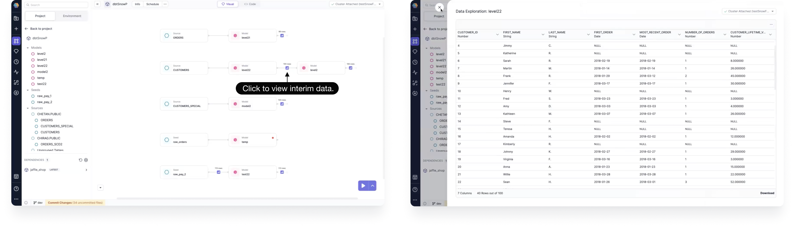
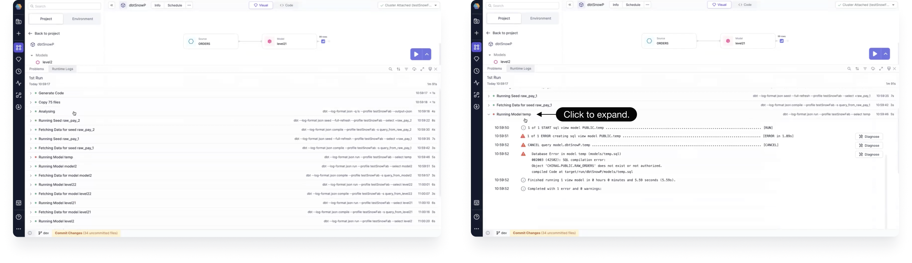
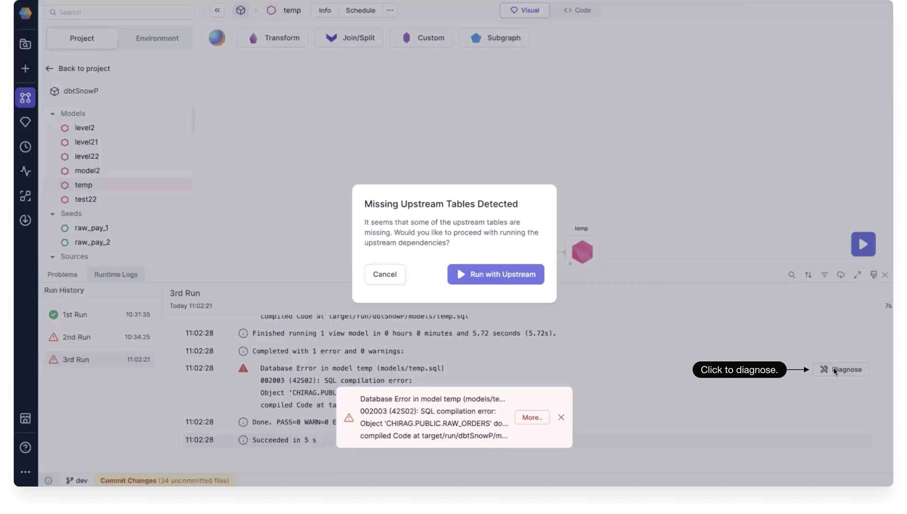

You can run and diagnose your project from the lineage view.

## Lineage run

From the lineage view, you can use the play button to run your project.

1. Click the up arrow next to the play button to select which entities you'd like to include in your run. You can choose to run all seeds, all models, and all tests.

2. Once you've made your selection, click the Play button.

3. After the run has completed, you can click to view interim data.

:::info

The run order is determined by the topological sort of the entities and their dependencies.

:::

From the Runtime Logs panel, you can see logs of the current run, including those that have failed. You can filter or sort the logs, and adjust the view.

The logs are grouped for easy viewing. You can click a grouping to expand it.

## Lineage diagnose

From the Runtime Logs panel, you can diagnose a failed run.

- On an opened failed run, click **Diagnose** next to the error log.

You are shown the error and a suggestion for a possible way to fix it.
