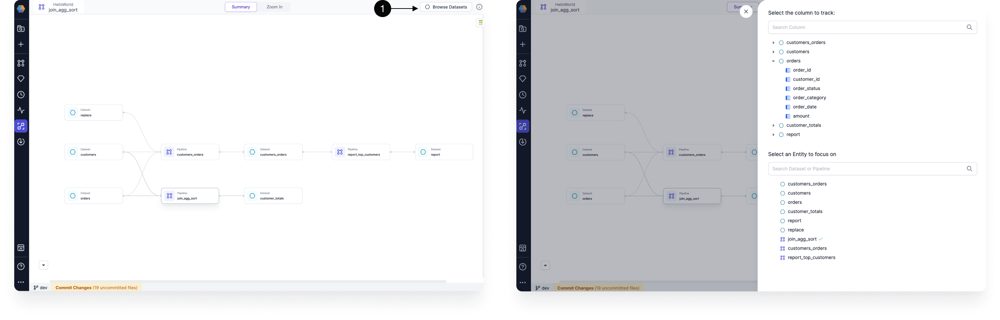
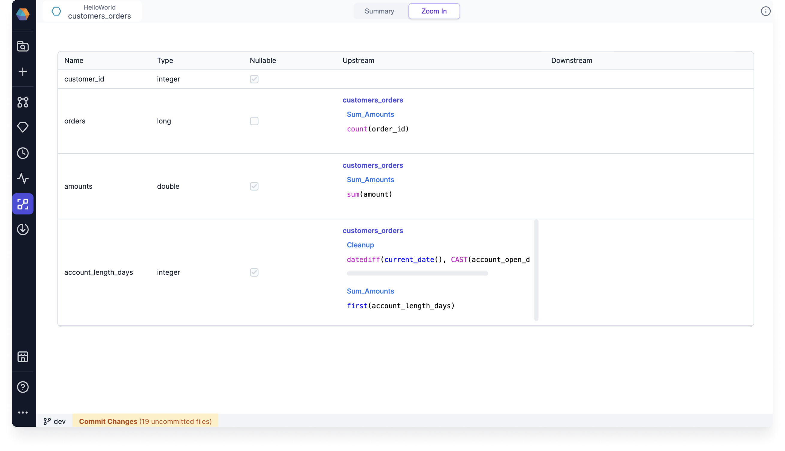

This page shows the different parts of the Lineage view and the option to search by column, dataset, or pipeline.

## Lineage view

`Browse Datasets` option from right-hand side can be used to search/select the column/entity for which lineage needs to be computed.

Zoom-in toggle for a particular pipeline/dataset can be used to better understand pipeline/dataset.

### Pipeline zoom-in view

This shows code-level info around all the components present in the pipeline.

:::info
Select a particular component aas shown below to get the code-level view.
:::

### Dataset zoom-in view

This view gives info around all the upstream and downstream transformations if any for all the columns of the selected Dataset.

## Lineage search

This option can be used to Search Lineage by column, dataset or pipeline.

Below filters are available to narrow down the search results:

- `Type` - Filter by datasets, pipelines, or columns
- `Project` - Filter by Project Name
- `Author` - Filter by Project Author
- `Last Modfified` - Filter by Last Modified Time
