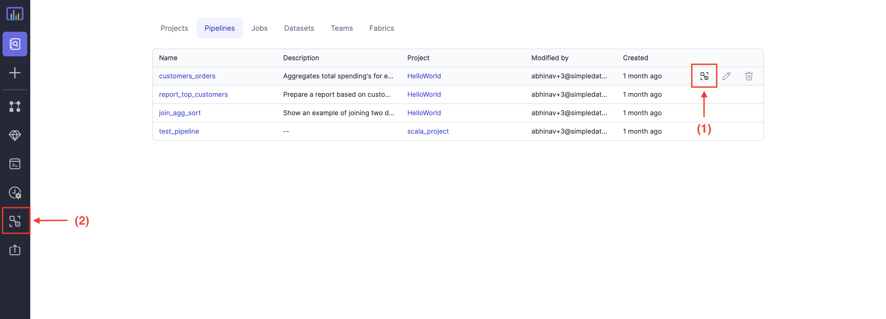

## What is Lineage?

Lineage tell us about the life cycle of data. Data lineage is the process of understanding, recording, and visualizing data as it flows from source to destination. This includes all transformations the data underwent along the way.

## Why is it important?

Just knowing the source of a particular data set is not always enough to understand its importance, perform error resolution, understand process changes, and perform system migrations and updates.

Knowing how data is updated and using what transformations, improves overall data quality.
Also, it allows data custodians to ensure the integrity and confidentiality of data is protected throughout its lifecycle.

Data lineage allows companies to:

1. Track errors in data processes.
2. Improve overall data quality.
3. Implement process changes and system migrations with lower risk and more confidence.
4. Combine data discovery with a comprehensive view of metadata.
5. Improve overall data governance.

## Navigation

There are two ways to get to the lineage view:

1. Directly from `pipeline` tab in `Metadata` by clicking on button as shown in image below.
2. Using the [Lineage Search](#lineage-search) option from the left side pane.

:::info
Lineage is always computed on-demand directly on the Git code. Therefore, you can do experimental changes in branch and see how it
will affect the overall lineage and rectify errors if any.
:::
