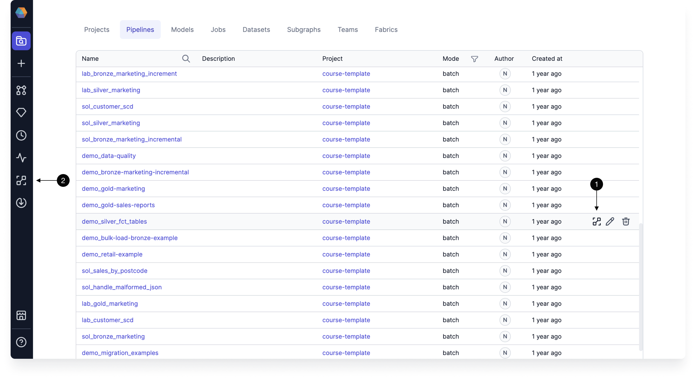
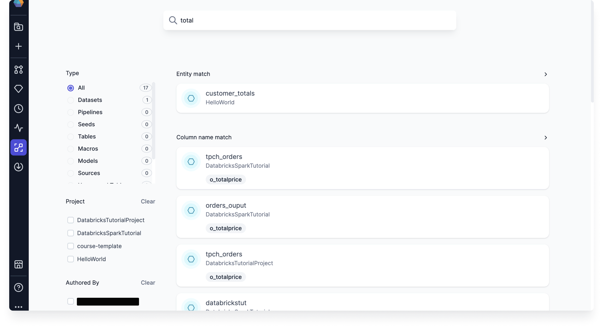
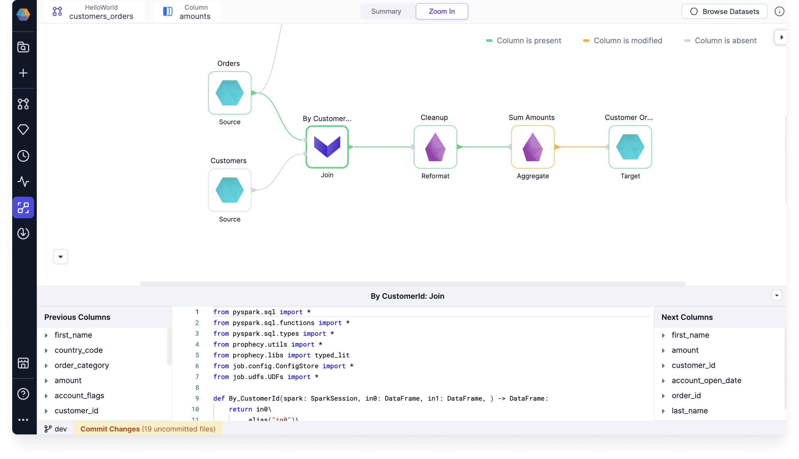

Data lineage visualizes the complete journey of your data from source to destination, including all transformations it undergoes along the way. This visibility provides critical context for data operations and governance.

Understanding data lineage delivers multiple benefits for your engineering team:

| Benefit           | Description                                     |
| ----------------- | ----------------------------------------------- |
| Error Tracking    | Quickly trace issues back to their source       |
| Quality Assurance | Verify data integrity throughout its lifecycle  |
| Change Management | Plan system migrations with complete visibility |
| Discovery         | Find and understand available data assets       |
| Governance        | Maintain compliance with data policies          |

:::tip
Lineage is computed on-demand directly from Git code. This means you can experiment in branches and immediately see how changes affect overall lineage before committing.
:::

:::note
Prophecy supports lineage for Python/PySpark and Scala [projects](/projects).
:::

## Accessing lineage

There are two ways to access the lineage view:

- Option 1: Hover over your pipeline in the **Pipeline** tab of the **Metadata** page.
- Option 2: Open the **Lineage** page from the left navigation bar.

When you open Lineage from the left navigation bar, you are brought to the lineage search page. Once you enter a search query, you can see a list of matching **entities** and a list of **columns**. You can filter these lists by:

- Entity type
- Project
- Author
- Last modified time period

Once you click an entity or column, you'll see the lineage visualization.

## Lineage Summary

The **Summary** tab visually illustrates the flow of data through pipelines, models, and datasets depending on the entities in your project. Use the **Browse Datasets** panel to search for and select the column or entity that you want to inspect.

:::info
When you open a project in the project editor, you will see the project's dataset and pipeline lineage. However, you cannot drill-down into lineage details unless you navigate to the lineage view described here.
:::

### Column-level lineage

Column-level lineage tracks the flow and transformation of individual data columns through the pipeline, demonstrating how they are processed at each stage. When you select a column in the lineage view, Prophecy provides the column's upstream and downstream transformations.

## Lineage Zoom In

The **Zoom In** tab allows you to dive deeper into specific components of your pipeline or dataset to examine detailed information.

### Pipeline lineage

For pipelines, you can see code-level information about each component present in the pipeline. Select a component to view its:

- Transformation code
- Input columns
- Output columns

### Dataset lineage

For datasets, you can find information around all the upstream and downstream transformations (if any) for all the columns of the selected dataset.

