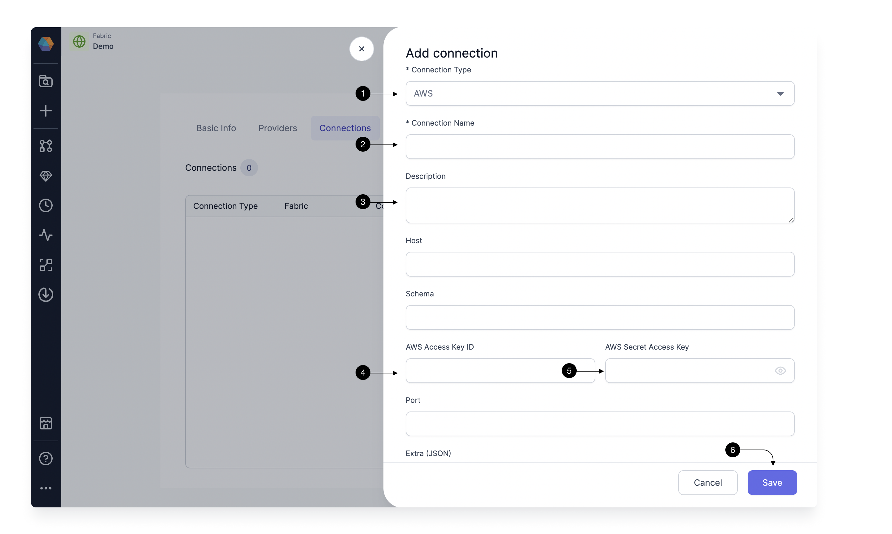

To be able to trigger your Airflow Job using an S3 File Sensor, you need to have connection from Prophecy Managed Airflow to you S3 account. For this, we need to add an AWS Connection. You would need this AWS connection for connecting to any AWS services.
To create an AWS connection for Prophecy Managed Airflow, you need to provide the **AWS access key id** and associated **Secret Key**. Check **[here](https://docs.aws.amazon.com/IAM/latest/UserGuide/id_credentials_access-keys.html)** to know how you can get it for your AWS account.

For adding a connection, Click on **(1) Add Connection** button. This Opens up the Connection form as shown.

Select AWS in **(1) Connection Type**. Provide a **(2) Connection Name** to identify your connection, add a **(3) Description** of your choice, and provide the **(4) AWS Access Key ID** and **(5)AWS Secret Access Key**. Once done, hit **(6) Save**.

