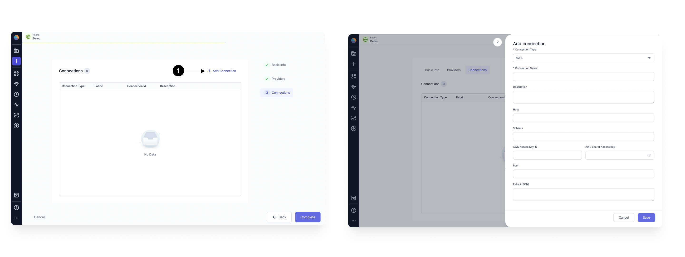

### Adding Email connection

To be able to send Email via Airflow using an Email Gem, you need to have Email connection in Prophecy Managed Airflow. Click on Add Connection button and select Email in (**1) Connection Type**.

Provide a **(2) Connection Name** to identify your connection, add a **(3) Description** of your choice, and provide the **(4) Host** as your SMTP host example `smtp.gmail.com`. Provide the login credentials for this server in **(5)Login** and **(6)Password** and provide your SMTP port in **(7) Port**. Once done, hit **(8) Save**.

