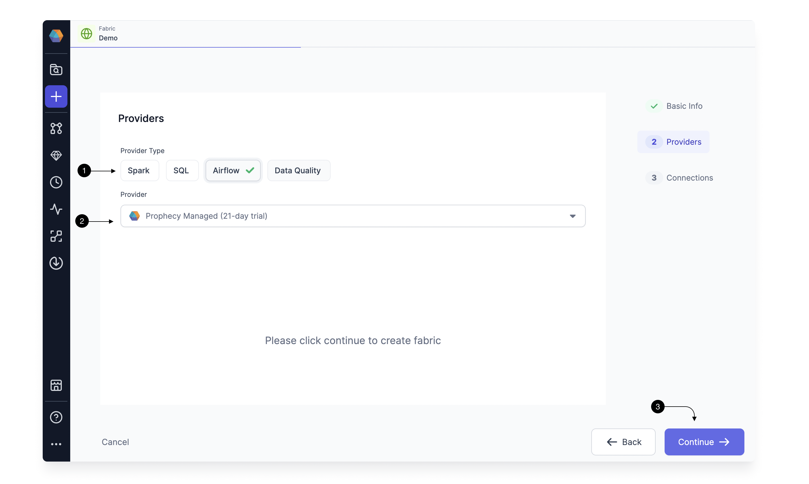

If you are new to Airflow and do not have an Airflow Instance running in your environment, we provide a `Prophecy Managed Airflow` to expedite your trial and POC.
You can use this to connect to your Spark or SQL execution env and try out scheduling for your Spark Pipelines or SQL Models.
Let's see how to set up this Fabric.

## How to create Prophecy Managed Airflow Fabric

Setting up a Fabric is very straightforward. Click the **(1) Create Entity** button, and choose **(2) Create Fabric** option. The Fabric creation is composed of two steps: Basic Info and Providers setup.
On the Basic Info screen, enter a **(1) Fabric Name**, **(2) Fabric Description**, and choose the **(3) Team** that’s going to own the Fabric.

Once ready, click **(4) Continue**.


Since we’re setting up a Fabric connected to Airflow, choose **Airflow** as the **(1) Provider Type** and **Prophecy Managed** as the **(2) Provider**.
For connecting to Prophecy Managed Airflow, you don't need to provide any other details, so go ahead and click on **(3) Continue**.



This completes the Fabric creation for you. Now you can start setting up connections for Prophecy Managed Airflow to your AWS/Databricks etc.

```mdx-code-block
import DocCardList from '@theme/DocCardList';
import {useCurrentSidebarCategory} from '@docusaurus/theme-common';

<DocCardList items={useCurrentSidebarCategory().items}/>
```
