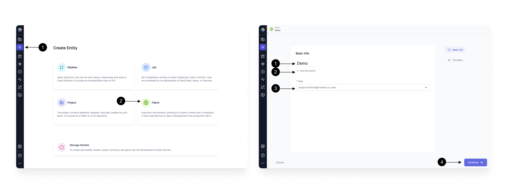

If you are new to Airflow and do not have an Airflow Instance running in your environment, we provide a `Prophecy Managed Airflow` to expedite your trial and POC.
You can use this to connect to your Spark or SQL execution env and try out scheduling for your Spark Pipelines or SQL Models.
Let's see how to setup this Fabric.

## How to create Prophecy Managed Airflow Fabric

Setting up a Fabric is very straightforward. Click the **(1) Create Entity** button, and choose **(2) Create Fabric** option. The Fabric creation is composed of two steps: Basic Info and Providers setup.
On the Basic Info screen, enter a **(1) Fabric Name**, **(2) Fabric Description**, and choose the **(3) Team** that’s going to own the Fabric.

Once ready, click **(4) Continue**.

Since we’re setting up a Fabric connected to Airflow, choose **Airflow** as the **(1) Provider Type** and **Prophecy Managed** as the **(2) Provider**.
For connecting to Prophecy Managed Airflow, you don't need to provide any other details, so go ahead and click on **(3) Continue**.

## Setting up Connections

You need Airflow to talk to various other systems in your Data Platform to be able to do certain tasks like send Email, trigger Spark pipelines and SQL models.
For these we create [connections](https://airflow.apache.org/docs/apache-airflow/stable/authoring-and-scheduling/connections.html) in Airflow.
For Prophecy Managed Airflow, you can provide all the details requires to connect to your external systems in Connections page, and Prophecy will setup the Airflow connection for you.

Lets see how to setup different type of conenctions one by one below:

### Adding AWS connection

###
