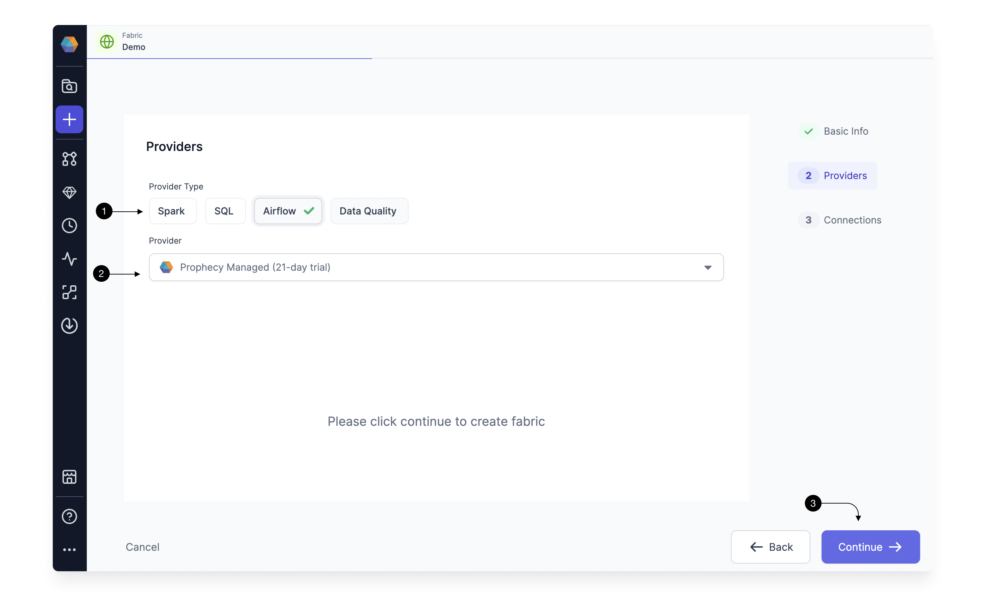
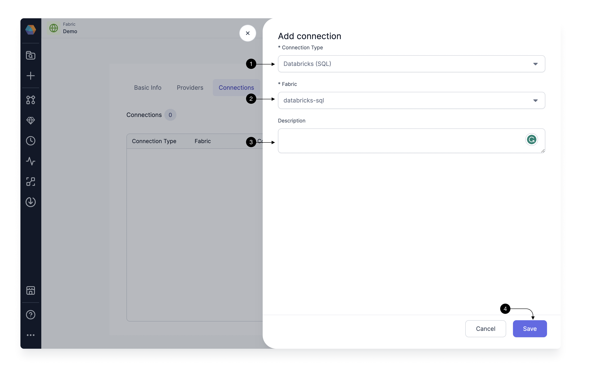

If you are new to Airflow and do not have an Airflow Instance running in your environment, we provide a `Prophecy Managed Airflow` to expedite your trial and POC.
You can use this to connect to your Spark or SQL execution env and try out scheduling for your Spark Pipelines or SQL Models.
Let's see how to set up this Fabric.

## How to create Prophecy Managed Airflow Fabric

Setting up a Fabric is very straightforward. Click the **(1) Create Entity** button, and choose **(2) Create Fabric** option. The Fabric creation is composed of two steps: Basic Info and Providers setup.
On the Basic Info screen, enter a **(1) Fabric Name**, **(2) Fabric Description**, and choose the **(3) Team** that’s going to own the Fabric.

Once ready, click **(4) Continue**.

Since we’re setting up a Fabric connected to Airflow, choose **Airflow** as the **(1) Provider Type** and **Prophecy Managed** as the **(2) Provider**.
For connecting to Prophecy Managed Airflow, you don't need to provide any other details, so go ahead and click on **(3) Continue**.

This completes the Fabric creation for you. Now you can start setting up connections for Prophecy Managed Airflow to your AWS/Databricks etc.

## Setting up Connections

You need Airflow to talk to various other systems in your Data Platform to be able to do certain tasks like send Email, trigger Spark pipelines and SQL models.
For these we create [connections](https://airflow.apache.org/docs/apache-airflow/stable/authoring-and-scheduling/connections.html) in Airflow.
For Prophecy Managed Airflow, you can provide all the details required to connect to your external systems in Connections page, and Prophecy will set up the Airflow connection for you.
The credentials for your connections are stored securely in a Google Cloud Secret Manager.

Let's see how to set up different type of connections one by one below:

### Adding AWS connection

To be able to trigger your Airflow Job using an S3 File Sensor, you need to have connection from Prophecy Managed Airflow to you S3 account. For this, we need to add an AWS Connection. You would need this AWS connection for connecting to any AWS services.
To create an AWS connection for Prophecy Managed Airflow, you need to provide the **AWS access key id** and associated **Secret Key**. Check **[here](https://docs.aws.amazon.com/IAM/latest/UserGuide/id_credentials_access-keys.html)** to know how you can get it for your AWS account.

For adding a connection, Click on **(1) Add Connection** button. This Opens up the Connection form as shown.

Select AWS in **(1) Connection Type**. Provide a **(2) Connection Name** to identify your connection, add a **(3) Description** of your choice, and provide the **(4) AWS Access Key ID** and **(5)AWS Secret Access Key**. Once done, hit **(6) Save**.

### Adding Email connection

To be able to send Email via Airflow using an Email Gem, you need to have Email connection in Prophecy Managed Airflow. Click again on Add Connection button and select Email in (**1) Connection Type**.

Provide a **(2) Connection Name** to identify your connection, add a **(3) Description** of your choice, and provide the **(4) Host** as your SMTP host example `smtp.gmail.com`. Provide the login credentials for this server in **(5)Login** and **(6)Password** and provide your SMTP port in **(7) Port**. Once done, hit **(8) Save**.

### Adding Databricks Spark connection

To be able to schedule your Databricks Spark pipelines via Airflow, you need to have a Databricks Spark Connections from Prophecy Managed Airflow to your Databricks Workspace.
Click on Add Connection button.

Select Databricks Spark in **(1) Connection Type**. Since you have already provided the details for your Databricks Workspace when creating a Databricks Fabric, you need not provide the details here again.
Under the **(2) Fabric**, select the Fabric you created for Databricks Spark and Prophecy would set up the connection. You can provide a description in the **(3) Description**. Once done, click **(4) Save**.

### Adding Databricks SQL connection (DBT)

To be able to Run your Databricks SQL Models, you need to have connection from Prophecy Managed Airflow to your Databricks SQL Environment. Click again on Add Connection button.

Select Databricks SQL in **(1) Connection Type**. Now under the **(2) Fabric**, you would select the already created Fabric for Databricks SQL and Prophecy would setup the connection. You can provide a description in the **(3) Description**. Once done, click **(4) Save**.

