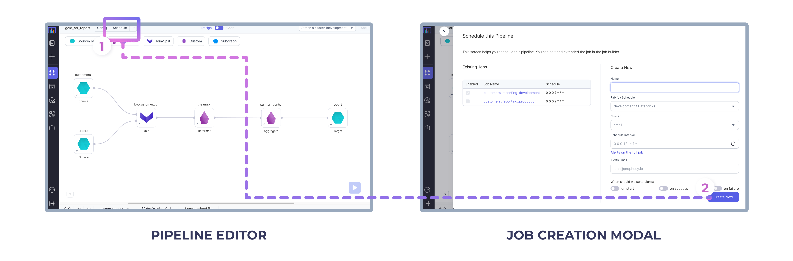
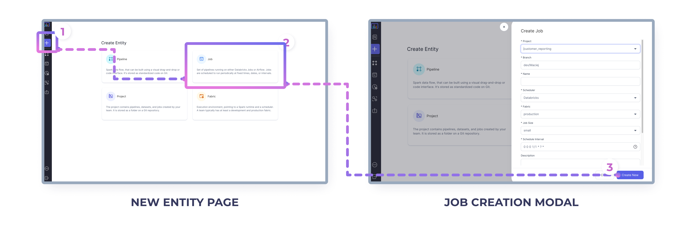
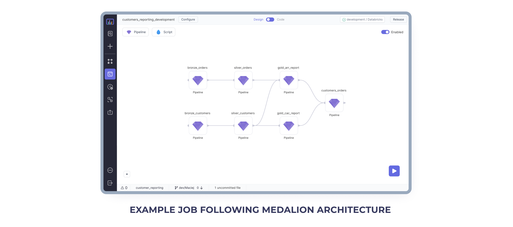
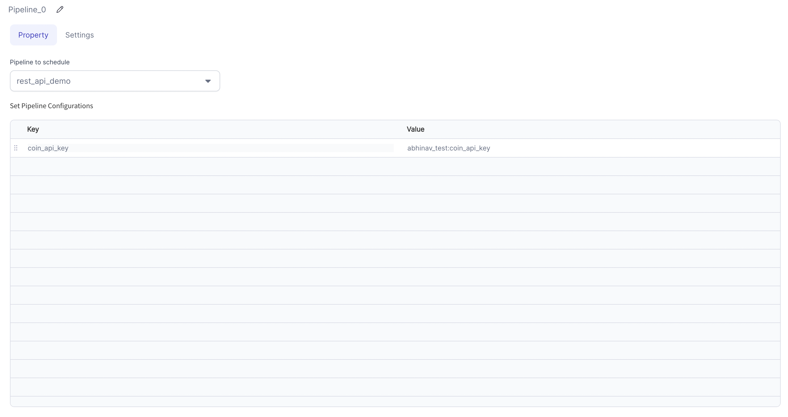
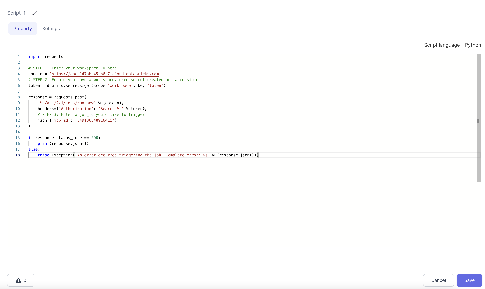
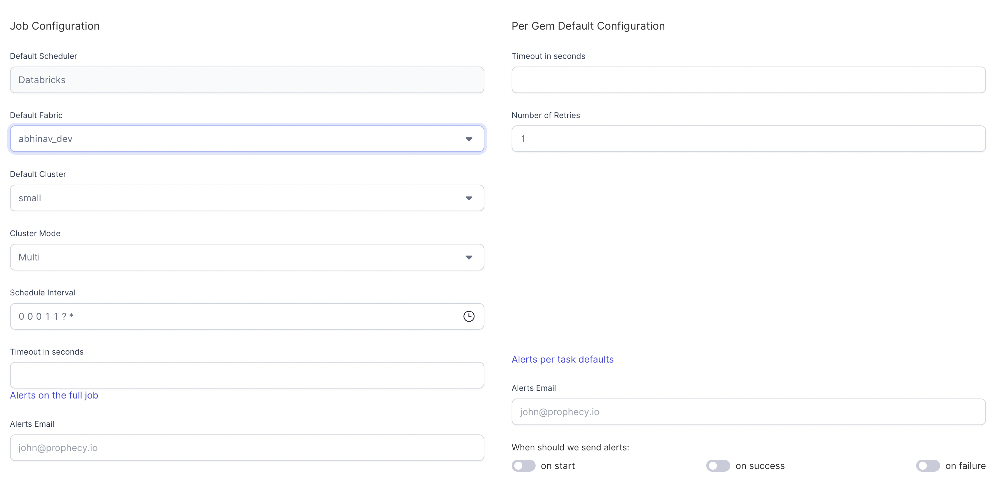
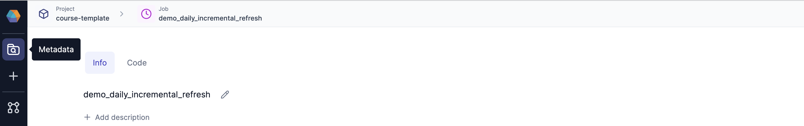
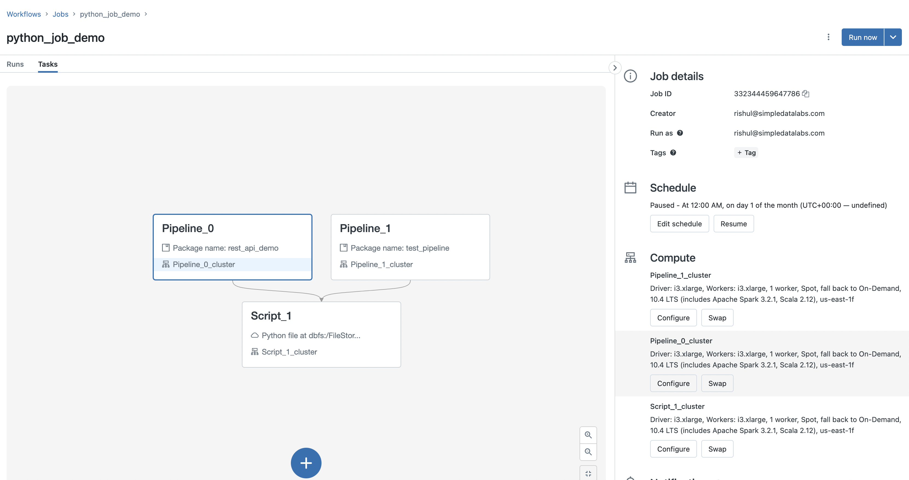
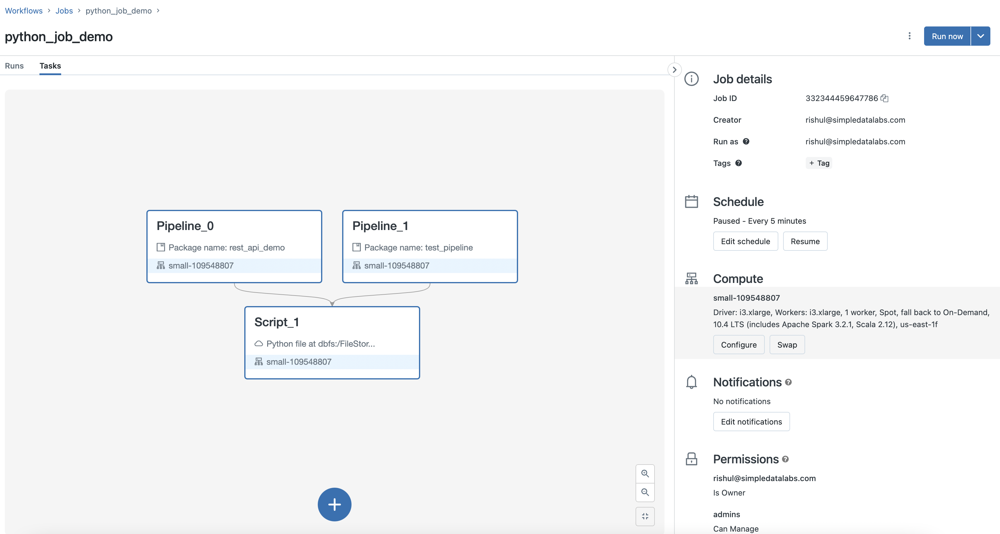

Once you have developed a [Spark Pipeline](/concepts/Pipeline) using Prophecy, you will want to schedule it to run at
some frequency. To support this, Prophecy provides a low-code layer on top of Databricks Jobs for an easy orchestration.

## Development

### Your first Job

You can create a Job from two places. If you're going to schedule only a single Pipeline, the easiest way to
build a Job for it is to do it directly from the Pipeline editor screen. This way your Job is automatically initialized
with the Pipeline you create it from.

To do that, simply navigate to your Pipeline, and click on the Schedule button (1). That opens a modal that shows all
the Jobs that refer to this Job or allow you to create a completely new Job from scratch. Upon clicking
Create New (2) you are redirected to the [Job building page](/low-code-jobs/databricks-jobs#building-the-job).

Alternatively, if you'd like to create a new Job completely from scratch, you can do that directly from the entity
creation page (1). There you can choose the Job tile (2) and that opens a similar modal where you can define your
Job details (3).

Whenever, creating a new Job you're asked for the following details:

| Field Name        | Description                                                                                                                                                                                                                                   |
| ----------------- | --------------------------------------------------------------------------------------------------------------------------------------------------------------------------------------------------------------------------------------------- |
| Project           | Which [Project](/concepts/project) to create the Job in. This controls who has access to the Job, groups Jobs together for lineage, and allows you to use Pipelines already published within that Project.                                    |
| Branch            | Which Git branch to use when developing this Job.                                                                                                                                                                                             |
| Name              | Unique Job name.                                                                                                                                                                                                                              |
| Scheduler         | The underlying engine that's going to execute your Job. Databricks is recommended.                                                                                                                                                            |
| Fabric            | The [execution Fabric](/concepts/fabrics) to which the Job is going to be deployed.                                                                                                                                                           |
| Job Size          | The [default size](/concepts/fabrics#whats-in-a-fabric) of the cluster that's going to be created for the Job to run.                                                                                                                         |
| Schedule Interval | Defines how often your Job is going to run. The interval is defined using the [Quartz format](http://www.quartz-scheduler.org/documentation/quartz-2.3.0/tutorials/crontrigger.html). You can click on the clock icon to select the interval. |
| Alerts email      | Comma separated list of emails that are going to receive notifications on specific Job status events (start, failure, or success).                                                                                                            |

### Building the Job

Now that you've created your first Job, you can start adding Gems to the canvas to define which Pipelines will
be run during the Job. To define dependencies between the Pipelines within the Job you can simply connect them
by dragging-and-dropping the edges between Gems.

Two Gem types are available when defining Databricks Jobs:

#### Pipeline Gem

The Pipeline Gem triggers a Spark Pipeline developed in Prophecy.

Settings for Pipeline component can be inherited from overall Job configuration or can be set inside the component itself.

#### Script Gem

Script Gem can be used to write any ad-hoc code.

Settings for script component can be inherited from overall Job configuration or can be set inside the component itself.

## Visual == Code

The visual graph created on the Jobs page is automatically converted to code (JSON) in the backend which gets committed to Git.

## Job Configuration

---

| Field Name                | Description                                                                                                                                                                                                                                   |
| ------------------------- | --------------------------------------------------------------------------------------------------------------------------------------------------------------------------------------------------------------------------------------------- |
| Scheduler                 | The underlying engine that's going to execute your Job. Databricks is recommended.                                                                                                                                                            |
| Fabric                    | The [execution Fabric](/concepts/fabrics) to which the Job is going to be deployed.                                                                                                                                                           |
| Cluster Size              | The [default size](/concepts/fabrics#whats-in-a-fabric) of the cluster that's going to be created for the Job to run.                                                                                                                         |
| Cluster Mode              | Can be selected as `Single` (all Gems within the Job re-use the same Cluster) or `Multi` (all Gems within the Job run on a separate new cluster)                                                                                              |
| Schedule Interval         | Defines how often your Job is going to run. The interval is defined using the [Quartz format](http://www.quartz-scheduler.org/documentation/quartz-2.3.0/tutorials/crontrigger.html). You can click on the clock icon to select the interval. |
| Pipeline level Timeout    | Timeout at Pipeline level                                                                                                                                                                                                                     |
| Alerts Email for Pipeline | Comma separated list of emails, that are going to receive notifications on specific Job status events (Job start, failure, or success) for entire Pipeline.                                                                                   |
| Per Gem Timeout           | Timeout for each Gem in Job Pipeline                                                                                                                                                                                                          |
| Number of retries per Gem | Number of retries for each Gem in Job Pipeline                                                                                                                                                                                                |
| Alerts Email per Gem      | Comma separated list of emails that are going to receive notifications on specific Job status events (start, failure, or success) for each Gem in Job Pipeline.                                                                               |

To change the Job name itself, go to Prophecy's metadata page. Locate the Job within a Project, and click the pencil icon.

## Deployment Modes

To deploy a Job on Databricks, we need to release the project from Prophecy UI as shown in example below. As soon as the project is
released, the Job would start appearing on Databricks Jobs page as well.

<iframe src="https://user-images.githubusercontent.com/103921419/184726064-67e3df01-ba4c-431e-92e9-8bda92a19530.mp4" title="Job Deployment" allow="autoplay;fullscreen" allowtransparency="true" frameborder="0" scrolling="no" class="wistia_embed" name="wistia_embed" msallowfullscreen width="100%" height="100%"></iframe>

---

:::info

Make sure to enable the Job before creating a Release. If it is not enabled the Job will not run on the specified schedule.

If a Job's selected Fabric is changed it will create a separate Databricks job definition. The previous Job (with the previous Fabric) will be paused automatically and the new version will be scheduled.
:::

Prophecy supports two different Job deployment models. Each has different impacts on Job cost and parallelism.

### Multi Job Cluster Mode

In this mode, each component of Job will spawn a separate cluster of its own.

Here's how the Databricks UI looks for Prophecy's Multi Cluster Mode.

### Single Job Cluster Mode

In this mode, each component of Job will run on the same cluster.

:::info
To use single cluster mode the package name across each Pipeline in Job should be unique.
This is done to ensure that the folder structure for one Pipeline does not overwrite another.
Please refer to the steps below in continuation to our earlier [Example](databricks-jobs#deployment-modes) on how to configure package name in Pipeline.
:::

---

<iframe src="https://user-images.githubusercontent.com/103921419/184726133-51bf76ec-31d7-4976-8d7d-68230c28e233.mp4" title="Single Cluster Mode" allow="autoplay;fullscreen" allowtransparency="true" frameborder="0" scrolling="no" class="wistia_embed" name="wistia_embed" msallowfullscreen width="100%" height="100%"></iframe>

Here's how the Databricks UI looks for Prophecy's Single Cluster Mode.

### Fully Configurable Cluster Mode

**Coming Soon!!!**

## Job Monitoring

Prophecy provides monitoring page which shows the status (enable/disable) of all the Jobs deployed via Prophecy and
status of historic/current runs (success/failure/in-progress) for quick reference.

<iframe src="https://user-images.githubusercontent.com/103921419/184726121-d2b7c5c7-ec01-48b1-9764-781292940f53.mp4" title="Monitoring" allow="autoplay;fullscreen" allowtransparency="true" frameborder="0" scrolling="no" class="wistia_embed" name="wistia_embed" msallowfullscreen width="100%" height="100%"></iframe>

## Guides

1. [How to trigger a job from another job?](/tutorials/low-code-jobs/multi-jobs-trigger)
2. [How to design a reliable CI/CD process?](/tutorials/low-code-jobs/reliable-ci-cd)
