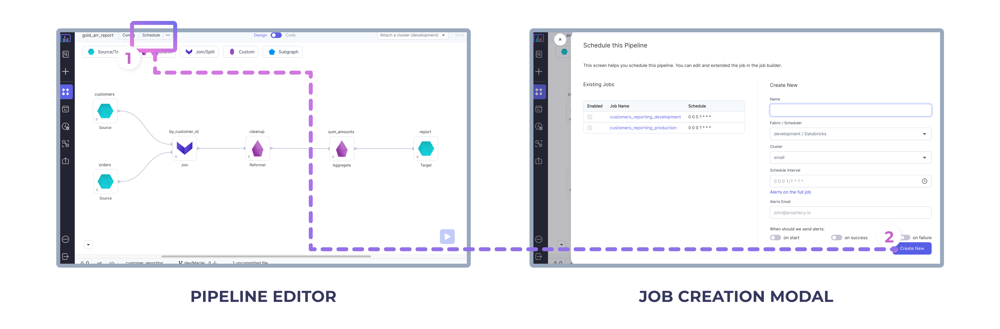
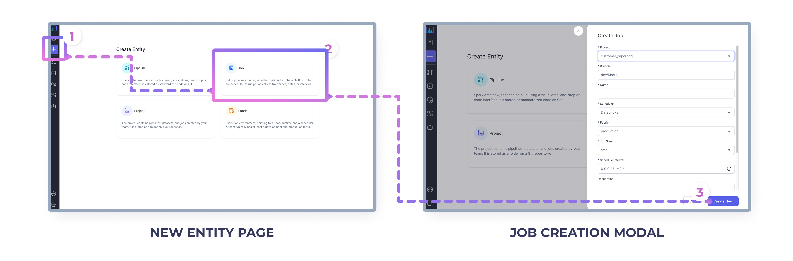
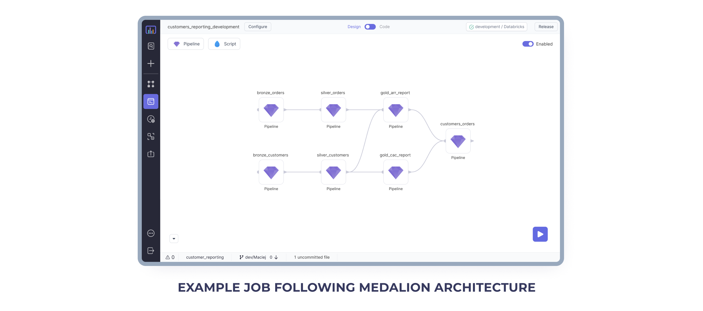

Once you have developed a [spark pipeline](/concepts/pipeline) using prophecy, you will want to schedule it to run at
some frequency. To support this, Prophecy provides a low-code layer on top of Databricks Jobs
or [Airflow](/low-code-jobs/airflow) for an easy orchestration.

## Development

### Your first job

You can create a job from two places. If you're going to schedule only a single pipeline, the easiest way to
build a job for it is to do it directly from the pipeline editor screen. This way your job is automatically initialized
with the pipeline you create it from.

To do that, simply navigate to your pipeline, and click on the Schedule button (1). That opens a modal that shows all
the jobs that refer to this job or allow you to create a completely new job from scratch. Upon clicking
Create New (2) you are redirected to the [job building page](/low-code-jobs/databricks-jobs#building-the-job).

Alternatively, if you'd like to create a new job completely from scratch, you can do that directly from the entity
creation page (1). There you can choose the job tile (2) and that opens a similar modal where you can define your
job details (3).

Whenever, creating a new job you're asked for the following details:

| Field Name        | Description                                                                                                                                                                                                                                         |
|-------------------|-----------------------------------------------------------------------------------------------------------------------------------------------------------------------------------------------------------------------------------------------------|
| Project           | Which [project](/concepts/project) to create the Job in. This controls who has access to the Job, groups Jobs' together for lineage, and allows you to use Pipelines already published within that project.                                         |
| Branch            | Which GIT branch to use when developing this Job.                                                                                                                                                                                                   |
| Name              | Unique job name.                                                                                                                                                                                                                                    |
| Scheduler         | The underlying engine that's going to execute your job. Databricks is recommended.                                                                                                                                                                  |
| Fabric            | The [execution fabric](http://localhost:3000/concepts/fabric) to which the job is going to be deployed.                                                                                                                                             |
| Job Size          | The [default size](http://localhost:3000/concepts/fabric#whats-in-a-fabric) of the cluster, that's going to be created for the job to run.                                                                                                          |
| Schedule Interval | Defines how often your job is going to run. The interval is defined using the [Quartz format](http://www.quartz-scheduler.org/documentation/quartz-2.3.0/tutorials/crontrigger.html). You can click on the clock icon, to easily pick the interval. |
| Alerts email      | Comma separated list of emails, that are going to receive notifications on specific job status events (job start, failure, or success).                                                                                                             |

### Building the job

Now that you've created your first job, you can start adding the gems onto the canvas to run them, during the job run
time. To define dependencies between gems, you can simply connect them, by dragging-and-dropping, the edges between
them.

When using Databricks Jobs there are two gem types available:  

#### Pipeline Gem

The pipeline gem triggers a Spark pipeline developed in Prophecy. 

#### Script Gem

### Visual == Code

## Configuration

## Deployment

## Monitoring

## Guides

1. [How to trigger a job from another job?](/tutorials/low-code-jobs/multi-jobs-trigger)
2. [How to design a reliable CI/CD process?](/tutorials/low-code-jobs/reliable-ci-cd)
