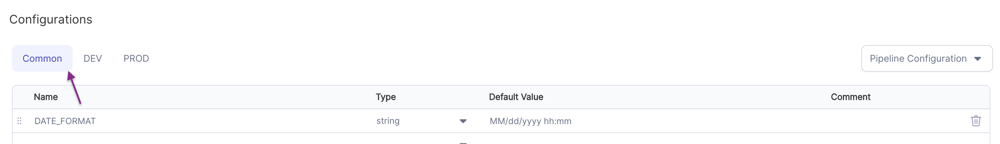
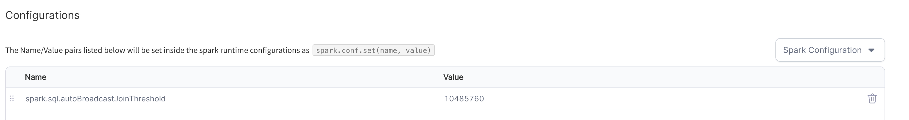
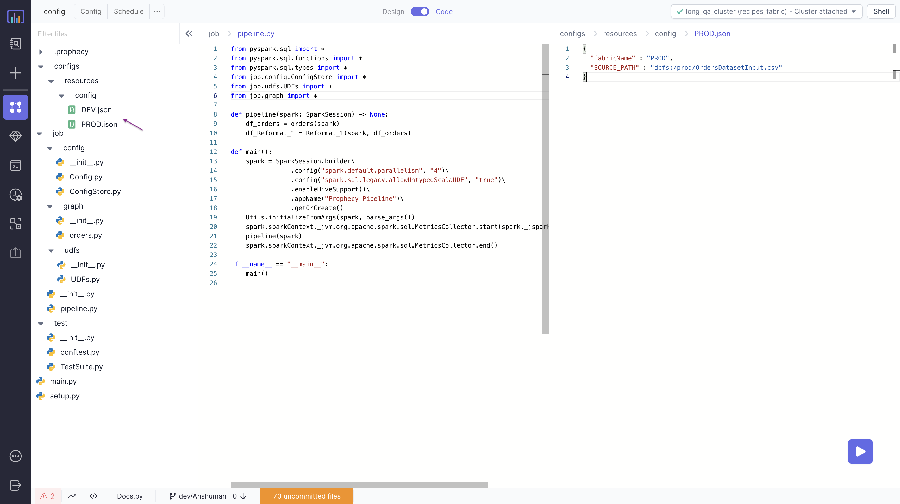

Allows you to define configurations to control various aspects of your pipeline. Prophecy IDE allows you to define three kinds of configurations:

1. **Pipeline Configuration**: name-value pair per [fabric](./../core-concepts/fabric/) which can then be accessed in pipeline as `${name}`. <br/> Eg: `for Fabric = dev, SOURCE_PATH: dbfs:/dev/file.csv`, <br/> `for Fabric = prod, SOURCE_PATH: dbfs:/prod/file.csv`
   :::note
   Each name-value pair has to be first defined in the `Common` tab. This can then be overridden in the individual fabric tabs.
   
   :::
2. **Spark Configuration**: Run time spark configurations as name-value pairs.
   :::note
   The name-value pairs will be set inside the spark runtime configurations as `spark.conf.set(name, value)`
   
   This will be compiled as:

   ```python
   spark.conf.set("spark.sql.autoBroadcastJoinThreshold", "10485760")
   ```

   :::<br/>

3. **Hadoop Configuration**: Hadoop configurations as name-value paris.
   :::note
   The name-value pairs will be set inside the hadoop configuration as `spark.sparkContext.hadoopConfiguration.set(name, value)`
   
   This will be compiled as:

   ```python
   spark.sparkContext.hadoopConfiguration.set("fs.s3a.access.key", "my_access_key")
   ```

   :::<br/>

### Examples

---

#### Dynamic Data Load Using Workflow Configurations

In this example, we'll see how we can configure different source file paths for different execution environments.
We have two [fabrics](./../core-concepts/fabric/) available for our pipeline viz. `DEV` and `PROD`

```mdx-code-block
import App from '@site/src/components/slider';

export const ImageData = [
  {
    "image":"/img/configurations/1.png",
    "description":<h3 style={{padding:'10px'}}>Step 1 - Open Config window</h3>,
  },
  {
    "image":"/img/configurations/2.png",
    "description":<h3 style={{padding:'10px'}}>Step 2 - Define Common <code>SOURCE_PATH</code> </h3>,
  },
  {
    "image":"/img/configurations/3.png",
    "description":<h3 style={{padding:'10px'}}> Step 3 - Define Dev <code>SOURCE_PATH</code></h3>
  },
  {
    "image":"/img/configurations/4.png",
    "description":<h3 style={{padding:'10px'}}>Step 4 - Define Prod <code>SOURCE_PATH</code></h3>,
  },
  {
    "image":"/img/configurations/5.png",
    "description":<h3 style={{padding:'10px'}}>Step 5 - Use the <code>SOURCE_PATH</code> to define the location in a <a href="./gems/source-target/">Source/Target</a> gem
</h3>,
  },
];

<App ImageData={ImageData}></App>
```

The configuration is stored in the `resources` and is parsed by the `ConfigStore` to be usable in other parts of the code as `Config.SOURCE_PATH`.
The resolution of the config will be done at the run-time according to the running fabric.

