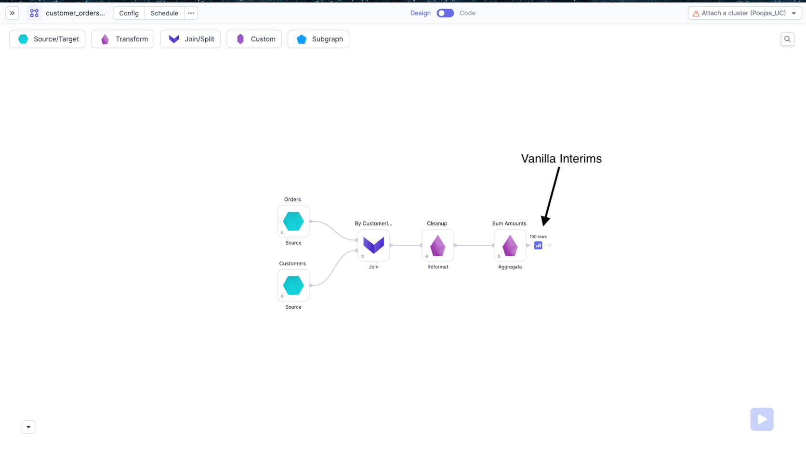
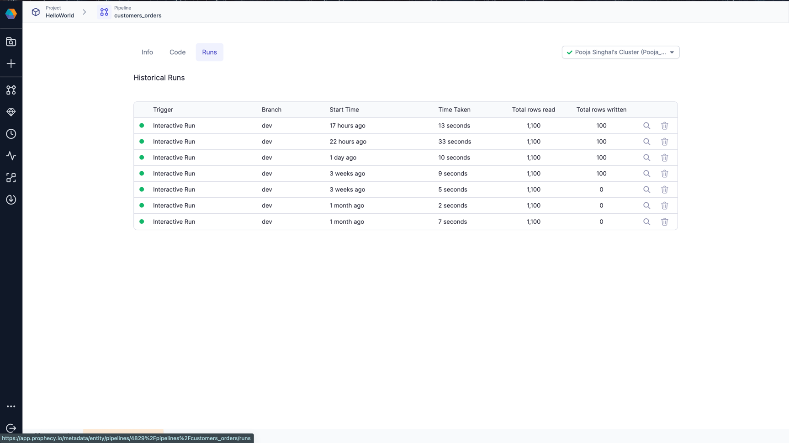
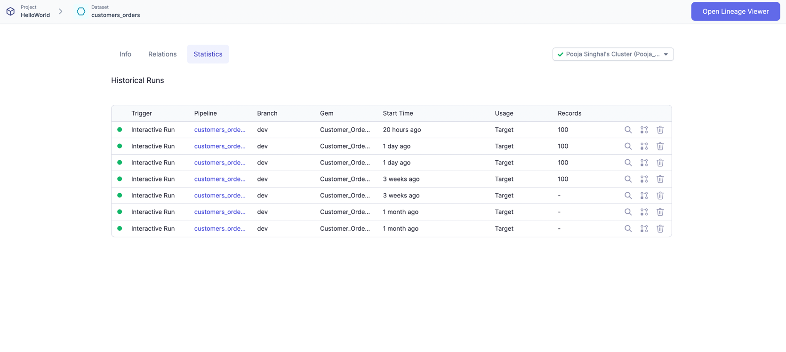

Databricks cluster comes with various [Access Modes](https://docs.databricks.com/clusters/create-cluster.html#what-is-cluster-access-mode).
Depending on the cluster type, external library installations might be restricted on some clusters as mentioned below.

For [Interims](./interactive-execution#interims) and [Execution Metrics](./execution-metrics) to work, Prophecy has written some libraries in Python and Scala, which needs to be installed on cluster. Hence, because of below restrictions, interims behaviour will be different for different clusters.

| Access mode dropdown      | Library Installations Allowed?          | Language supported | Interims             | Execution Metrics |
| ------------------------- | --------------------------------------- | ------------------ | -------------------- | ----------------- |
| Single User               | Yes                                     | Python, Scala      | Regular Interims     | Yes               |
| Shared                    | Yes, but interim nodes cant be attached | Python             | **Vanilla Interims** | **No**            |
| No isolation shared       | Yes                                     | Python, Scala      | Regular Interims     | Yes               |
| Unity Catalog Single User | Yes                                     | Python, Scala      | Regular Interims     | Yes               |
| Unity Catalog Shared      | No                                      | Python             | **Vanilla Interims** | **No**            |

### Interims

During development, often the user will want to see their data to make more sense of it and to check whether the expected output is getting
generated or not after the transformation. Prophecy generates these data samples as `Interims`, which are temporarily cached previews of data after each Gem.
To check more about interims, please refer [here](./interactive-execution#interims)

Depending on the type of clusters, we have two modes of Interims

#### Regular Interims

For Single User clusters, and No isolation Shared clusters, we have interims available after each Gem of Pipeline. These are available on both Unity and Non Unity catalog workspaces.

#### Vanilla Interims

For Shared mode clusters, since we cannot attach interims after each gems, we have added interims on all Actions/Tail nodes of the Pipeline.
Please see the below image for reference.

### Execution Metrics

When running Pipelines and Jobs, you may be interested to know few metrics related to execution like records
read/written, bytes read/written, total time taken and Data samples b/w components. These Dataset, Pipeline-run and
Job-run related metrics are accumulated and stored on your data plane and can be viewed later from Prophecy UI. For more details please refer [here](./execution-metrics)

These metrics are not available for querying from Shared mode clusters. You should see a proper error when trying to get historical runs of Pipelines/Jobs executed on Shared mode clusters.

Please refer below images for Execution Metrics on Pipelines page.

Each row here is one run of the Pipeline. You can click and go to a particular run and see the interims for that run or metrics like Rows read/written, time taken etc

You can also see Execution Metrics for each Dataset in the Pipeline.

Each row here is one run where this Dataset was used. You can click and go to a particular run and see more detailed insights on your data along with preview.

:::info
For High Concurrency/Shared Mode Databricks Clusters, the first command execution takes time. This is expected because Executor does a lazy `pip install` for the Python libraries during execution of first command on that executor. It is more visible for clusters with autoscaling as everytime a new executor is added, lazy installation of the Python libraries takes time. As a workaround, It is recommended to install the packages from a custom Artifactory or dbfs. Please [contact us](https://help.prophecy.io/support/tickets/new) to learn more about this.

:::
