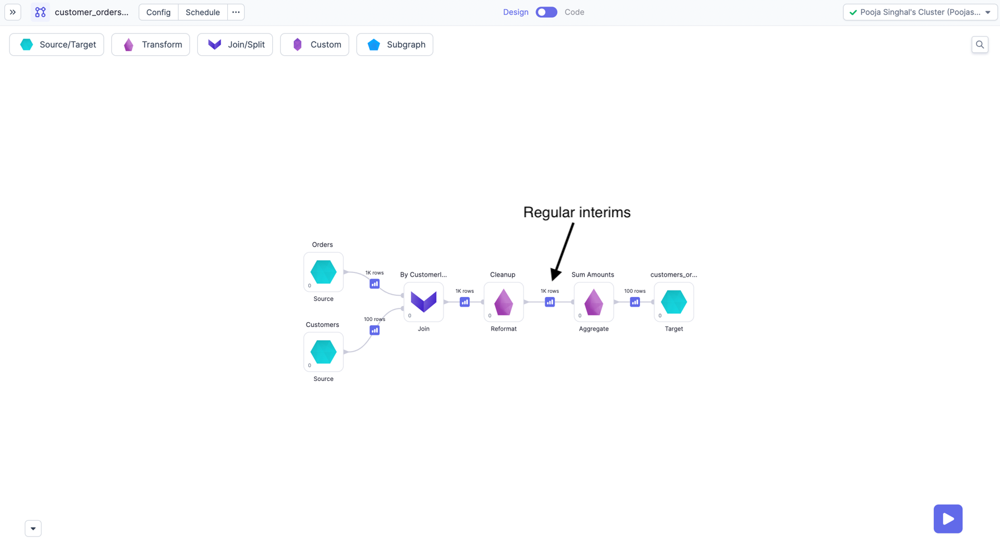
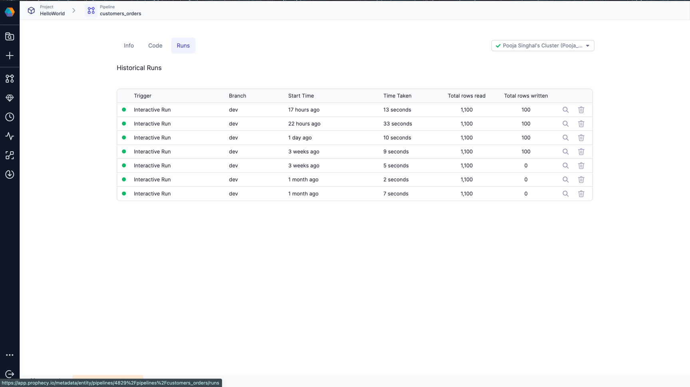
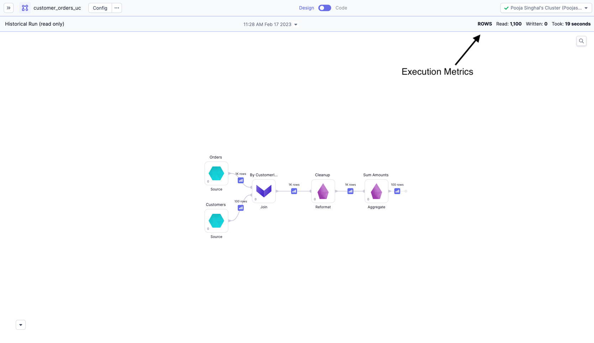
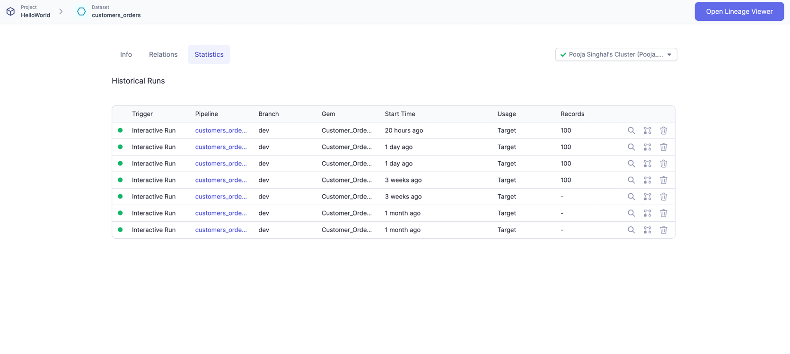

## Cluster Types

Execution metrics is supported for all types of clusters having Livy enabled and have a Hive metastore (HMS).
we can just provide the table names in [execution metric setup page](./execution-metrics#team-level-access-control).

- Prophecy **automatically creates** table if they do not exist, Or users can also create their own table with [required table schema](./execution-metrics#creating-tables-for-livy).
- Creating tables can be specially useful if user want to use **External tables** or want to change the default storage format (**parquet**).

## Interims on Livy

During development, often the user will want to see their data to make more sense of it and to check whether the expected output is getting
generated or not after the transformation. Prophecy generates these data samples as `Interims`, which are temporarily cached previews of data after each Gem.
To check more about interims, please refer [here](https://docs.prophecy.io/low-code-spark/execution/interactive-execution#interims).

We have interims available after each Gem of Pipeline.

## Execution Metrics on Livy

When running Pipelines and Jobs, you may be interested to know few metrics related to execution like records
read/written, bytes read/written, total time taken and Data samples b/w components. These Dataset, Pipeline-run and
Job-run related metrics are accumulated and stored on your data plane and can be viewed later from Prophecy UI. For more details please refer [here](./execution-metrics)

Please refer below images for Execution Metrics on Pipelines page.

Each row here is one run of the Pipeline. You can click and go to a particular run and see the interims for that run or metrics like Rows read/written, time taken etc

You can also see Execution Metrics for each Dataset in the Pipeline.

Each row here is one run where this Dataset was used. You can click and go to a particular run and see more detailed insights on your data along with preview.

