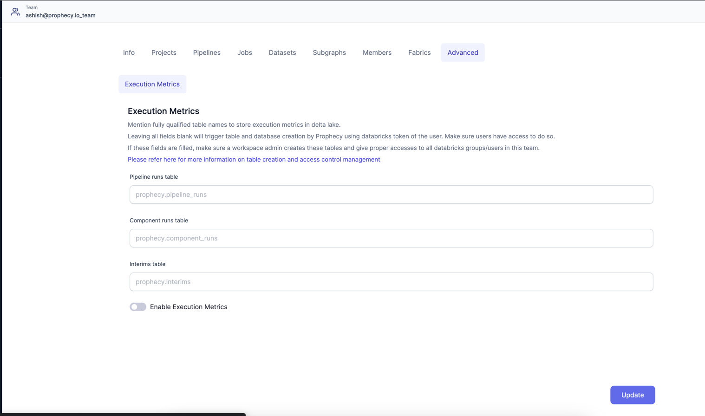

<br/>

### What are execution metrics?

When running Pipelines and Jobs, you may be interested to know few metrics related to execution like records
read/written, bytes read/written, total time taken and Data samples between components. These Dataset, Pipeline-run and
Job-run related metrics are accumulated and stored on your data plane and can be viewed later from Prophecy UI.

### Team level access-control

For clusters with table ACL enabled, users may have limited access on catalogs, schemas and tables. Here we advise
users to setup the execution metrics tables beforehand. Data is stored in the workspace storage itself and the
tables can be chosen from Team view in Prophecy UI.
You will have the option to choose the following at the time of team creation:

1.  Pipeline Metrics Table - contains metrics and code for Pipeline runs
2.  Component (Dataset) Metrics Table - contains metrics for individual component runs
3.  Interim Table - contains samples of data, depending on the interim mode selected



### Pre-requisite

Workspace / Catalog Admin will have to create tables and grant appropriate permissions to the users if they choose
to mention tables of their choice.
It is recommended that this should be done at the time of team creation itself, to ensure best experience for the users.
DDLs and Grant accesses are defined below

### Create Table (For Databricks Clusters)

- **Pipeline Metrics**

```sql
  CREATE TABLE IF NOT EXISTS <database.pipeline_runs_table_name>
  (
      uid STRING NOT NULL,
      pipeline_uri STRING NOT NULL,
      job_uri STRING,
      job_run_uid STRING NOT NULL,
      task_run_uid STRING NOT NULL,
      status STRING,
      fabric_uid STRING NOT NULL,
      time_taken LONG,
      rows_read LONG,
      rows_written LONG,
      created_at TIMESTAMP,
      created_by STRING NOT NULL,
      run_type STRING,
      input_datasets ARRAY<STRING>,
      output_datasets ARRAY<STRING>,
      workflow_code MAP<STRING, STRING>,
      expired Boolean,
      branch STRING,
      pipeline_config STRING,
      user_config STRING,
      expected_interims INT,
      actual_interims INT,
      logs STRING
  )
  USING DELTA
  PARTITIONED BY (fabric_uid, pipeline_uri, created_by)
  LOCATION '<table_path>'
  TBLPROPERTIES (delta.autoOptimize.optimizeWrite = true, delta.autoOptimize.autoCompact = true)
```

- **Component Metrics**

```sql
  CREATE TABLE IF NOT EXISTS <database.component_runs_table_name>
  (
      uid STRING NOT NULL,
      component_uri STRING NOT NULL,
      pipeline_uri STRING NOT NULL,
      pipeline_run_uid String NOT NULL,
      fabric_uid String NOT NULL,
      component_name STRING NOT NULL,
      interim_component_name STRING NOT NULL,
      component_type STRING NOT NULL,
      interim_subgraph_name STRING NOT NULL,
      interim_process_id STRING NOT NULL,
      interim_out_port STRING NOT NULL,
      created_at TIMESTAMP NOT NULL,
      created_by STRING NOT NULL,
      records LONG,
      bytes LONG,
      partitions LONG,
      expired BOOLEAN NOT NULL,
      run_type STRING,
      job_uri STRING,
      branch STRING
  )
  USING DELTA
  PARTITIONED BY (fabric_uid, component_uri, created_by)
  LOCATION '<table_path>'
  TBLPROPERTIES (delta.autoOptimize.optimizeWrite = true, delta.autoOptimize.autoCompact = true)
```

- **Interims**

```sql
  CREATE TABLE IF NOT EXISTS <database.interims_table_name>
  (
      uid STRING NOT NULL,
      interim STRING NOT NULL,
      created_by STRING NOT NULL,
      created_at TIMESTAMP,
      fabric_uid STRING
  )
  USING DELTA
  PARTITIONED BY (created_by, fabric_uid)
  LOCATION '<table_path>'
  TBLPROPERTIES (delta.autoOptimize.optimizeWrite = true, delta.autoOptimize.autoCompact = true)
```

- **Grant permissions**

```sql
  GRANT USAGE ON SCHEMA <database> TO group1;
  GRANT USAGE ON SCHEMA <database> TO group2;

  GRANT SELECT ON <database.component-runs-table> TO group1;
  GRANT SELECT ON <database.component-runs-table> TO group2;
  GRANT MODIFY ON <database.component-runs-table> TO group1;
  GRANT MODIFY ON <database.component-runs-table> TO group2;

  GRANT SELECT ON <database.pipeline-runs-table> TO group1;
  GRANT SELECT ON <database.pipeline-runs-table> TO group2;
  GRANT MODIFY ON <database.pipeline-runs-table> TO group1;
  GRANT MODIFY ON <database.pipeline-runs-table> TO group2;

  GRANT SELECT ON <database.interims-table> TO group1;
  GRANT SELECT ON <database.interims-table> TO group2;
  GRANT MODIFY ON <database.interims-table> TO group1;
  GRANT MODIFY ON <database.interims-table> TO group2;
```

### Restrictions

- Reading execution metrics from High-Concurrency Clusters with Table-ACL enabled is supported in Databricks
  Runtimes 11.0 or below
- Shared Access mode in Unity Catalog enabled workspaces is not supported
