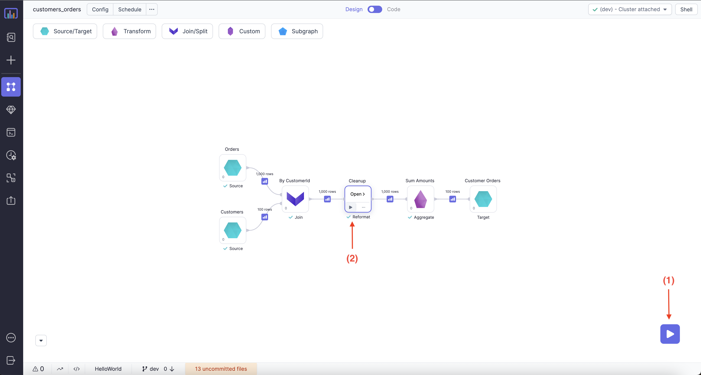
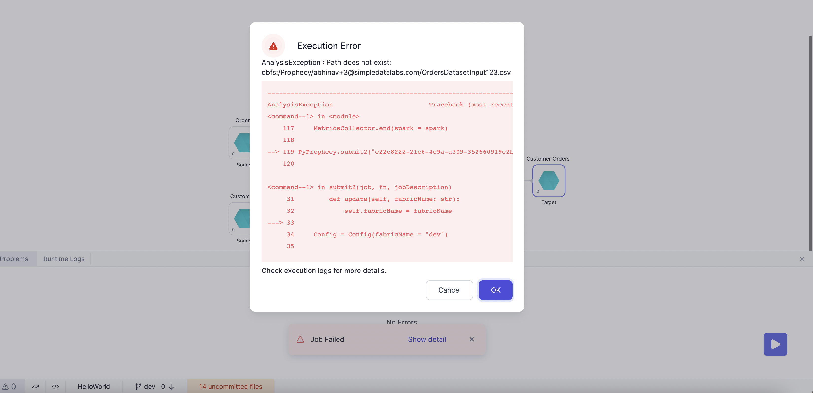
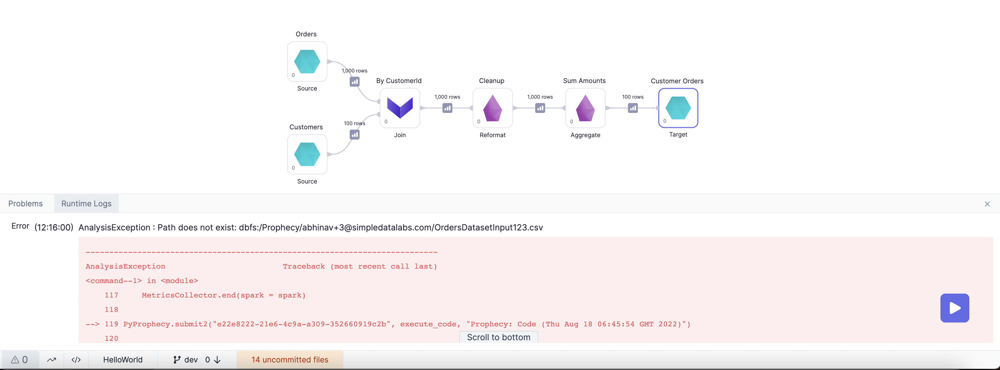
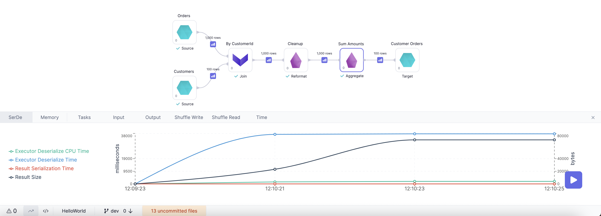
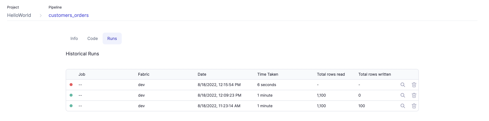
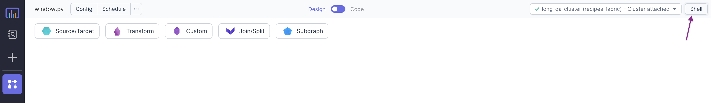
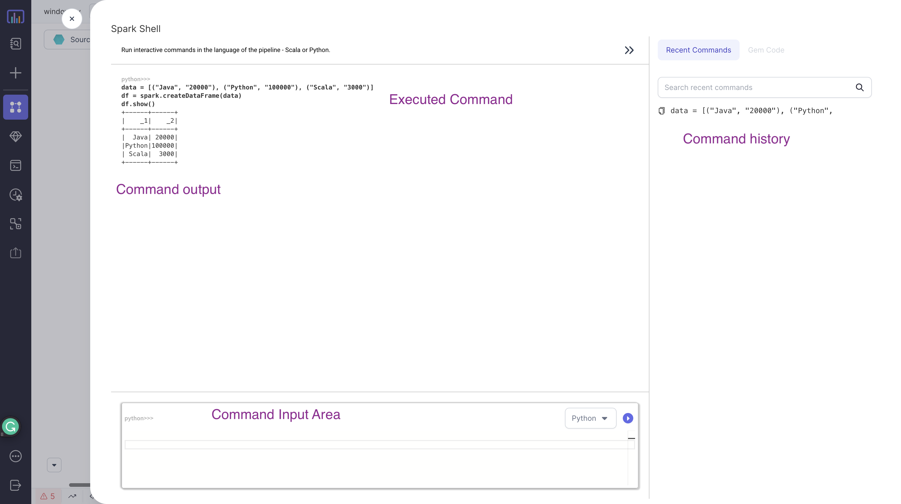

## Running a Pipeline

There are 2 ways to run a Pipeline interactively:



1. Using the play button from the bottom right side. This would execute the entire Pipeline.
2. Using the play button on a particular Gem. This would only execute the flow in the Pipeline up to and including that Gem. This comes
   in handy during development, so that we don't have to run the entire Pipeline to debug/change a particular Gem.

<div class="wistia_responsive_padding" style={{padding:'56.25% 0 0 0', position:'relative'}}>
<div class="wistia_responsive_wrapper" style={{height:'100%',left:0,position:'absolute',top:0,width:'100%'}}>
<iframe src="https://user-images.githubusercontent.com/103921419/185360973-928612ae-7655-4e67-8f95-ae9b63829231.mp4" title="Monitoring" allow="autoplay;fullscreen" allowtransparency="true" frameborder="0" scrolling="no" class="wistia_embed" name="wistia_embed" msallowfullscreen width="100%" height="100%"></iframe>
</div></div>

## Interims

During development, often the user will want to see their data to make more sense of it and to check whether the expected output is getting
generated or not after the transformation. Prophecy generates these data samples as `Interims`, which are temporarily cached previews of data after each Gem.
Which Gems automatically get Interims created is controlled by the Pipeline settings as shown below.

By default, for interactive runs, data sampling is enabled for all components. This behaviour can be configured as needed from the
`options` menu as shown in image below:

```mdx-code-block
import App from '@site/src/components/slider';

export const ImageData = [
  {
    "image":"/img/interactive-execution/interactive-execution-interims-config.png",
    "description":<h3 style={{padding:'10px'}}>Data Sampling Configuration</h3>,
  },
  {
    "image":"/img/interactive-execution/interactive-execution-interim-all.png",
    "description":<h3 style={{padding:'10px'}}>Data Sampling Mode - All</h3>,
  },
  {
    "image":"/img/interactive-execution/interactive-execution-interim-source.png",
    "description":<h3 style={{padding:'10px'}}>Data Sampling Mode - Source</h3>
  },
  {
    "image":"/img/interactive-execution/interactive-execution-interim-target.png",
    "description":<h3 style={{padding:'10px'}}>Data Sampling Mode - Target</h3>,
  },
  {
    "image":"/img/interactive-execution/interactive-execution-interim-io.png",
    "description":<h3 style={{padding:'10px'}}>Data Sampling Mode - IO</h3>,
  },
  {
    "image":"/img/interactive-execution/interactive-execution-sample-interim.png",
    "description":<h3 style={{padding:'10px'}}>Interim example</h3>,
  },
];

<App ImageData={ImageData}></App>
```

- (1) - Option to enable/disable data sampling during interactive runs.
- (2) - Option to choose the level of data sampling for interactive runs.
- (3) - Option to enable/disable data sampling for Job runs (scheduled/interactive). Level of data sampling can be configured same as (2). If enabled the interims would be stored in [execution metrics](#execution-metrics) for scheduler runs as well.

## Execution

Once we run a Pipeline, we have several options to better understand our Pipeline:

- [Execution code](#execution-code)
- [Execution Errors](#execution-errors)
- [Runtime Logs](#runtime-logs)
- [Runtime Metrics](#runtime-metrics)
- [Execution Metrics](#execution-metrics)

### Execution Code

Once we run a Pipeline interactively Prophecy generates the execution code in the backend, which is then executed in
the selected Fabric.


:::info
Execution code can also be copy-pasted inside `databricks notebook` or [shell](#shell) and can directly
be executed for debugging.
:::

### Execution Errors

If there are any errors in the Pipeline, a pop-up window will open for `execution errors`.


Also the error can be seen in the runtime logs:


### Runtime Logs

Overall progress with associated timestamps can be monitored from the Runtime Logs as shown here:


### Runtime Metrics

Various Spark metrics collected during runtime can be monitored as shown here:



### Execution Metrics

For `interactive runs` execution metrics are collected to make the development easier and performance tuning more intuitive. These can be
accessed from the `Metadata Page` inside the `run tab` of the `Pipeline`.



## Shell

Prophecy IDE comes with an inbuilt interactive Spark shell that supports both `Python` and `Scala`. The shell is an easy way to quickly analyze data or test Spark commands


:::info
`Spark context` and `session` are available within the shell as variables `sc` and `spark` respectively
:::

---

### Examples

:::note
You need to be connected to a cluster to access the interactive shell
:::

#### Python



#### Scala


