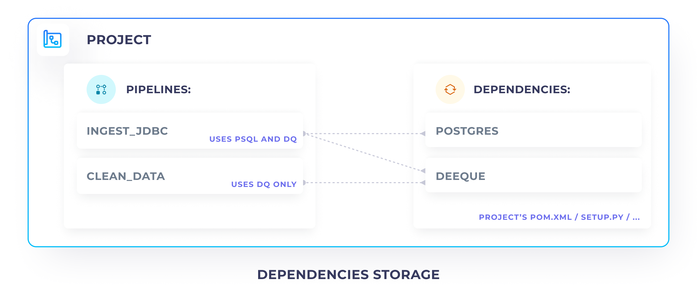
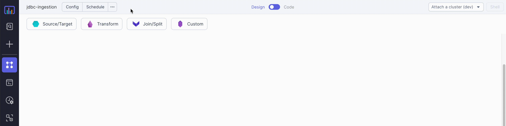
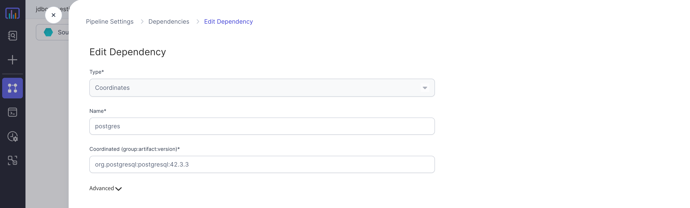
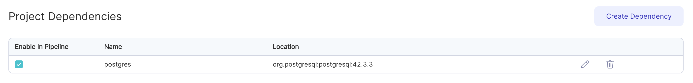
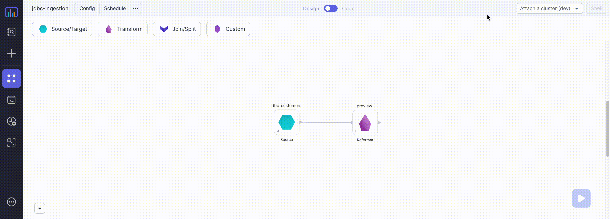
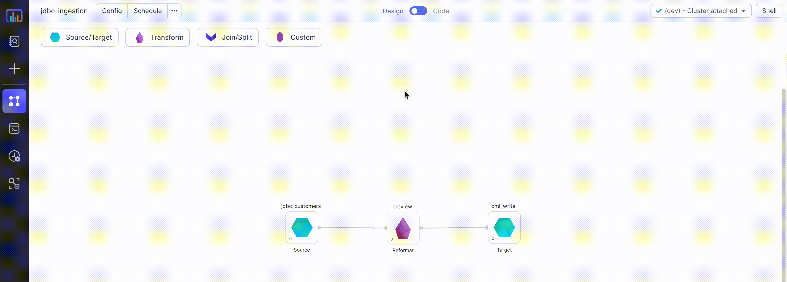

Dependencies allow you to make use of third-party or custom code in your data Pipelines and Jobs. Dependencies can be
written in Java, Scala, or PySpark, and can be connected to your data Pipelines by pointing
to [Maven](https://mvnrepository.com/) or [PyPi](https://pypi.org/) coordinates.

## Storage



All of your dependencies are stored at the Project-level. When adding a dependency to a single
Pipeline, by default it becomes available to all the other Pipelines within the same Project. However, within each
Pipeline you can control if a given dependency should be enabled or disabled.

Dependencies are natively saved within your build-system files. E.g. if you're using Scala, they're saved in the
**pom.xml** file, if you're using Python, they're saved in the **setup.py** file. To customize the build system further,
please check out the [Custom Build Tool](#build-tool-customization) section.

## Common Actions

### See dependencies



To see all of your Project and Pipeline dependencies simply open the **Manage Dependencies** screen by going to **... >
Options > Manage Dependencies**.

### Add dependency

To add the dependency, first click [dependencies list](#see-dependencies). There you will see a complete list of your
dependencies. Click on **Create Dependency** to add a new dependency.



To define a new dependency, specify the following:

1. **Type** - which can be either **Coordinates (Maven)** or **Package (PyPi)** (Python Projects only).
2. **Name** - the name of your dependency - this can be any name, chosen by you to easier identify each dependency
3. **Coordinates** - maven coordinates in the `groupId:artifcatId:version` format (e.g. `org.postgresql:postgresql:42.3.3`)

For further customization of your dependency you can additionally define **Advanced** properties:

1. **Repository** - by default your dependency is fetched from **Maven Central** repository. If you'd like to use an external repository (e.g. your organizations' repository) you can specify the link to it here. Please note
   the repository must be publicly accessible.
2. **Exclusions** - optional list of of `groupId:artifactId` pairs, of dependencies you'd like to exclude. Learn more
   about dependency
   exclusion [here](https://maven.apache.org/guides/introduction/introduction-to-optional-and-excludes-dependencies.html#dependency-exclusions)
   .

After you defined the Dependency press **Save**. Prophecy is going to validate the dependency and add it to the Project,
making it enabled in the current workflow, and adding it as dependency (but disabled) among all other Pipelines in the Project.

When adding dependencies, Prophecy validates that the dependency coordinates are valid and accessible. If
that fails, you should see an invalid coordinates error.

:::info Invalid coordinates
In rare cases, your dependency might be only accessible to the Spark cluster or the build system but not Prophecy
itself. If you're confident that the dependency is correct, but the validation error shows up, it's safe to press **Save
Anyways** to ignore that warning.
:::

### Enable / Disable dependency



Since dependencies are stored at a Project-level, any changes, like adding or deleting a dependency affects all the
Pipelines in that Project. To selectively enable or disable a dependency for a specific Pipeline, you can use the **Enable In Pipeline**
option.

### Delete dependency

To delete a dependency click on a trash icon on the dependencies list.

:::caution Deleting a dependency

Deleting a dependency deletes it within the whole Project, and all inheriting Pipelines. If you're not confident about
the functionality of the other Pipelines, it's usually better to disable a dependency, instead of deleting it.

:::

### Installing on a cluster



Whenever you connect the Pipeline to a cluster, dependencies are automatically installed on your cluster. If the
cluster doesn't have the dependency installed yet, Prophecy installs it and restarts the cluster automatically.

## Build Tool Customization

Project level templates can be defined on the **advanced** tab on the Project main screen to generate the build files for all Pipelines present inside a Project.
By default, Project Level Templating is enabled for new Projects.
The **template** can be customised at the Project level as per need.

<div class="wistia_responsive_padding" style={{padding:'56.25% 0 0 0', position:'relative'}}>
<div class="wistia_responsive_wrapper" style={{height:'100%',left:0,position:'absolute',top:0,width:'100%'}}>
<iframe src="https://user-images.githubusercontent.com/103921419/175944764-1289eac2-4f24-4fe1-8893-7e98e298ddd5.mp4" title="Enable templating" allow="autoplay;fullscreen" allowtransparency="true" frameborder="0" scrolling="no" class="wistia_embed" name="wistia_embed" msallowfullscreen width="100%" height="100%"></iframe>
</div></div>

---

:::info
For Projects created before **Prophecy 2.0 release on 24th June 2022**, Project templating would be disabled by default. We highly recommend you to enable it
as shown in the process below:

<div class="wistia_responsive_padding" style={{padding:'56.25% 0 0 0', position:'relative'}}>
<div class="wistia_responsive_wrapper" style={{height:'100%',left:0,position:'absolute',top:0,width:'100%'}}>
<iframe src="https://user-images.githubusercontent.com/103921419/175944722-32fc6e26-75d7-4c91-be7d-e8cc9afb34be.mp4" title="Old Project Enable templating" allow="autoplay;fullscreen" allowtransparency="true" frameborder="0" scrolling="no" class="wistia_embed" name="wistia_embed" msallowfullscreen width="100%" height="100%"></iframe>
</div></div>

As soon as Project templating is enabled and any Pipeline is opened on the browser, the existing **pom.xml/build.py** files
would get updated automatically with the new template defined at the Project level. The **pom.xml/build.py** files include the dependencies defined
in the **... > Options > Manage Dependencies** screen as well. Please **commit the changes and re-release the Project** for
changes to take effect in the Job.

For any help required in enabling the Project template for older Projects, please reach out to Prophecy support team.
:::

## Jobs Support

For Projects in which templating is enabled, dependencies are added automatically to **pom.xml/build.py** files as soon as they
are added on the **...> Options > Manage Dependencies** screen.

### Scala

<div class="wistia_responsive_padding" style={{padding:'56.25% 0 0 0', position:'relative'}}>
<div class="wistia_responsive_wrapper" style={{height:'100%',left:0,position:'absolute',top:0,width:'100%'}}>
<iframe src="https://user-images.githubusercontent.com/103921419/175944754-84002ed5-2c7c-4ed5-94bd-dd9c7e077e36.mp4" title="Auto addition to pom file for scala" allow="autoplay;fullscreen" allowtransparency="true" frameborder="0" scrolling="no" class="wistia_embed" name="wistia_embed" msallowfullscreen width="100%" height="100%"></iframe>
</div></div>

### Python

<div class="wistia_responsive_padding" style={{padding:'56.25% 0 0 0', position:'relative'}}>
<div class="wistia_responsive_wrapper" style={{height:'100%',left:0,position:'absolute',top:0,width:'100%'}}>
<iframe src="https://user-images.githubusercontent.com/103921419/175944746-5300acd1-90b2-4356-8190-128dbe06d0b3.mp4" title="Auto addition to build file for python" allow="autoplay;fullscreen" allowtransparency="true" frameborder="0" scrolling="no" class="wistia_embed" name="wistia_embed" msallowfullscreen width="100%" height="100%"></iframe>
</div></div>

---

:::info
For older Projects in which templating is disabled, the dependencies added to the Pipelines are not propagated to the scheduled Jobs automatically.
**(We highly recommend to enable the templating for all Projects, rather than editing the pom.xml files manually)**

Though, if you want to keep the templating disabled at Project level and still want to add dependencies for Scala Projects such that it is visible to your Pipeline when it's scheduled, it has to be **manually** added to the **pom.xml** file. Below is an example on how it can be achieved:

The dependency should be added anywhere between the `<dependencies></dependencies>` tags. For instance to add `io.github.etspaceman:scalacheck-faker_2.12:7.0.0` dependency, add it to the **pom.xml** like so:



```xml
...
<dependencies>
    <dependency>
        <groupId>io.github.etspaceman</groupId>
        <artifactId>scalacheck-faker_2.12</artifactId>
        <version>7.0.0</version>
    </dependency>

    ...
</dependencies>
...
```

:::
