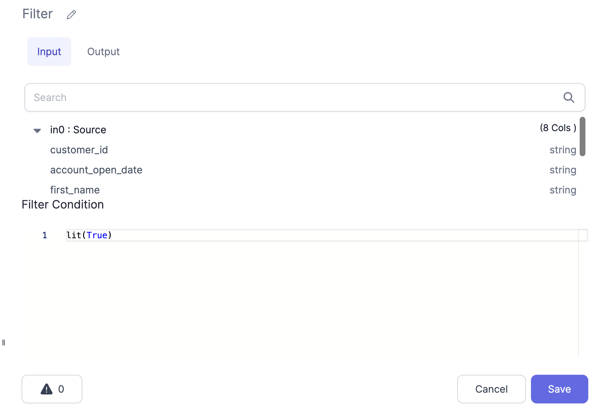
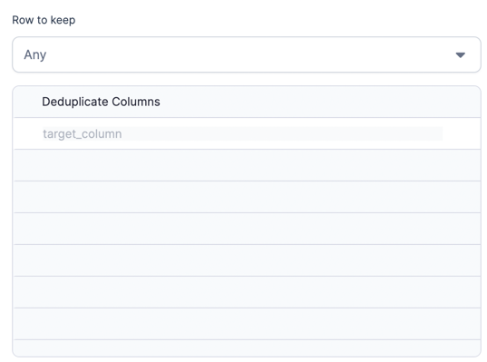
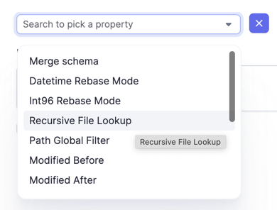
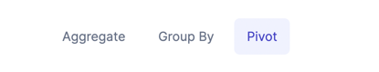

# UI Components
There are various UI Components that can be defined for your gem like you can divide a pane into section, add columns. You can have Scroll box, tabs, buttons, checkbox, etc.
The `Dialog` object returned from here is serialized into JSON, sent to the UI and rendered there.

In this document we will see how to add different UI compnents in you Gem builder dialog with examples. 
Lets take below dialog function for example 

### Transform Dialog

The Dialog function defined in a transform gem returns a Dialog object.

````mdx-code-block
import Tabs from '@theme/Tabs';
import TabItem from '@theme/TabItem';

<Tabs>

<TabItem value="py" label="Python">

```py

    def dialog(self) -> Dialog:
        return Dialog("Filter").addElement(
            ColumnsLayout(height="100%")
                .addColumn(PortSchemaTabs(selectedFieldsProperty=("columnsSelector")).importSchema(), "2fr")
                .addColumn(StackLayout(height=("100%"))
                .addElement(TitleElement("Filter Condition"))
                .addElement(
                Editor(height=("100%")).withSchemaSuggestions().bindProperty("condition.expression")
            ), "5fr"))

```

</TabItem>
<TabItem value="scala" label="Scala">

```scala

  def dialog: Dialog = Dialog("Filter")
    .addElement(
      ColumnsLayout(height = Some("100%"))
        .addColumn(
          PortSchemaTabs(selectedFieldsProperty = Some("columnsSelector")).importSchema(),
          "2fr"
        )
        .addColumn(
          StackLayout(height = Some("100%"))
            .addElement(TitleElement("Filter Condition"))
            .addElement(
              Editor(height = Some("100%"))
                .withSchemaSuggestions()
                .bindProperty("condition.expression")
            ),
          "5fr"
        )
    )
    
```

</TabItem>
</Tabs>
````

This is how the Rendered UI looks for above dialog code.


You start by giving a title to your dialog, "Filter" in this case. And then add one or more elements to it. Here we are adding just one.

#### Element
Element is nothing but has child elements inside it to divide you UI pane. Everything you add essentially is an element like ColumnsLayout, TextBox, etc. 
Elements can be added to a dialoge using the addElements method.
For example if we add two elements instead of one element with two columns, it will render something like this.


Example code: 
````mdx-code-block

<Tabs>

<TabItem value="py" label="Python">

```py
   def dialog(self) -> Dialog:
        return Dialog("Filter").addElement(
            ColumnsLayout(height="50%")
                .addColumn(PortSchemaTabs(selectedFieldsProperty=("columnsSelector")).importSchema(), "2fr")
                ).addElement(
            ColumnsLayout(height="50%")
                .addColumn(StackLayout(height=("100%"))
                .addElement(TitleElement("Filter Condition"))
                .addElement(
                Editor(height=("100%")).withSchemaSuggestions().bindProperty("condition.expression")
            ), "5fr"))

```

</TabItem>
<TabItem value="scala" label="Scala">

```scala

  def dialog: Dialog = Dialog("Filter")
    .addElement(
      ColumnsLayout(height = Some("50%"))
        .addColumn(
          PortSchemaTabs(selectedFieldsProperty = Some("columnsSelector")).importSchema(),
          "2fr"
        )    
    ).addElement(
      ColumnsLayout(height = Some("50%"))
        .addColumn(
          StackLayout(height = Some("50%"))
            .addElement(TitleElement("Filter Condition"))
            .addElement(
              Editor(height = Some("100%"))
                .withSchemaSuggestions()
                .bindProperty("condition.expression")
            ),
          "2fr"
        )
    )

```

</TabItem>
</Tabs>
````

#### Layouts
The child components of this `Element` are `Layouts`. We have the following kind of Layouts available:
* `ColumnsLayout`: Divides the area on screen into different Columns. ColumnLayout is an element Which takes in an element Column,and you can pass in a width for that column. We have seen an example of this in the above example.
* `StackLayout`: Stacks various child elements one under another (`direction:vertical`) or one next to the other (`direction:horizontal`). You can add elements to a stack again using the addElement method. 
Example:
`StackLayout(height = Some("100%")).addElement(selectBox).addElement(testTable)`
Where selectBox and testTable are already defined elements.
  

## DataSet Dialog

The Dialog function defined in a transform gem returns a DatasetDialog object. Also note that a datasource gem will need to have source and target dialog functions separately.

#### Section
In a `DatasetDialog`, sections can be defined which are different panes, each containing properties to be set etc.
A section can be added to a `Dialig` using the `addSection` function.
addSection takes in a title for the Section and an element object. 
Example: `.addSection("PREVIEW", PreviewTable("").bindProperty("schema")`


### Navigation related UI

#### ScrollBox
This component is used to add a scroll box on UI like this.


Example code: 
````mdx-code-block

<Tabs>

<TabItem value="py" label="Python">

```py
ScrollBox().addElement(
                    StackLayout(height=("100%"))
                        .addElement(
                        StackItem(grow=(1)).addElement(
                                .addField(Checkbox("Merge schema"), "mergeSchema")
                                .addField(
                                SelectBox("Datetime Rebase Mode")
                                    .addOption("EXCEPTION", "EXCEPTION")
                                    .addOption("CORRECTED", "CORRECTED")
                                    .addOption("LEGACY", "LEGACY"),
                                "datetimeRebaseMode"
                            )
                                .addField(
                                SelectBox("Int96 Rebase Mode")
                                    .addOption("EXCEPTION", "EXCEPTION")
                                    .addOption("CORRECTED", "CORRECTED")
                                    .addOption("LEGACY", "LEGACY"),
                                "int96RebaseMode"
                            )
                                .addField(Checkbox("Recursive File Lookup"), "recursiveFileLookup")
                                .addField(TextBox("Path Global Filter").bindPlaceholder(""), "pathGlobFilter")
                                .addField(TextBox("Modified Before").bindPlaceholder(""), "modifiedBefore")
                                .addField(TextBox("Modified After").bindPlaceholder(""), "modifiedAfter")
                        )
                    )
                ),

```

</TabItem>
<TabItem value="scala" label="Scala">

```scala

  StackItem(grow = Some(1)).addElement(
                  FieldPicker(height = Some("100%"))
                    .addField(Checkbox("Merge schema"), "mergeSchema")
                    .addField(
                      SelectBox("Datetime Rebase Mode")
                        .addOption("EXCEPTION", "EXCEPTION")
                        .addOption("CORRECTED", "CORRECTED")
                        .addOption("LEGACY", "LEGACY"),
                      "datetimeRebaseMode"
                    )
                    .addField(
                      SelectBox("Int96 Rebase Mode")
                        .addOption("EXCEPTION", "EXCEPTION")
                        .addOption("CORRECTED", "CORRECTED")
                        .addOption("LEGACY", "LEGACY"),
                      "int96RebaseMode"
                    )
                    .addField(Checkbox("Recursive File Lookup"), "recursiveFileLookup")
                    .addField(TextBox("Path Global Filter").bindPlaceholder(""), "pathGlobFilter")
                    .addField(TextBox("Modified Before").bindPlaceholder(""), "modifiedBefore")
                    .addField(TextBox("Modified After").bindPlaceholder(""), "modifiedAfter")
                )

```

</TabItem>
</Tabs>
````
#### Tabs

This component is used to render Tabs in UI like this: 


Example code: 
````mdx-code-block

<Tabs>

<TabItem value="py" label="Python">

```py
                Tabs()
                    .bindProperty("activeTab")
                    .addTabPane(
                    TabPane("Group By", "groupBy").addElement(
                        ExpTable("Group By Columns").bindProperty("groupBy")
                    )
                )
```

</TabItem>
<TabItem value="scala" label="Scala">

```scala

 Tabs()
              .bindProperty("activeTab")
              .addTabPane(
                TabPane("Group By", "groupBy")
                  .addElement(
                    ExpTable("Group By Columns")
                      .bindProperty("groupBy")
                  )
              )
```

</TabItem>
</Tabs>
````

#### Buttons

Used to add a button on UI.


````mdx-code-block

<Tabs>

<TabItem value="py" label="Python">

```py
                 Button("Add Transformation").bindOnClick(self.onClickFunc).addElement(
                            NativeText("Add Transformation")))
```

</TabItem>
<TabItem value="scala" label="Scala">

```scala

 Button(
"Create Dataset",
children = List(NativeText("Create Dataset")),
variant = Some(ButtonVariant.tertiaryGrey),
block = Some(true),
style = Some(Map("width" -> "100%", "height" -> "48px")),
onClick = Some { state: Any ⇒
openCreateDatasetDialog(state.asInstanceOf[WorkflowProcess])
}
)
```

</TabItem>
</Tabs>
````


### Forms and Capturing Data
#### FieldSelector
#### Checkbox
#### Field
#### RadioGroup

#### Credentials
#### FileEditor
#### Editor
#### SelectBox
#### NumberBox


### Prophecy Specific Components
#### SchemaSelectBox
#### SchemaTable
#### PortSchema
#### FileBrowser
#### Dataset
#### PreviewTable
#### ExpressionBox
#### AutoComplete

More such component: NewDataSet, Database/Catalogue table, 

### Formatting Related UI Components
#### Text
#### Divider
#### List
#### CodeBlock
#### Table