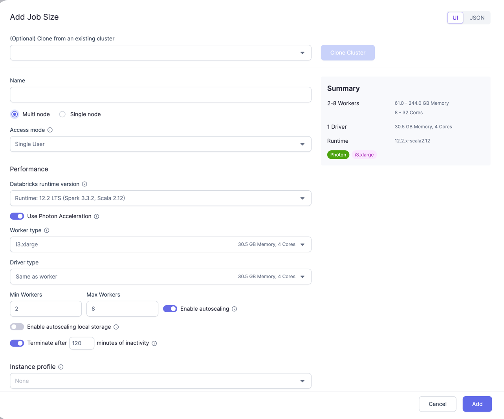

Prophecy provides you with three different types of Fabrics.

### **Prophecy Managed**

Using this option, you can create a 14-Day Free Trial Fabric, On Prophecy Managed Databricks. You can use this when trying out Prophecy and when you don't want to connect your own Spark Execution Environment to Prophecy. We already have some sample data and tables created to try out the different functionalities.
Please refer below video for step-by-step example

<iframe src="https://user-images.githubusercontent.com/121796483/217787623-1cf01df2-54d6-4338-bd59-bd921e101ce9.mp4" title="Databricks Fabric" allow="autoplay;fullscreen" allowtransparency="true" frameborder="0" scrolling="no" class="wistia_embed" name="wistia_embed" msallowfullscreen width="100%" height="100%"></iframe>

In this Fabric you can only change the [Databricks Runtime version](https://docs.databricks.com/runtime/dbr.html#databricks-runtime). The auto-termination timeout, Executor and Driver Machine Type and Job sizes are uneditable.

### **Databricks**

To connect your own Databricks Workspace to Prophecy, you can use this option to create a Fabric. Think of a Fabric as connection to your [Databricks workspace](https://docs.databricks.com/workspace/index.html#navigate-the-workspace).

Please refer below video for step-by-step example

<iframe src="https://user-images.githubusercontent.com/121796483/217735090-41853091-ef2e-4d60-bdf6-62fe31a7ee3b.mp4" title="Databricks Fabric" allow="autoplay;fullscreen" allowtransparency="true" frameborder="0" scrolling="no" class="wistia_embed" name="wistia_embed" msallowfullscreen width="100%" height="100%"></iframe>

- **Databricks Credentials** - Here you will provide your Databricks Workspace URL and the [Personal Access token](https://docs.databricks.com/dev-tools/api/latest/authentication.html#generate-a-personal-access-token)
- **Cluster Details** - Here you would need to provide the [Databricks Runtime version](https://docs.databricks.com/runtime/dbr.html#databricks-runtime), Executor and Drive Machine Types and Termination Timeout if any. These cluster details will be used when creating a cluster via Prophecy during Interactive development and for job clusters during Scheduled Databricks Job runs.
- **Job sizes** - User can create Job sizes here using which clusters can be spawned while testing through prophecy IDE. Here you can provide Cluster mode, Databricks Runtime version, total number of the Executors, Core and Memory for them, etc. This provides all the options which are available on Databricks while spawning clusters through Databricks.

In Json you can just copy-paste your compute Json from Databricks.

- **Prophecy Library** - These are some Scala and Python libraries written by Prophecy to provide additional functionalities on top of Spark. These would get automatically installed in your Spark execution environment when you attach to a cluster/create new cluster. These libraries are also publicly available on Maven central and Pypi respectively.
- **Metadata Connection** - Optionally, enhance your Fabric by creating a [Metadata Connection](/docs/metadata/metadata-connections.md), recommended for users with hundreds or thousands of tables housed in their data provider(s).

### **Livy**

[Apache Livy](https://livy.apache.org/) is a service that enables easy interaction with a Spark cluster over a REST interface. If you're running Spark-on-hadoop, most Hadoop distributions (CDP/MapR) come with livy bundled, you just need to enable it. For Spark-on-k8s, you can put a livy in the k8s cluster which exposes Spark over rest API.

Please refer below video for step-by-step example, or learn how to configure an EMR Fabric with Livy [here](/docs/low-code-spark/fabrics/emr-fabric.md).

<iframe src="https://user-images.githubusercontent.com/121796483/217732038-d01bbfbe-a140-4661-a279-1b4858ab2285.mp4" title="Livy Fabric" allow="autoplay;fullscreen" allowtransparency="true" frameborder="0" scrolling="no" class="wistia_embed" name="wistia_embed" msallowfullscreen width="100%" height="100%"></iframe>

- **Spark Connection** - Here you will provide the Livy URL, Authentication, Spark version and Scala version. Spark and Scala versions are used when user tries to attach a cluster using this Fabric.

:::note
The Spark and Scala versions are now mandatory with recent [Release](/release_notes/Feb_2023#spark-and-scala-versions-are-now-required-in-livy-Fabrics).
If users has an old Fabric which doesn't have Spark abd Scala versions present, an error (seen below) will appear when trying to attach to a cluster. User would need to update the Fabric from the metadata page or by clicking `Update Fabric` button (seen below).

:::

- **Job sizes** -
  By default, you will see a Small Job size pre created. You can edit or add more Job sizes. A Job sie consists off

  - Size of the Driver: Driver Core and Memory
  - Size of the Executor: Core and Memory for each executor
  - Total number of Executors

- **Prophecy Library** -
  These are some Scala and Python libraries written by Prophecy to provide additional functionalities on top of Spark. These would get automatically installed in your Spark execution environment when you attach to a cluster/create new cluster. These libraries are also publicly available on Maven central and Pypi respectively.

- **Spark Config** -
  These are additional [Spark Properties](https://spark.apache.org/docs/latest/configuration.html#available-properties) which you can set which would be applied at Spark session initialisation.
  For example if your Spark installation is configured to have dynamic allocation enabled, you can disable it for sessions created through Prophecy.
