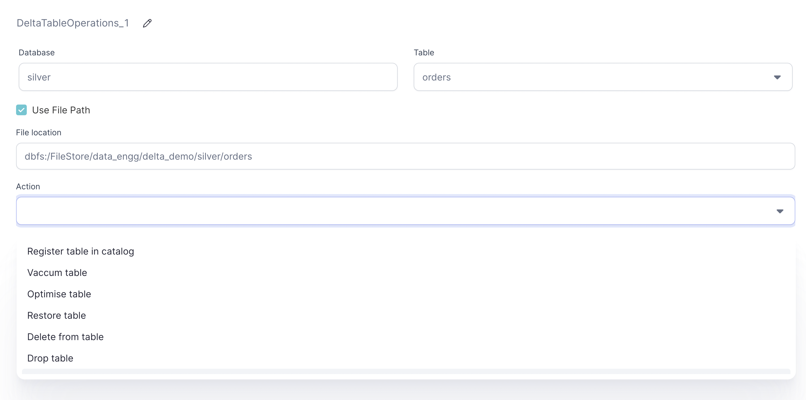

Helps perform the following operations on delta tables.

1. Register table in catalog
2. Vaccum table
3. Optimize table
4. Restore table
5. Delete from table
6. Drop table
7. FSCK Repair table

## Parameters

| Parameter     | Description                    | Required |
| :------------ | :----------------------------- | :------- |
| Database name | Database name                  | False    |
| Table name    | Table name                     | False    |
| File path     | File path for delta table      | False    |
| Action        | Action to perform on the table | True     |

:::note
At lease one value from table name or file path needs to be provided.
:::

## Example

## Register table in catalog

This will register the data at mentioned file path as a table in catalog.

## Vaccum table

Recursively vacuum directories associated with the Delta table. VACUUM removes all files from the
table directory that are not managed by Delta, as well as data files that are no longer in the
latest state of the transaction log for the table and are older than a retention threshold. The
default threshold is 7 days.

To know more about vaccum [click here](https://docs.databricks.com/spark/latest/spark-sql/language-manual/delta-vacuum.html).

### Parameters

| Parameter       | Description         | Required |
| :-------------- | :------------------ | :------- |
| Retention hours | Retention threshold | False    |

## Optimize table

Optimizes the layout of Delta Lake data. Optionally optimize a subset of data or colocate
data by column. If colocation is not specified, bin-packing optimization is performed by default.

To know more about optimize [click here](https://docs.databricks.com/spark/latest/spark-sql/language-manual/delta-optimize.html).

### Parameters

| Parameter    | Description                                                                                                                        | Required |
| :----------- | :--------------------------------------------------------------------------------------------------------------------------------- | :------- |
| Where clause | Optimize the subset of rows matching the given partition predicate. Only filters involving partition key attributes are supported. | False    |
| ZOrder By    | List of columns to perform ZOrder on                                                                                               | False    |

## Restore table

Restores a Delta table to an earlier state. Restoring to an earlier version number or a
timestamp is supported.

### Parameters

| Parameter   | Description                                | Required |
| :---------- | :----------------------------------------- | :------- |
| Restore via | Restore the table via timestamp or version | False    |
| Value       | Value to restore on                        | False    |

## Delete from table

Delete removes the data from the latest version of the Delta table as per the condition
specified below. Please note that delete does not remove it from the physical storage
until the older versions are explicitly vacuumed.

### Parameters

| Parameter    | Description                                           | Required |
| :----------- | :---------------------------------------------------- | :------- |
| Where clause | Condition which needs to be satisfied to delete a row | True     |

## Drop table

This will drop the table from catalog and remove the files.

## FSCK Repair table

Removes the file entries from the transaction log of a Delta table that can no longer be found in
the underlying file system. This can happen when these files have been manually deleted.

To know more about fsck repair [click here](https://docs.databricks.com/spark/latest/spark-sql/language-manual/delta-fsck.html).
