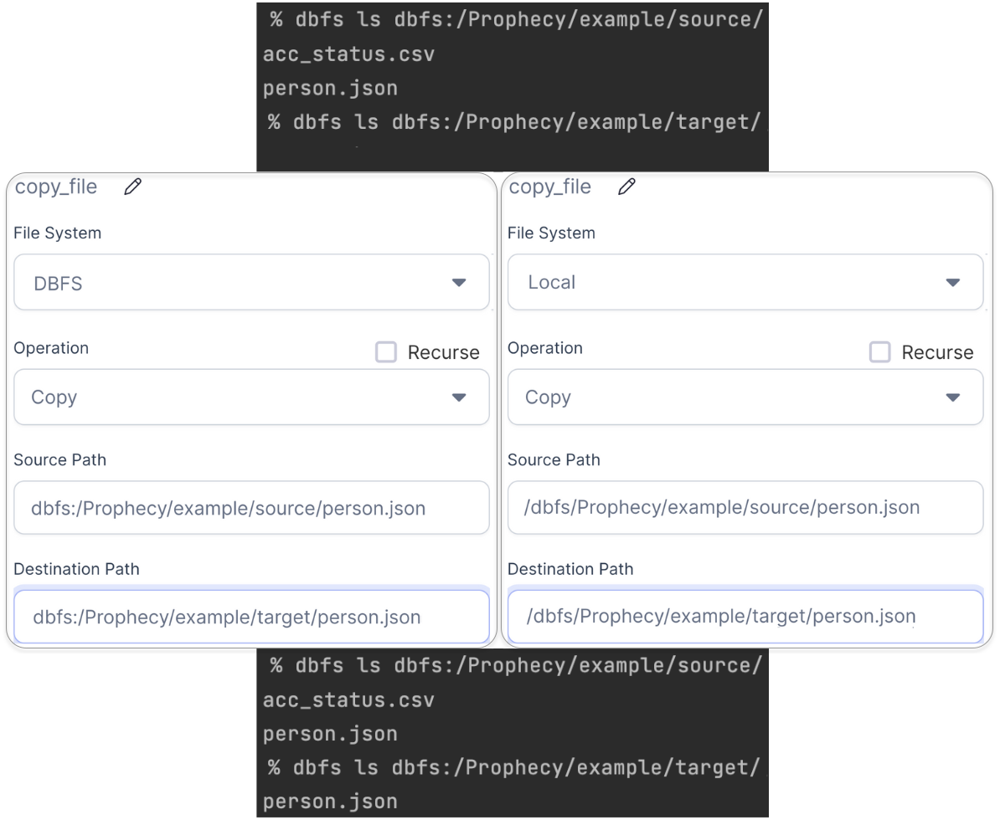
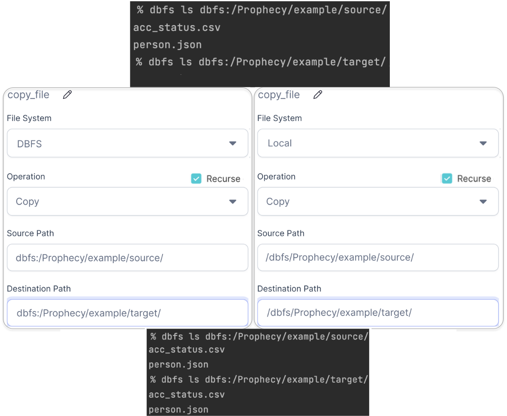
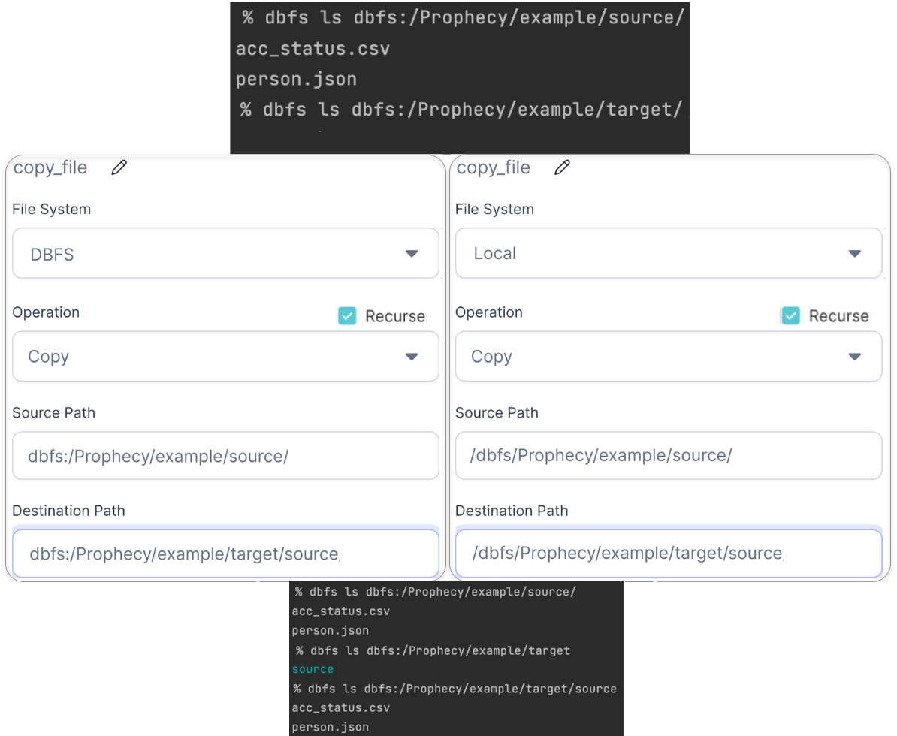

Helps perform file operations like `copy` and `move` on different file systems

### Parameters

| Parameter        | Description                                                                                                 | Required |
| :--------------- | :---------------------------------------------------------------------------------------------------------- | :------- |
| File System      | `Local` - for operations on driver node file system <br/> `DBFS` - for operations on Databricks file system | True     |
| Operation        | Operation to perform, `Copy` or `Move`                                                                      | True     |
| Recurse          | Boolean for performing `Operation` recursively. Default is `False`                                          | False    |
| Source Path      | Path of source file/directory. <br/>Eg: /dbfs/source_file.txt, dbfs:/source_file.txt                        | True     |
| Destination Path | Path of destination file/directory. <br/> Eg: /dbfs/target_file.txt, dbfs:/target_file.txt                  | True     |

:::info
You can perform operations on DBFS files using `Local` file system too by providing path under `/dbfs`!<br/>
This is because Databricks uses a FUSE mount to provide local access to the files stored in the cloud.
A FUSE mount is a secure, virtual filesystem.
:::

### Examples

---

#### Copy Single File



````mdx-code-block
import Tabs from '@theme/Tabs';
import TabItem from '@theme/TabItem';

<Tabs>

<TabItem value="py" label="DBFS">

```py
def copy_file(spark: SparkSession):
    from pyspark.dbutils import DBUtils
    DBUtils(spark).fs.cp(
        "dbfs:/Prophecy/example/source/person.json",
        "dbfs:/Prophecy/example/target/person.json",
        recurse = False
    )
```

</TabItem>
<TabItem value="py2" label="Local">

```py
def copy_file(spark: SparkSession):
    import os
    import shutil
    shutil.copy2("/dbfs/Prophecy/example/source/person.json",
                 "/dbfs/Prophecy/example/target/person.json")
```

</TabItem>
</Tabs>

````

---

#### Copy All Files From A Directory



````mdx-code-block
<Tabs>

<TabItem value="py" label="DBFS">

```py
def copy_file(spark: SparkSession):
    from pyspark.dbutils import DBUtils
    DBUtils(spark).fs.cp(
        "dbfs:/Prophecy/example/source/",
        "dbfs:/Prophecy/example/target/",
        recurse = True
    )
```

</TabItem>
<TabItem value="py2" label="Local">

```py
def copy_file(spark: SparkSession):
    import os
    import shutil
    shutil.copytree(
        "/dbfs/Prophecy/example/source/",
        "/dbfs/Prophecy/example/target/",
        copy_function = shutil.copy2,
        dirs_exist_ok = True
    )
```

</TabItem>
</Tabs>

````

---

#### Copy Entire Directory



````mdx-code-block
<Tabs>

<TabItem value="py" label="DBFS">

```python
def copy_file(spark: SparkSession):
    from pyspark.dbutils import DBUtils
    DBUtils(spark).fs.cp(
        "dbfs:/Prophecy/example/source/",
        "dbfs:/Prophecy/example/target/source",
        recurse = True
    )
```

</TabItem>
<TabItem value="py2" label="Local">

```python
def copy_file(spark: SparkSession):
    import os
    import shutil
    shutil.copytree(
        "/dbfs/Prophecy/example/source/",
        "/dbfs/Prophecy/example/target/source",
        copy_function = shutil.copy2,
        dirs_exist_ok = True
    )
```

</TabItem>
</Tabs>

````

---
