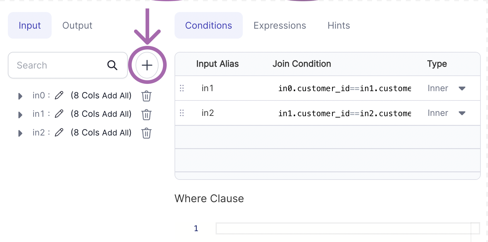
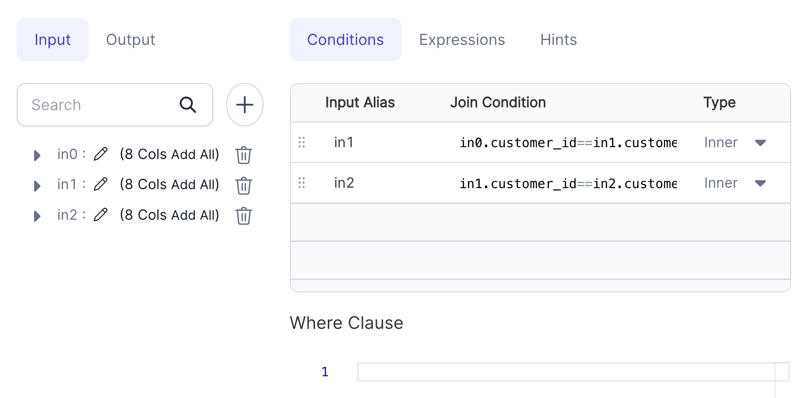
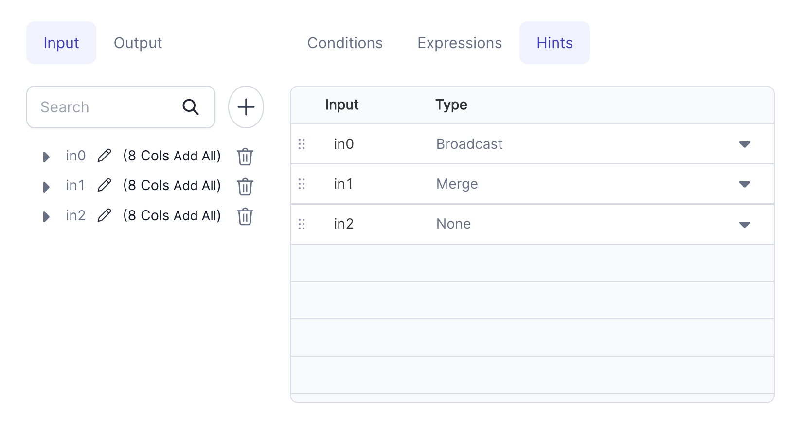

Performs various types of joins with one more dataframes

### Parameters

| Parameter                         | Description                                                                 | Required                               |
|:----------------------------------|:----------------------------------------------------------------------------|:---------------------------------------|
| Dataframe 1                       | First input dataframe                                                       | True                                   |
| Dataframe 2                       | Second input dataframe                                                      | True                                   |
| Dataframe N                       | Nth input dataframe                                                         | False                                  |
| Join Condition ( Conditions tab ) | The join condition specifies how the rows will be combined.                 | True                                   |
| Type ( Conditions tab )           | The type of JOIN (  Inner, Full Outer, Left , Right , Left Semi, Left Anti  | True                                   |
| Where Clause ( Conditions tab )   | Filter applied after the Join operation                                     | False                                  |
| Target column ( Expressions )     | Output column name                                                          | False                                  |
| Expression   ( Expressions )      | Expression to compute target column                                         | Required if a Target column is present |
| Type ( Hints )                    | The type of Hint ( Broadcast, Merge, Shuffle Hash, Shuffle Replicate NL     | False                                  |

### Add a new input
1. Click on the plus icon to add a new input.
2. Then add your condition expression for the newly added input.
   

### Examples

#### Example 1 - Join with three datasets

````mdx-code-block
import Tabs from '@theme/Tabs';
import TabItem from '@theme/TabItem';

<Tabs>
<TabItem value="py" label="Python">

```py
def total_orders(spark: SparkSession, in0: DataFrame) -> DataFrame:
        return in0\
        .alias("in0")\
        .join(in1.alias("in1"), (col("in0.customer_id") == col("in1.customer_id")), "inner")\
        .join(in2.alias("in2"), (col("in1.customer_id") == col("in2.customer_id")), "inner")
```

</TabItem>

<TabItem value="scala" label="Scala">

```scala
object total_orders {
   def apply(
    spark: SparkSession,
    in0:   DataFrame,
    in1:   DataFrame,
    in2:   DataFrame
  ): DataFrame =
    in0
      .as("in0")
      .join(in1.as("in1"), col("in0.customer_id") === col("in1.customer_id"), "inner")
      .join(in2.as("in2"), col("in1.customer_id") === col("in2.customer_id"), "inner")
}
```

</TabItem>
</Tabs>

````

#### Example 2 - Join with Hints


````mdx-code-block
import Tabs from '@theme/Tabs';
import TabItem from '@theme/TabItem';

<Tabs>
<TabItem value="py" label="Python">

```py
def total_orders(spark: SparkSession, in0: DataFrame) -> DataFrame:
        return in0\
        .alias("in0")\
        .hint("broadcast")\
        .join(in1.alias("in1").hint("merger"), (col("in0.customer_id") == col("in1.customer_id")), "inner")\
        .join(in2.alias("in2"),                (col("in1.customer_id") == col("in2.customer_id")), "inner")
```

</TabItem>

<TabItem value="scala" label="Scala">

```scala
object total_orders {
   def apply(
    spark: SparkSession,
    in0:   DataFrame,
    in1:   DataFrame,
    in2:   DataFrame
  ): DataFrame =
    in0
      .as("in0")
      .hint("broadcast")
      .join(in1.as("in1").hint("merge"), col("in0.customer_id") === col("in1.customer_id"), "inner")
      .join(in2.as("in2"),                col("in1.customer_id") === col("in2.customer_id"), "inner")
}
```

</TabItem>
</Tabs>

````

### Types of Join
Suppose there are 2 tables TableA and TableB with only 2 columns (Ref, Data) and following data:
### Table A
| Ref | Data     |    
|:----|:---------|
| 1   | Data_A11 | 
| 1   | Data_A12 |
| 1   | Data_A13 |
| 2   | Data_A21 | 
| 3   | Data_A31 | 

### Table B
| Ref | Data     |    
|:----|:---------|
| 1   | Data_B11 | 
| 2   | Data_B21 |
| 2   | Data_B22 |
| 2   | Data_B23 | 
| 4   | Data_B41 | 

### INNER JOIN
Inner Join on column Ref will return columns from both the tables and only the matching records  as long as the condition is satisfied:


| Ref | Data     | Ref | Data     |
|:----|:---------|:----|:---------|
| 1   | Data_A11 | 1   | Data_B11 |
| 1   | Data_A12 | 1   | Data_B11 |
| 1   | Data_A13 | 1   | Data_B11 |
| 2   | Data_A21 | 2   | Data_B21 |
| 2   | Data_A21 | 2   | Data_B22 |
| 2   | Data_A21 | 2   | Data_B23 |


### LEFT JOIN
Left Join (or Left Outer join) on column Ref will return columns from both the tables and match records with records from the left table. The result-set will contain null for the rows for which there is no matching row on the right side.

| Ref | Data     | Ref  | Data     |
|:----|:---------|:-----|:---------|
| 1   | Data_A11 | 1    | Data_B11 |
| 1   | Data_A12 | 1    | Data_B11 |
| 1   | Data_A13 | 1    | Data_B11 |
| 2   | Data_A21 | 2    | Data_B21 |
| 2   | Data_A21 | 2    | Data_B22 |
| 2   | Data_A21 | 2    | Data_B23 |
| 3   | Data_A31 | NULL | NULL     |

### RIGHT JOIN

Right Join (or Right Outer join) on column Ref will return columns from both the tables and match records with records from the right table. The result-set will contain null for the rows for which there is no matching row on the left side.

| Ref  | Data     | Ref | Data     |
|:-----|:---------|:----|:---------|
| 1    | Data_A11 | 1   | Data_B11 |
| 1    | Data_A12 | 1   | Data_B11 |
| 1    | Data_A13 | 1   | Data_B11 |
| 2    | Data_A21 | 2   | Data_B21 |
| 2    | Data_A21 | 2   | Data_B22 |
| 2    | Data_A21 | 2   | Data_B23 |
| NULL | NULL     | 4   | Data_B41 |

### FULL OUTER JOIN
Full Outer Join on column Ref will return columns from both the tables and matching records with records from the left table and records from the right table .  The result-set will contain NULL values for the rows for which there is no matching.

| Ref   | Data     | Ref   | Data     |
|:------|:---------|:------|:---------|
| 1     | Data_A11 | 1     | Data_B11 |
| 1     | Data_A12 | 1     | Data_B11 |
| 1     | Data_A13 | 1     | Data_B11 |
| 2     | Data_A21 | 2     | Data_B21 |
| 2     | Data_A21 | 2     | Data_B22 |
| 2     | Data_A21 | 2     | Data_B23 |
| 3     | Data_A31 | NULL  | NULL     |
| NULL  | NULL     | 4     | Data_B41 |

### LEFT SEMI JOIN
Left Semi Join on column Ref will return columns only from left table and matching records only from left table.

| Ref | Data     |    
|:----|:---------|
| 1   | Data_B11 | 
| 1   | Data_B21 |
| 1   | Data_B22 |
| 2   | Data_B23 | 
| 3   | Data_B41 | 

### LEFT ANTI JOIN
Left anti join on column Ref will return columns from the left for non-matched records :

| Ref | Data     | Ref  | Data     |
|:----|:---------|:-----|:---------|
| 3   | Data_A31 | NULL | NULL     |