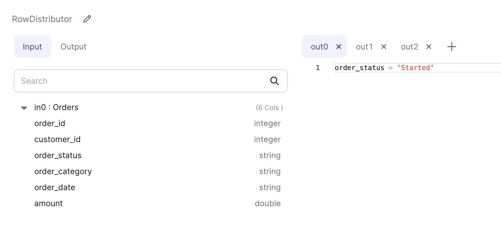

Create multiple Dataframes based on provided filter conditions from an input Dataframe.

This is useful for cases where rows from the input Dataframe needs to be distributed into multiple Dataframes in different ways for the downstream application/pipeline.

### Parameters

| Parameter         | Description                                                                                               | Required |
| ----------------- | --------------------------------------------------------------------------------------------------------- | -------- |
| Dataframe         | Input Dataframe for which rows needs to be distributed into multiple Dataframes                           | True     |
| Filter Conditions | Boolean Type column or boolean expression for each output tab. Supports SQL, Python and Scala expressions | True     |

### Example



:::info
Number of outputs can be changed as needed by clicking the `+` button.
:::

### Generated Code

````mdx-code-block
import Tabs from '@theme/Tabs';
import TabItem from '@theme/TabItem';

<Tabs>

<TabItem value="py" label="Python">

```py
def RowDistributor(spark: SparkSession, in0: DataFrame) -> (DataFrame, DataFrame, DataFrame):
    df1 = in0.filter((col("order_status") == lit("Started")))
    df2 = in0.filter((col("order_status") == lit("Approved")))
    df3 = in0.filter((col("order_status") == lit("Finished")))

    return df1, df2, df3
```

</TabItem>
<TabItem value="scala" label="Scala">

```scala
object RowDistributor {

  def apply(
    spark: SparkSession,
    in:    DataFrame
  ): (DataFrame, DataFrame, DataFrame) =
    (in.filter(col("order_status") === lit("Started")),
     in.filter(col("order_status") === lit("Approved")),
     in.filter(col("order_status") === lit("Finished"))
    )

}
```

</TabItem>
</Tabs>

````
