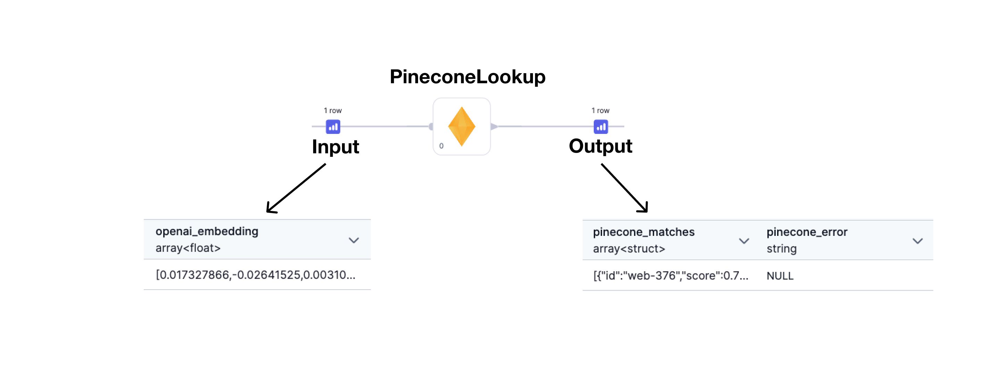
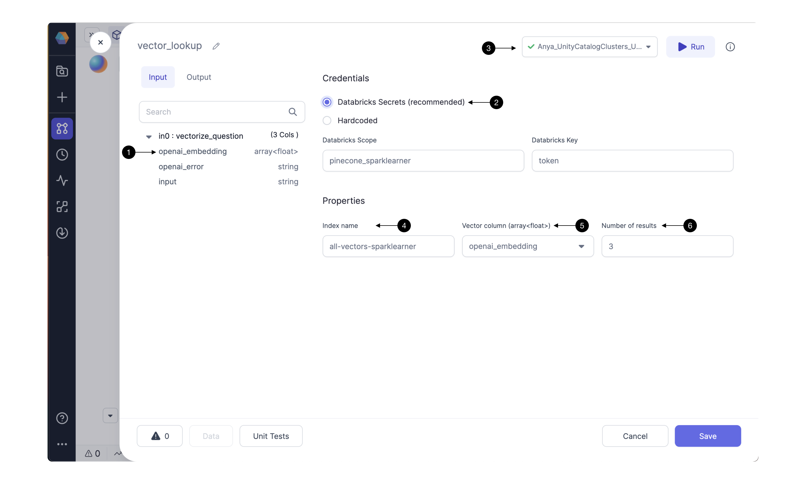

<div class="wistia_responsive_padding" style={{padding:'62.5% 0 0 0', position:'relative'}}>
<div class="wistia_responsive_wrapper" style={{height:'100%',left:0,position:'absolute',top:0,width:'100%'}}>
<iframe src="https://fast.wistia.net/embed/iframe/019qt3csq9?seo=false?videoFoam=true" title="Getting Started With SQL Video" allow="autoplay; fullscreen" allowtransparency="true" frameborder="0" scrolling="no" class="wistia_embed" name="wistia_embed" msallowfullscreen width="100%" height="100%"></iframe>
</div></div>
<script src="https://fast.wistia.net/assets/external/E-v1.js" async></script>

The Pinecone Lookup Gem identifies content that is similar to a provided vector embedding. Briefly, we should understand the input, Gem configuration, and output.

**Input:** This Gem requires an embedding as input. The embedding is provided by a foundational model like [OpenAI](https://platform.openai.com/docs/introduction) or [Dolly](https://www.databricks.com/blog/2023/04/12/dolly-first-open-commercially-viable-instruction-tuned-llm).

**Gem action:** The Pinecone Lookup Gem calls the Pinecone API and returns a set of IDs with highest similarity to the provided embedding.

**Output:** This Gem outputs an array of IDs with corresponding similarity scores.



Now let’s understand the input, Gem Configuration, and output in more detail.

### Input columns

Pinecone Lookup requires credentials and a model_embedding.

| Name            | Description                                                                                                                                                                                                                                                                                                                                                                                                                                                                                                                          |
| --------------- | ------------------------------------------------------------------------------------------------------------------------------------------------------------------------------------------------------------------------------------------------------------------------------------------------------------------------------------------------------------------------------------------------------------------------------------------------------------------------------------------------------------------------------------ |
| credentials     | An API key for Pinecone. Store this key as a Databricks secret.                                                                                                                                                                                                                                                                                                                                                                                                                                                                      |
| model_embedding | array(float) - for each content entry, the embedding received from a foundational model’s API. The format of this embedding is important. It must be an array of floating point numbers that matches the requirements of the Pinecone index. For example, we used a Pinecone index with `1536` dimensions, `Cosine` metric, and an `s1` pod type. So the embedding input to the Pinecone Lookup Gem must be an array of `1536` floating point numbers between `-1 and 1`, such as `[-0.0018493991, -0.0059955865, ... -0.02498541]`. |

### Gem Configuration

todo: increase font


Verify an **(1) input column** contains an embedding from a foundational model, eg OpenAI.

#### Credentials

Configure the Pinecone API credentials here. Storing the Pinecone API token as a **(2) Databricks Secret** is highly recommended. For instructions click [here.](https://docs.databricks.com/en/security/secrets/index.html) Be sure to use the **(3) Fabric connection** to the Databricks workspace which contains the Databricks scope and secrets configured in this Gem.

Hardcoding the Pinecone credential is not recommended. Selecting this option could send credentials to be stored hardcoded in Git; use only for credentials that should be shared with the world. Contact us to understand the integrations with other secret managers.

#### Properties

Pinecone DB uses indexing to map the vectors to a data structure that will enable faster searching. The Pinecone Lookup Gem searches through a Pinecone index to identify embeddings with similarity to the input embedding. Enter the Pinecone **[(4) Index name](/docs/low-code-spark/Gems/machine-learning/ml-pinecone-lookup.md#faq)** which you’d like to use for looking up embeddings.

Select one of the Gem’s input columns with vector embeddings as the **(5) Vector column** to send to Pinecone’s API. The column [must](/docs/low-code-spark/Gems/machine-learning/ml-pinecone-lookup.md#input-columns) be compatible with the Pinecone Index. To change the column’s datatype and properties, [configure](/docs/low-code-spark/Gems/machine-learning/ml-pinecone-lookup.md#faq) the Gem(s) preceding the Pinecone Lookup Gem.

Pinecone’s API can return multiple results. Depending on the use case, select the desired **(6) Number of results** sorted by similarity score. The result with highest similarity to the user’s text question will be listed first.

### Output columns

The output dataset contains the pinecone_matches column. For each input content entry, this Gem adds an array to the pinecone_matches column. The output array will have [Number of Results](link to section in Gem config) entries.

| Name             | Description                                                                                                                                                     |
| ---------------- | --------------------------------------------------------------------------------------------------------------------------------------------------------------- |
| pinecone_matches | array - an array of several content IDs and their scores.                                                                                                       |
| pinecone_error   | string - this column is provided to show any error message returned from Pinecone’s API; helpful for troubleshooting errors related to the Pinecone Lookup Gem. |

````mdx-code-block
import Tabs from '@theme/Tabs';
import TabItem from '@theme/TabItem';

<Tabs>

<TabItem value="py" label="Python">

```py
def vector_lookup(spark: SparkSession, in0: DataFrame) -> DataFrame:
    from pyspark.sql.functions import expr, array, struct
    from spark_ai.dbs.pinecone import PineconeDB, IdVector
    from pyspark.dbutils import DBUtils
    PineconeDB(DBUtils(spark).secrets.get(scope = "< my_scope >", key = "< my_key >"), "us-east-1-aws")\
        .register_udfs(spark)

    return in0\
        .withColumn("_vector", col("<model>_embedding"))\
        .withColumn("_response", expr(f"pinecone_query(\<index name>\", _vector, {3})"))\
        .withColumn("pinecone_matches", col("_response.matches"))\
        .withColumn("pinecone_error", col("_response.error"))\
        .drop("_vector", "_response")
```

</TabItem>
<TabItem value="scala" label="Scala">

```scala
   todo
```

</TabItem>
</Tabs>

````

### FAQ

#### Troubleshooting

To troubleshoot the Gem preceding Pinecone Lookup, open the data preview output from the previous Gem. For example if the embedding structure is incorrect then try adjusting the previous Gem, run, and view that Gem’s output data preview.

#### Creating a Pinecone Index

If you don’t have one yet, [create a Pinecone index](https://docs.pinecone.io/docs/quickstart). Click [here](https://docs.pinecone.io/docs/choosing-index-type-and-size) for pointers on choosing an index type and size. How to populate the index? For example, [this guide](https://docs.prophecy.io/getting-started/gen-ai-chatbot#step-2-build-a-knowledge-warehouse) shows how to ingest and vectorize web content data to store in a Pinecone Database index.

#### Do you support additional models and vector databases?

LLMs Supported

- 🚧 OpenAI
- 🚧 Spark-ML
- 🗺️ Databrick's Dolly
- 🗺️ HuggingFace's Models

Vector Databases Supported

- 🚧 Pinecone
- 🚧 Spark-ML (table store & cos sim)
- 🗺 ElasticSearch

And many more are coming soon (feel free to request at contact.us@Prophecy.io)! 🚀

✅: General Availability; 🚧: Beta availability; 🗺️: Roadmap;
