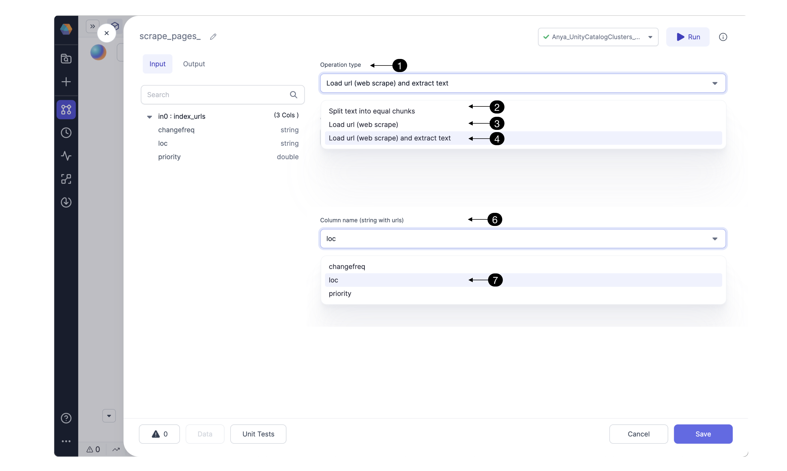

[page under construction]

TODO: REPLACE VIDEO LINK

[Overview of the Gem showing the input and output for ml text processing](to be added)

### Configure



TODO: intro

**Input:**

**Gem function:**

**Output:**

Now let’s understand the input, Gem Configuration, and output in more detail.

### Input columns

| Name | Description |
| ---- | ----------- |

### Gem Configuration

#### Properties

### Output columns

| Name | Description |
| ---- | ----------- |

````mdx-code-block
import Tabs from '@theme/Tabs';
import TabItem from '@theme/TabItem';

<Tabs>

<TabItem value="py" label="Python">

```py
def scrape_pages(spark: SparkSession, in0: DataFrame) -> DataFrame:
    from pyspark.sql.functions import expr, array, struct
    from spark_ai.webapps import WebUtils
    WebUtils().register_udfs(spark)

    return in0.withColumn("result_content", expr(f"web_scrape_text(loc)"))
```

</TabItem>
<TabItem value="scala" label="Scala">

```scala
  [page under construction]
```

</TabItem>
</Tabs>

````

### FAQ

#### Troubleshooting
