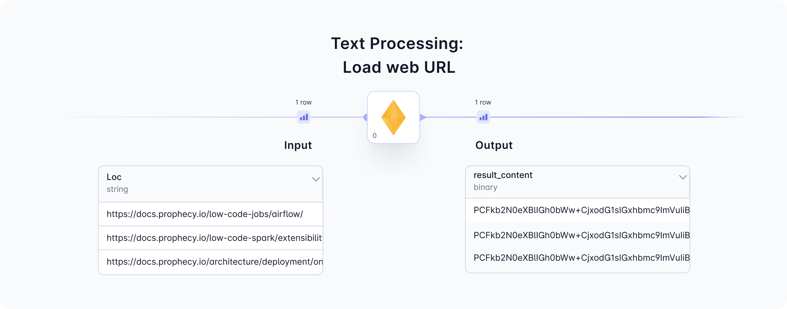
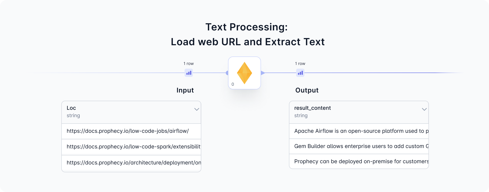
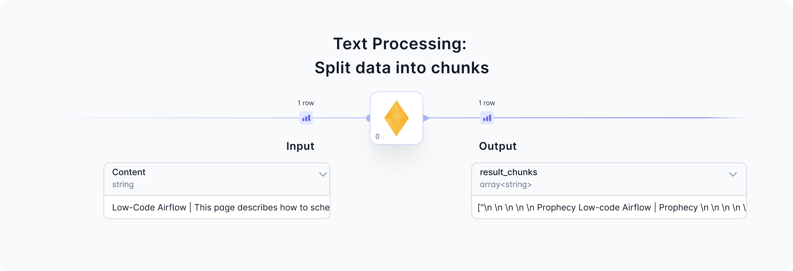

[page under construction]

<div class="wistia_responsive_padding" style={{padding:'56.25% 0 0 0', position:'relative'}}>
<div class="wistia_responsive_wrapper" style={{height:'100%',left:0,position:'absolute',top:0,width:'100%'}}>
<iframe src="https://fast.wistia.net/embed/iframe/7v6y4ldt5x?seo=false?videoFoam=true" title="Getting Started With SQL Video" allow="autoplay; fullscreen" allowtransparency="true" frameborder="0" scrolling="no" class="wistia_embed" name="wistia_embed" msallowfullscreen width="100%" height="100%"></iframe>
</div></div>
<script src="https://fast.wistia.net/assets/external/E-v1.js" async></script>

<br />

The TextProcessing Gem enables text data preparation for machine learning in two different ways:

1. [Load](/docs/low-code-spark/gems/machine-learning/ml-text-processing.md#1-load-web-urls-and-extract-text) web URLs and extract text.
2. [Split](/docs/low-code-spark/gems/machine-learning/ml-text-processing.md#2-split-text-data-into-equal-chunks) text data into equal chunks.

Follow along to see how to use the TextProcessing Gem. For an example set of Pipelines that uses this Gem to create a Generative AI Chatbot, see this [guide.](/docs/getting-started/genaichatbot.md)

### 1. Load web URLs and Extract Text





#### 1a. Configure


#### 1b. Input

#### 1c. Output

#### 1d. Generated Code

````mdx-code-block
import Tabs from '@theme/Tabs';
import TabItem from '@theme/TabItem';

<Tabs>

<TabItem value="py" label="Python">

```py
def scrape_pages(spark: SparkSession, in0: DataFrame) -> DataFrame:
    from pyspark.sql.functions import expr, array, struct
    from spark_ai.webapps import WebUtils
    WebUtils().register_udfs(spark)

    return in0.withColumn("result_content", expr(f"web_scrape(loc)"))
```

</TabItem>
<TabItem value="scala" label="Scala">

```scala
  [Not yet supported]
```

</TabItem>
</Tabs>

````

### 2. Split text data into equal chunks



#### 2a. Configure


#### 2b. Input

#### 2c. Output

### FAQ

#### Troubleshooting
