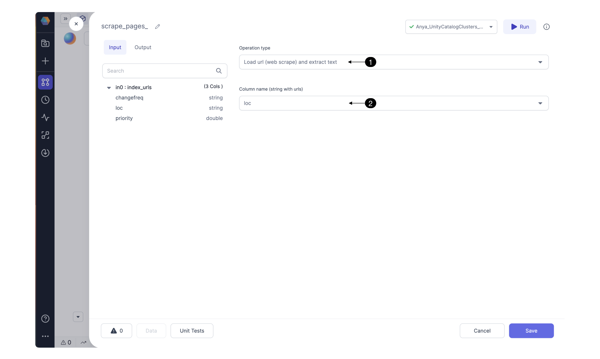

# Text Processing

\


The TextProcessing Gem enables text data preparation for machine learning in two different ways:

1. [Load](ml-text-processing.md#1-load-web-urls-and-extract-text) web URLs and extract text.
2. [Split](ml-text-processing.md#2-split-text-data-into-equal-chunks) text data into equal chunks.

Follow along to see how to use the TextProcessing Gem. For an example set of Pipelines that uses this Gem to create a Generative AI Chatbot, see this [guide.](https://docs.prophecy.io/getting-started/gen-ai-chatbot)

#### 1. Load web URLs and Extract Text

Given a column with web URLs, the `Load web URLs` operation will scrape the content from each URL, and output the content as a binary format or as a human readable text format, depending on the operation type selected. The figure below shows the `Load web URL and Extract Text` operation.


**1a. Configure web scrape**



Configure the **(1) Operation Type** to Load url (web scrape), and optionally extract the text. Specify which input **(2) Column name** contains the web urls. If the `extract text` operation is selected, the text will be converted from binary to human readable format. When would you want to use the binary format? Binary web scraping is useful for downloading content including images or archived documents.

**1b. Input**

| Parameter                      | Description                                                      | Required |
| ------------------------------ | ---------------------------------------------------------------- | -------- |
| Column name (string with urls) | string - the input column which contains the strings of web URLs | True     |

**1c. Output**

| Parameter                                               | Description                                                                          |
| ------------------------------------------------------- | ------------------------------------------------------------------------------------ |
| Result content `Load url (web scrape)`                  | binary - the contents of each web page                                               |
| Result content `Load url (web scrape) and extract text` | string - the contents of each web page, converted from binary to human readable text |

**1d. Generated Code**

````mdx-code-block
import Tabs from '@theme/Tabs';
import TabItem from '@theme/TabItem';

<Tabs>

<TabItem value="py" label="Python">

```py
def scrape_pages(spark: SparkSession, in0: DataFrame) -> DataFrame:
    from pyspark.sql.functions import expr, array, struct
    from spark_ai.webapps import WebUtils
    WebUtils().register_udfs(spark)

    return in0.withColumn("result_content", expr(f"web_scrape(loc)"))
```

</TabItem>
<TabItem value="scala" label="Scala">

```
[Not yet supported]
```

</TabItem>
</Tabs>

````

#### 2. Split text data into equal chunks

Sometimes you'd like to send text data to a foundational model or store in a vector database, but the text is too long. For this case, just split the text into "chunks" of characters.


**2a. Configure text splitting**

Given a text input, the `Split data` operation will separate the input column entries into chunks of specified `size`.


Select the **(1) Operation type** to split text into equal chunks. Specify which input **(2) Column name** contains the relevant content. Specify an integer chunk **(3) Size** relevant for your generative AI use case.

**2b. Input**

| Parameter   | Description                                                             | Required |
| ----------- | ----------------------------------------------------------------------- | -------- |
| Column name | string - the text content which should be split into equal chunks       | True     |
| Size        | integer - the size of each chunk, number of characters. Example: `1000` | True     |

**2c. Output**

| Parameter      | Description                                                                                             |
| -------------- | ------------------------------------------------------------------------------------------------------- |
| result\_chunks | array(string) - an array of text strings, each string representing one chunk of the larger text content |

**2d. Generated code**

````mdx-code-block

<Tabs>

<TabItem value="py" label="Python">

```py
def Chunkify(spark: SparkSession, web_bronze_content: DataFrame) -> DataFrame:
    from pyspark.sql.functions import expr, array, struct
    from spark_ai.files.text import FileTextUtils
    FileTextUtils().register_udfs(spark)

    return web_bronze_content.withColumn("result_chunks", expr(f"text_split_into_chunks(content, 1000)"))
```

</TabItem>
<TabItem value="scala" label="Scala">

```
[Not yet supported]
```

</TabItem>
</Tabs>


### FAQ

**How does this Gem fit into the bigger picture of building a generative AI application?**

For an example set of Pipelines that uses this Gem to create a Generative AI Chatbot, see this [guide.](https://docs.prophecy.io/getting-started/gen-ai-chatbot) Feel free to [reach out](https://www.prophecy.io/request-a-demo) and explore your use case with us.

#### Troubleshooting

Select a chunk size according to the limitations of your vector database index.
````
