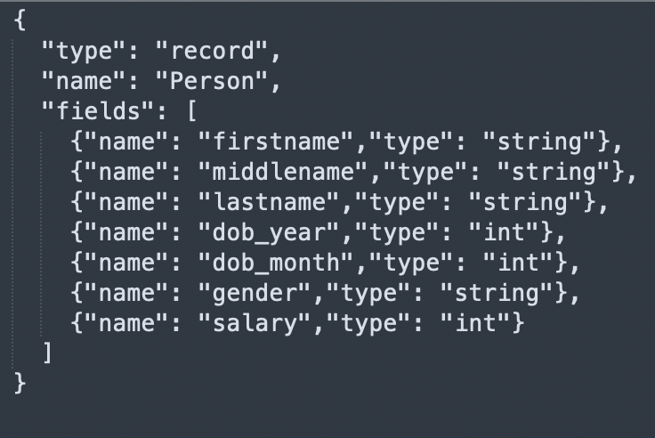

Avro format is a row-based storage format for Hadoop, which is widely used as a serialization platform.
Avro format stores the schema in JSON format, making it easy to read and interpret by any program.
The data itself is stored in a binary format making it compact and efficient.

This gem allows you to read from or write to an Avro file.

## Source

### Source Parameters

| Parameter             | Description                                                                                                                                                                                                                                              | Required | Default |
| --------------------- | -------------------------------------------------------------------------------------------------------------------------------------------------------------------------------------------------------------------------------------------------------- | -------- | ------- |
| Location              | File path where avro files are present                                                                                                                                                                                                                   | True     | None    |
| Schema                | Schema to be applied on the loaded data. Can be defined/edited as JSON or inferred using `Infer Schema` button                                                                                                                                           | True     | None    |
| Recursive File Lookup | This is used to recursively load files and it disables partition inferring. If data source explicitly specifies the partitionSpec when recursiveFileLookup is true, an exception will be thrown.                                                         | False    | False   |
| Path Global Filter    | An optional glob pattern to only include files with paths matching the pattern. The syntax follows [GlobFilter](https://hadoop.apache.org/docs/stable/api/org/apache/hadoop/fs/GlobFilter.html). It does not change the behavior of partition discovery. | False    | None    |
| Modified Before       | An optional timestamp to only include files with modification times occurring before the specified Time. The provided timestamp must be in the following form: YYYY-MM-DDTHH:mm:ss (e.g. 2020-06-01T13:00:00)                                            | False    | None    |
| Modified After        | An optional timestamp to only include files with modification times occurring after the specified Time. The provided timestamp must be in the following form: YYYY-MM-DDTHH:mm:ss (e.g. 2020-06-01T13:00:00)                                             | False    | None    |
| Avro Schema           | Optional schema in JSON format. See [here](#schema-evolution) for more details.                                                                                                                                                                          | False    | None    |
| ignoreExtension       | **_DEPRECATED_**. Enable to load files without the `.avro` extension. See caveats [here](#ignoring-the-file-extension)                                                                                                                                   | False    | True    |

#### Schema Evolution

When reading Avro, the `Avro Schema` option can be set to a newer evolved schema which is compatible but different from the schema written to storage. The resulting Dataframe will follow the newer, evolved schema. For example, if we set an evolved schema containing one additional column with a default value, the resulting Dataframe will contain the new column too.

#### Ignoring the File Extension

If the `ignoreExtension` option is enabled, all files (with and without .avro extension) are loaded. The option has been deprecated, and it will be removed in the future releases. Please [pathGlobFilter](https://spark.apache.org/docs/latest/sql-data-sources-generic-options.html#path-global-filter) for filtering file names.

### Example {#source}

<div class="wistia_responsive_padding" style={{padding:'56.25% 0 0 0', position:'relative'}}>
<div class="wistia_responsive_wrapper" style={{height:'100%',left:0,position:'absolute',top:0,width:'100%'}}>
<iframe src="https://user-images.githubusercontent.com/103921419/174399585-40067429-953e-4157-a5db-d80e25713d24.mp4" title="Avro Source" allow="autoplay;fullscreen" allowtransparency="true" frameborder="0" scrolling="no" class="wistia_embed" name="wistia_embed" msallowfullscreen width="100%" height="100%"></iframe>
</div></div>

#### Schema used in example above



### Generated Code {#source-code}

````mdx-code-block
import Tabs from '@theme/Tabs';
import TabItem from '@theme/TabItem';

<Tabs>

<TabItem value="py" label="Python">

```py
def read_avro(spark: SparkSession) -> DataFrame:
    return spark.read\
        .format("avro")\
        .option("ignoreExtension", True)\
        .option(
          "avroSchema",
          "{\"type\":\"record\",\"name\":\"Person\",\"fields\":[{\"name\":\"firstname\",\"type\":\"string\"},{\"name\":\"middlename\",\"type\":\"string\"},{\"name\":\"lastname\",\"type\":\"string\"},{\"name\":\"dob_year\",\"type\":\"int\"},{\"name\":\"dob_month\",\"type\":\"int\"},{\"name\":\"gender\",\"type\":\"string\"},{\"name\":\"salary\",\"type\":\"int\"}]}"
        )\
        .load("dbfs:/FileStore/Users/abhinav/avro/test.avro")

```

</TabItem>
<TabItem value="scala" label="Scala">

```scala
object read_avro {

  def apply(spark: SparkSession): DataFrame =
    spark.read
        .format("avro")
        .option("ignoreExtension", true)
        .option(
          "avroSchema",
          "{\"type\":\"record\",\"name\":\"Person\",\"fields\":[{\"name\":\"firstname\",\"type\":\"string\"},{\"name\":\"middlename\",\"type\":\"string\"},{\"name\":\"lastname\",\"type\":\"string\"},{\"name\":\"dob_year\",\"type\":\"int\"},{\"name\":\"dob_month\",\"type\":\"int\"},{\"name\":\"gender\",\"type\":\"string\"},{\"name\":\"salary\",\"type\":\"int\"}]}"
        )
        .load("dbfs:/FileStore/Users/abhinav/avro/test.avro")

}
```

</TabItem>
</Tabs>

````

---

## Target

### Target Parameters

Write data as avro files at the specified path.

| Parameter         | Description                                                                                                                                                                                                                                                                           | Required | Default        |
| ----------------- | ------------------------------------------------------------------------------------------------------------------------------------------------------------------------------------------------------------------------------------------------------------------------------------- | -------- | -------------- |
| Location          | Locaiton to write the Avro files to present                                                                                                                                                                                                                                           | True     | None           |
| Avro Schema       | Optional schema provided by a user in JSON format. This option can be set if the expected output Avro schema doesn't match the schema converted by Spark. For example, the expected schema of one column is of `enum` type, instead of `string` type in the default converted schema. | False    | None           |
| Record Name       | Top level record name in write result, which is required in Avro spec.                                                                                                                                                                                                                | False    | topLevelRecord |
| Record Namespace  | Record namespace in write result.                                                                                                                                                                                                                                                     | False    | ""             |
| Compression       | Compression codec used when writing.<br/> Currently supported codecs are `uncompressed`, `snappy`, `deflate`, `bzip2`, `xz` and `zstandard`. Defaults to whatever `spark.sql.avro.compression.codec` is set to.                                                                       | False    | `snappy`       |
| Write Mode        | How to handle existing data. See [this table](#supported-write-modes) for a list of available options.                                                                                                                                                                                | True     | `error`        |
| Partition Columns | List of columns to partition the avro files by                                                                                                                                                                                                                                        | False    | None           |

### Supported Write Modes

| Write Mode | Description                                                                                                                      |
| ---------- | -------------------------------------------------------------------------------------------------------------------------------- |
| overwrite  | If data already exists, overwrite with the contents of the Dataframe                                                             |
| append     | If data already exists, append the contents of the Dataframe                                                                     |
| ignore     | If data already exists, do nothing with the contents of the Dataframe. This is similar to a `CREATE TABLE IF NOT EXISTS` in SQL. |
| error      | If data already exists, throw an exception.                                                                                      |

### Example {#target}

<div class="wistia_responsive_padding" style={{padding:'56.25% 0 0 0', position:'relative'}}>
<div class="wistia_responsive_wrapper" style={{height:'100%',left:0,position:'absolute',top:0,width:'100%'}}>
<iframe src="https://user-images.githubusercontent.com/103921419/174399603-07080a2f-a52b-4feb-a029-733f947fad6c.mp4" title="Avro Target" allow="autoplay;fullscreen" allowtransparency="true" frameborder="0" scrolling="no" class="wistia_embed" name="wistia_embed" msallowfullscreen width="100%" height="100%"></iframe>
</div></div>

### Generated Code {#target-code}

````mdx-code-block

<Tabs>

<TabItem value="py" label="Python">

```py
def write_avro(spark: SparkSession, in0: DataFrame):
    in0.write\
        .format("avro")\
        .mode("overwrite")\
        .partitionBy("dob_year","dob_month")\
        .save("dbfs:/data/test_output.avro")
```

</TabItem>
<TabItem value="scala" label="Scala">

```scala
object write_avro {
  def apply(spark: SparkSession, in: DataFrame): Unit =
    in.write
        .format("avro")
        .mode("overwrite")
        .partitionBy("dob_year","dob_month")
        .save("dbfs:/data/test_output.avro")
}
```

</TabItem>
</Tabs>


````

:::info
To know more about tweaking Avro related properties in Spark config [click here](https://spark.apache.org/docs/latest/sql-data-sources-avro.html).
:::
