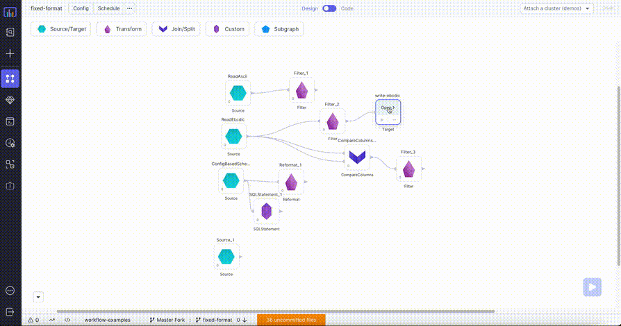

:::caution Enterprise Only

Please [contact us](https://www.prophecy.io/request-a-demo) to learn more about the Enterprise offering.

:::

Read data from from fixed format files with expected schema, or write data to fixed format files with expected schema.

## Source

Reads data from fixed format files 

### Source Parameters

| Parameter      | Description                                | Required |
| :------------- | :----------------------------------------- | :------- |
| Location       | File path where fixed format files are present    | True     |
| Fixed Format Schema | Schema string for the fixed format file, supports either ebcdic or ascii formats        | True    |


### Source Example


:::

### Generated Code {#source-code}

````mdx-code-block

<Tabs>

<TabItem value="scala" label="Scala">

```scala

object ReadEbcdic {

  def apply(spark: SparkSession): DataFrame = {
    import _root_.io.prophecy.abinitio.dml.DMLSchema.parse
    import _root_.io.prophecy.libs.{FFSchemaRecord, _}
    import play.api.libs.json.Json
    import _root_.io.prophecy.libs.FixedFormatSchemaImplicits._
    spark.read
      .option(
        "schema",
        Some("""ebcdic record
                string(6) service ;
                string(2) person ;
                decimal(2, 0) data ;
                string(1) format ;
                string(1) working ;
                end""").map(s => parse(s).asInstanceOf[FFSchemaRecord])
                          .map(s => Json.stringify(Json.toJson(s)))
                          .getOrElse("")
      )
      .format("io.prophecy.libs.FixedFileFormat")
      .load("/FileStore/tables/fixed_format/test/write_ebcdic")
      .cache()
  }

}
```

</TabItem>
</Tabs>

````
---
## Target

Writes data in fixed file format according to the specified schema string.

### Target Parameters

| Parameter                     | Description                                                                                                                                                                | Required |
| :---------------------------- | :-------------------------------------------------| :-------  |
| Location                      | File path where fixed format files will be written  | True      |
| Write mode                    | Write mode for dataframe                          | False     |                                                                                                                         | True     |
| Fixed Format Schema           | Schema string for the fixed format file, supports either ebcdic or ascii formats            | True      |

### Write modes

Below are different type of write modes which prophecy provided delta format supports.

| Write Mode | Description                                                                                                                                                                                   |
| :--------- | :-------------------------------------------------------------------------------------------------------------------------------------------------------------------------------------------- |
| overwrite  | If data already exists, existing data is expected to be overwritten by the contents of the DataFrame.                                                                                         |
| append     | If data already exists, contents of the DataFrame are expected to be appended to existing data.                                                                                               |
| ignore     | If data already exists, the save operation is expected not to save the contents of the DataFrame and not to change the existing data. This is similar to a CREATE TABLE IF NOT EXISTS in SQL. |
| error      | If data already exists, an exception is expected to be thrown.                                                                                                                                |


### Target Example



### Generated Code {#target-code}

````mdx-code-block

<Tabs>

<TabItem value="scala" label="Scala">

```scala
object write_ebcdic {

  def apply(spark: SparkSession, in: DataFrame): Unit = {
    import _root_.io.prophecy.abinitio.dml.DMLSchema.parse
    import _root_.io.prophecy.libs.{FFSchemaRecord, _}
    import play.api.libs.json.Json
    import _root_.io.prophecy.libs.FixedFormatSchemaImplicits._
    val schema = Some("""ebcdic record
                            string(6) service ;
                            string(2) person ;
                            decimal(2, 0) data ;
                            string(1) format ;
                            string(1) working ;
                            end""").map(s => parse(s).asInstanceOf[FFSchemaRecord])
    var writer = in.write.format("io.prophecy.libs.FixedFileFormat")
    writer = writer.mode("overwrite")
    schema
      .map(s => Json.stringify(Json.toJson(s)))
      .foreach(schema => writer = writer.option("schema", schema))
    writer.save("/FileStore/tables/fixed_format/test/write_ebcdic_alt")
  }

}
```

</TabItem>
</Tabs>

````