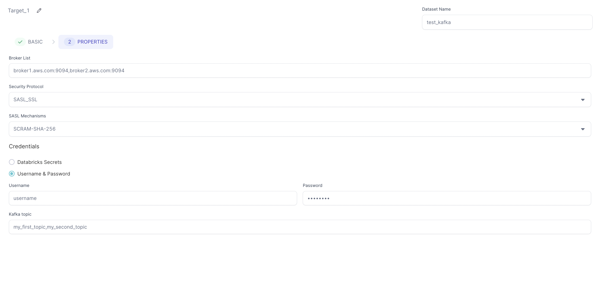
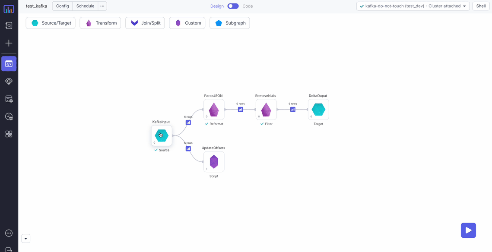

[Apache Kafka](https://kafka.apache.org/) is an open-source distributed event streaming platform. Supporting a number of streaming paradigms it's used by thousands of companies and organizations in scenarios including Data Ingestion, Analytics and more.

This source currently connects with Kafka Brokers in **Batch** mode.

## Source

Reads data from Kafka stream in batch mode. Data is read only incrementally from the last offset stored in the specified Metadata table. If the Metadata table is not present, then data will be read from the `earliest` offset.

### Source Parameters

| Parameter         | Description                                                               | Required |
| :---------------- | :------------------------------------------------------------------------ | :------- |
| Broker List       | Comma separated list of Kafka brokers                                     | True     |
| Group Id          | Kafka consumer group ID                                                   | True     |
| Session Timeout   | Session timeout for Kafka. (Default value set to 6000s)                   | False    |
| Security Protocol | Security protocol for Kafka (Default value set to SASL_SSL)               | True     |
| SASL Mechanism    | Default SASL Mechanism for SASL_SSL (Default value set to SCRAM-SHA-256)  | True     |
| Credential Type   | Credential Type provider (Databricks Secrets or Username/Password)        | True     |
| Credential Scope  | Scope to use for Databricks secrets                                       | True     |
| Kafka Topic       | Comma separated list of Kafka topics                                      | True     |
| Metadata Table    | Table name which would be used to store offsets for each topic, partition | True     |

### Example {#source-example}


### Generated Code {#source-code}

````mdx-code-block
import Tabs from '@theme/Tabs';
import TabItem from '@theme/TabItem';

<Tabs>

<TabItem value="py" label="Python">

```py
def KafkaSource(spark: SparkSession) -> DataFrame:
    from delta.tables import DeltaTable
    import json
    from pyspark.dbutils import DBUtils

    if spark.catalog._jcatalog.tableExists(f"metadata.kafka_offsets"):
        offset_dict = {}

        for row in DeltaTable.forName(spark, f"metadata.kafka_offsets").toDF().collect():
            if row["topic"] in offset_dict.keys():
                offset_dict[row["topic"]].update({row["partition"] : row["max_offset"] + 1})
            else:
                offset_dict[row["topic"]] = {row["partition"] : row["max_offset"] + 1}

        return (spark.read\
            .format("kafka")\
            .options(
              **{
                "kafka.sasl.jaas.config": (
                  f"kafkashaded.org.apache.kafka.common.security.scram.ScramLoginModule"
                  + f' required username="{DBUtils(spark).secrets.get(scope = "test", key = "username")}" password="{DBUtils(spark).secrets.get(scope = "test", key = "password")}";'
                ),
                "kafka.sasl.mechanism": "SCRAM-SHA-256",
                "kafka.security.protocol": "SASL_SSL",
                "kafka.bootstrap.servers": "broker1.aws.com:9094,broker2.aws.com:9094",
                "kafka.session.timeout.ms": "6000",
                "group.id": "group_id_1",
                "subscribe": "my_first_topic,my_second_topic",
                "startingOffsets": json.dumps(offset_dict),
              }
            )\
            .load()\
            .withColumn("value", col("value").cast("string"))\
            .withColumn("key", col("key").cast("string")))
    else:
        return (spark.read\
            .format("kafka")\
            .options(
              **{
                "kafka.sasl.jaas.config": (
                  f"kafkashaded.org.apache.kafka.common.security.scram.ScramLoginModule"
                  + f' required username="{DBUtils(spark).secrets.get(scope = "test", key = "username")}" password="{DBUtils(spark).secrets.get(scope = "test", key = "password")}";'
                ),
                "kafka.sasl.mechanism": "SCRAM-SHA-256",
                "kafka.security.protocol": "SASL_SSL",
                "kafka.bootstrap.servers": "broker1.aws.com:9094,broker2.aws.com:9094",
                "kafka.session.timeout.ms": "6000",
                "group.id": "group_id_1",
                "subscribe": "my_first_topic,my_second_topic"
              }
            )\
            .load()\
            .withColumn("value", col("value").cast("string"))\
            .withColumn("key", col("key").cast("string")))

```

</TabItem>
<TabItem value="scala" label="Scala">

```scala
Coming Soon
```

</TabItem>
</Tabs>

````

---

## Target

Writes each row from the Dataframe to Kafka topic(s) as JSON messages.

### Target Parameters

| Parameter         | Description                                                              | Required |
| :---------------- | :----------------------------------------------------------------------- | :------- |
| Broker List       | Comma separated list of Kafka brokers                                    | True     |
| Security Protocol | Security protocol for Kafka (Default value set to SASL_SSL)              | True     |
| SASL Mechanism    | Default SASL Mechanism for SASL_SSL (Default value set to SCRAM-SHA-256) | True     |
| Credential Type   | Credential Type provider (Databricks Secrets or Username/Password)       | True     |
| Credential Scope  | Scope to use for Databricks secrets                                      | True     |
| Kafka Topic       | Comma separated list of Kafka topics                                     | True     |

### Example {#target-example}



### Generated Code {#target-code}

````mdx-code-block

<Tabs>

<TabItem value="py" label="Python">

```py
def KafkaTarget(spark: SparkSession, in0: DataFrame):
    df1 = in0.select(to_json(struct("*")).alias("value"))
    df2 = df1.selectExpr("CAST(value AS STRING)")
    df2.write\
        .format("kafka")\
        .options(
          **{
            "kafka.sasl.jaas.config": (
              f"kafkashaded.org.apache.kafka.common.security.scram.ScramLoginModule"
              + f' required username="{DBUtils(spark).secrets.get(scope = "test", key = "username")}" password="{DBUtils(spark).secrets.get(scope = "test", key = "password")}";'
            ),
            "kafka.sasl.mechanism": "SCRAM-SHA-256",
            "kafka.security.protocol": "SASL_SSL",
            "kafka.bootstrap.servers": "broker1.aws.com:9094,broker2.aws.com:9094",
            "topic": "my_first_topic,my_second_topic",
          }
        )\
        .save()

```

</TabItem>
<TabItem value="scala" label="Scala">

```scala
Coming Soon

```

</TabItem>
</Tabs>

````

## Example Pipelines

### Source Pipeline Example

In this example we'll read JSON messages from Kafka, parse them, remove any null messagesand then finally persist it to a Delta table.



#### Metadata Table

In order to avoid reprocessing messages on subsequent pipeline runs, we're going to update a certain table with the last processed offsets for each Kafka partition and topic. The next time the pipeline runs this table will be used to only get a batch of messages that have arrived since the previously-processed offset.

For this example, we're going to update `metadata.kafka_offsets`, which has the following structure:

| topic           | partition | max_offset |
| :-------------- | :-------- | :--------- |
| my_first_topic  | 0         | 10         |
| my_first_topic  | 1         | 5          |
| my_second_topic | 0         | 10         |
| my_second_topic | 1         | 5          |

Taking this approach gives us the following benefits:

1. Build the pipeline interactively without committing any offsets
2. Production workflows will only consume messages that have arrived since the previously-processed offset
3. We can replay old messages by modifying the Metadata table

:::note
For production workflows the [Phase](../../../../concepts/gems.md#phase) for the `Script` gem that updates the offsets should be greater than the Phase of the Target gem.
This is to ensure that offsets are only updated in the table after data is safely persisted to the Target.
:::

#### Spark Code used for script component

````mdx-code-block

<Tabs>

<TabItem value="py" label="Python">

```py
def UpdateOffsets(spark: SparkSession, in0: DataFrame):

    if not ("SColumnExpression" in locals()):
        from delta.tables import DeltaTable
        import pyspark.sql.functions as f
        metadataTable = "metadata.kafka_offsets"
        metaDataDf = in0.groupBy("partition", "topic").agg(f.max(f.col("`offset`").cast("int")).alias("max_offset"))

        if not spark.catalog._jcatalog.tableExists(metadataTable):
            metaDataDf.write.format("delta").mode("overwrite").saveAsTable(metadataTable)
        else:
            DeltaTable\
                .forName(spark, metadataTable)\
                .alias("target")\
                .merge(
                  metaDataDf.alias("source"),
                  (
                    (col("source.`partition`") == col("target.`partition`"))
                    & (col("source.`topic`") == col("target.`topic`"))
                  )
                )\
                .whenMatchedUpdateAll()\
                .whenNotMatchedInsertAll()\
                .execute()

```

</TabItem>
<TabItem value="scala" label="Scala">

```scala
Coming Soon

```

</TabItem>
</Tabs>

````
