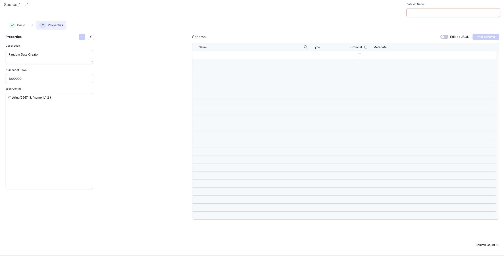

## Introduction

The Random Data Creator Gem is a Source Gem which can Generate Random data for running pipelines quickly, without setting up all datasets.

## Data Configuration: What is possible?

This Gem takes two things as Input:

- Number of Rows to Generate
- Data Configuration



Currently, a user can create Random data Columns in the following formats:

- `string(N)`: Returns an N character String
- `numeric`: Returns `DoubleType` columns, with data lying between 0 and 10000000
- `boolean`: Returns Boolean Columns having True or False values
- `date`: Returns Date Columns having any date
- `datetime`: Returns Timestamp Columns having any timestamp
- `json`: Returns Nested structures: Equivalent to defining a Struct within a Column: Needs to be explicitly defined
- `rand_int(N, M)`: Returns Random Integer between N and M.

## Example Configuration

An Example Configuration for Random Data Creator is the following:

```json
{
  "numeric": [
    "hello_world_column_1",
    "hello_world_column_2",
    "hello_world_column_3",
    "hello_world_column_4",
    "hello_world_column_5",
    "hello_world_column_6"
  ],
  "string(256)": 20,
  "boolean": 5,
  "date": 10,
  "datetime": 10,
  "rand_int(30, 70)": 2,
  "json": [
    {
      "numeric": 4,
      "json": [
        {
          "string(256)": 2,
          "numeric": 3
        }
      ],
      "string(500)": 2
    },
    {
      "numeric": 4,
      "json": [
        {
          "numeric": 3,
          "json": [
            {
              "string(250)": 2
            },
            {
              "numeric": 2
            }
          ]
        }
      ],
      "string(500)": 2
    }
  ]
}
```

Here, data would be created with the following characteristics:

- 6 Numeric columns having a uniform distribution would be created with names `hello_world_column_1`, `hello_world_column_2` etc.
- 20 String Columns would be created having a length of `256` characters (see `string(256)`) with names `string_256_col1`, `string_256_col2` respectively.
- 5 Boolean columns would be created with names `bool_col1`, `bool_col2` etc.
- 10 date and 10 datetime columns would be created respectively.
- 2 Random Integer Columns would be created, whose value lies between 30-70. Note that for creating Join Keys, we would recommend using `randInt(start, end)` columns
- 2 JSON Columns would be created:
  - The first contains 2 fields of `string(500)` and 4 `numeric` fields. This also contains a nested JSON which itself contains 2 `string(256)` and 3 `numeric` fields.
  - The second contains 4 `numeric` fields, 2 `string(500)` columns. It also contains two nested JSONs inside:
  - The first JSON contains 3 `numeric` columns and an inner `json` column which contains two `string(250)` fields.
  - The second JSON contains 2 `numeric` columns
    The Random Data Creator currently does not support a categorical column or an explicit join key variable. Instead, something like `rand_int(1, N)` can be used for now.
