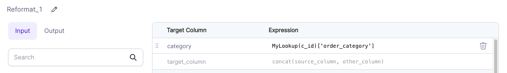

Lookups are a special kind of Gem that allow you to mark a particular DataFrame as a _Broadcast_ DataFrame. Spark will ensure that this data is available on every computation node so that these lookups can be done without shuffling data. This is useful for looking up values in tables, hence the name.


|     | Name          | Description                                                                  |
| :-: | ------------- | ---------------------------------------------------------------------------- |
|  1  | Key Columns   | Specify one or more columns to use as the lookup key in the source DataFrame |
|  2  | Value Columns | Pick which columns can be referenced wherever this Lookup is used            |

## Using Lookups

Lookups can be used wherever any other Expression can be used, but usage depends on your Expression language of choice. Lookup references follow a certain pattern:

````mdx-code-block
import Tabs from '@theme/Tabs';
import TabItem from '@theme/TabItem';

<Tabs>

<TabItem value="py" label="Python">

```py
lookup("<LOOKUP NAME>", <KEY COLUMN>).getField(<VALUE COLUMN>)
```

</TabItem>
<TabItem value="scala" label="Scala">

```scala
lookup("<LOOKUP NAME>", <KEY COLUMN>).getField(<VALUE COLUMN>)
```

</TabItem>

<TabItem value="sql" label="SQL">

```sql
<LOOKUP NAME>(<KEY COLUMN>)['<VALUE COLUMN>']
```
</TabItem>

</Tabs>
````

### Column-based lookups

So, based on our above `MyLookup` example we'd use:

````mdx-code-block
<Tabs>
<TabItem value="py" label="Python">

```py
lookup("MyLookup", col("customer_id")).getField("order_category")
```

</TabItem>
<TabItem value="scala" label="Scala">

```scala
lookup("MyLookup", col("customer_id")).getField("order_category")
```

</TabItem>

<TabItem value="sql" label="SQL">

```sql
MyLookup(customer_id)['order_category']
```
</TabItem>

</Tabs>
````

For example, let's look at a [Reformat](../transform/reformat.md) component:



Here we have a column named `category` that is set to the value of `MyLookup(customer_id)['order_category']` in SQL Expression mode. Whatever the value of `order_category` is for the key found in the `c_id` column (compared to the source `customer_id` key column) will be used for the new column.

### Literal lookups

Since any column reference can be used in Lookup expressions, you can use Lookups with static keys:

````mdx-code-block
<Tabs>
<TabItem value="py" label="Python">

```py
lookup("MyLookup", lit("0000")).getField("order_category")
```

</TabItem>
<TabItem value="scala" label="Scala">

```scala
lookup("MyLookup", lit("0000")).getField("order_category")
```

</TabItem>

<TabItem value="sql" label="SQL">

```sql
MyLookup('0000')['order_category']
```
</TabItem>

</Tabs>
````

In this case, the expression evaluates to the value of `order_category` where `customer_id` is `0000`. This can be useful in situations when you want to have a table of predefined keys and their values available in Expressions.
