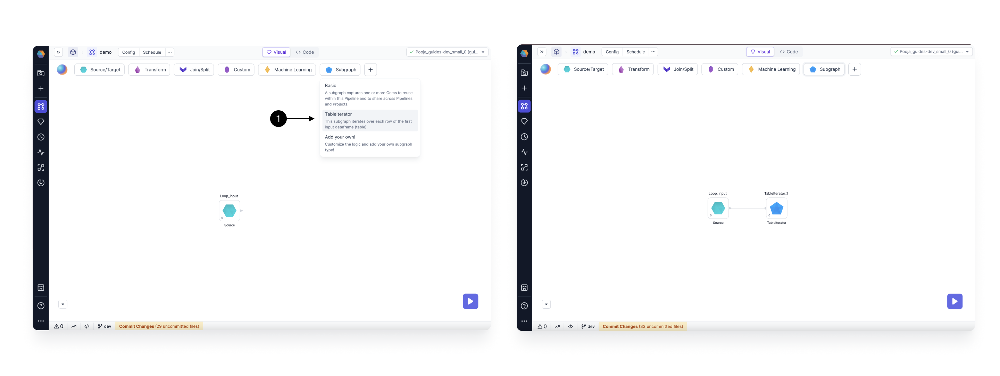
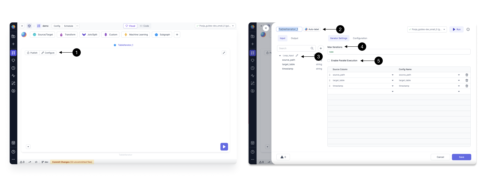
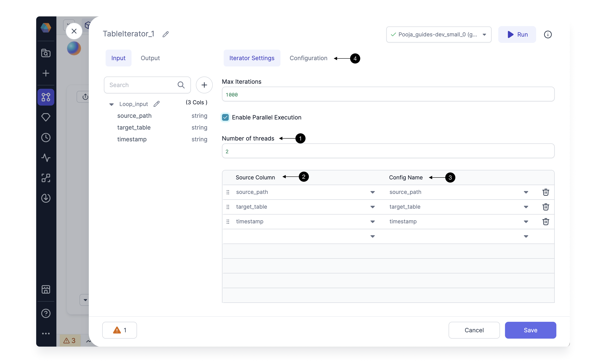
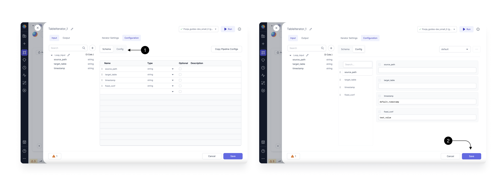
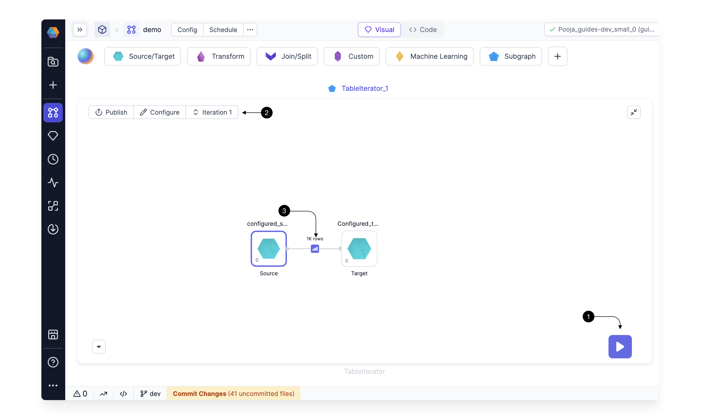
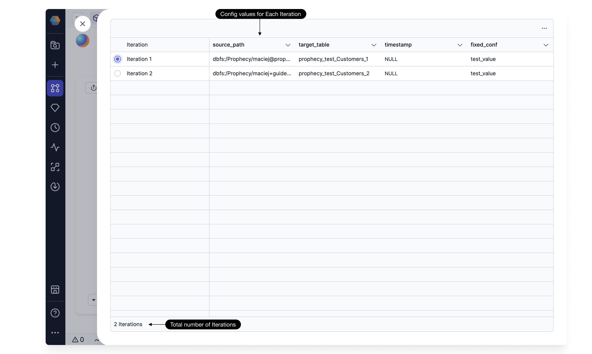

Table Iterator allows you to iterate over one or more Gems for each row of the first input DataFrame.
Let's see how to Create a Basic Loop which Loops over a Metadata Table, and for each Row of the table Runs the Gems inside the Subgraph.

## Creating a Table Iterator Gem

First add the Input Gem on which you want to Iterate over. For this, simply use an existing Dataset or create a new [Source Gem](/docs/low-code-spark/gems/source-target/source-target.md) pointing to your Metadata table.
You can Run This source Gem to check once to see the Data your loop would be running for.

Now, Drag and Drop the **(1) Table Iterator** Gem from the Subgraph Menu, and connect it to the above created Source Gem.

## Configure the Table Iterator

Open the Table Iterator Gem, and click on **(1) Configure** to open the Settings dialog.
Here, on the left side panel you can Edit the **(2) Name\* of your Gem, check the **(3) Input Schema\*\* for your DataFrame on which the loop will Iterate.

On the right side, you can define your Iterator Settings, and any other Subgraph Configs you want to use in the Subgraph.
In the **(4) Max Iterations** field, you can control the maximum number of Iterations this loop can have. This is to safeguard that nobody Runs the loop on a very large DataFrame by mistake. The default value is set to 1000.

You can also **(5) Enable Parallel Execution**.

When you check Enable Parallel Execution, you can also control **(1) Number of threads** to Run in parallel at a time as shown below.

In the table below, Map the columns from the incoming DataFrame, to the configs of The Subgraph.
When you pick a Column name in **(2) Source column**, a config is automatically created with the same name in **(3) Config name**.

You can see the configs created by switching to the **(4) Configuration** tab. This will show all the configurations created for this Subgraph as shown below.

You can add default values for any of these by switching to the **(1) Config Tab**, as shown above. You can also add any other configurations here you want to use in your subgraph.

:::info
Please note,The configurations associated with a source column will have different values for each iteration based on the input data's current row value for that column.
The configs which are not mapped to a source column, will have a fixed Value for each Iteration provided in the Config Tab.
:::

Once done, click on **(2) Save**, to save the Iterator configurations.

Now You can add the Gems to your Subgraph on which you want to loop on. To do this simply Drag and Drop any Gem onto the Subgraph Canvas.
You can add any Source, Target or any other transformation Gem and use the configs inside these Gems to change the values for each Iteration.

## Running the Loop

Once you have added the Gems to your Subgraph, Click on the **(1) Play button** to start execution.
As the execution Starts, you will see a new **(2) Iteration** button. This will show for which Iteration you are seeing the current interims.
You can click on the **(3) Interim** to check values for that Iteration.

Click on the **(2) Iteration** button, and it will open up the Iterations table as shown below. Here you can see all iterations and config values for each of them.

