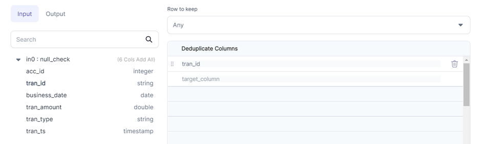
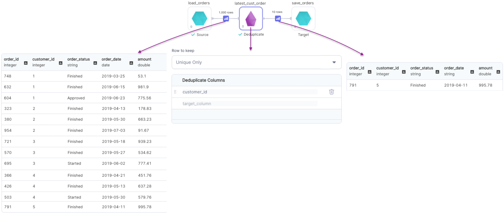

Removes rows with duplicate values of specified columns.

### Parameters

| Parameter           | Description                                                                                                                                                                                                                                                                                     | Required |
| :------------------ | :---------------------------------------------------------------------------------------------------------------------------------------------------------------------------------------------------------------------------------------------------------------------------------------------- | :------- |
| Dataframe           | Input dataframe                                                                                                                                                                                                                                                                                 | True     |
| Row to keep         | - `Any`: Keeps any one row among duplicates. Uses underlying `dropDuplicates` construct<br/>- `First`: Keeps first occurrence of the duplicate row <br/>- `Last`: Keeps last occurrence of the duplicate row <br/>- `Unique Only`: Keeps rows that don't have duplicates <br/> Default is `Any` | True     |
| Deduplicate columns | Columns to consider while removing duplicate rows                                                                                                                                                                                                                                               | True     |
| Order columns       | Columns to sort dataframe on before de-duping in case of `First` and `Last` rows to keep                                                                                                                                                                                                        | False    |

### Examples

---

#### Rows to keep - `Any`



````mdx-code-block
import Tabs from '@theme/Tabs';
import TabItem from '@theme/TabItem';

<Tabs>

<TabItem value="py" label="Python">

```py
def dedup(spark: SparkSession, in0: DataFrame) -> DataFrame:
    return in0.dropDuplicates(["tran_id"])
```

</TabItem>
<TabItem value="scala" label="Scala">

```scala
object dedup {
  def apply(spark: SparkSession, in: DataFrame): DataFrame = {
    in.dropDuplicates(List("tran_id"))
  }
}
```

</TabItem>
</Tabs>

````

---

#### Rows to keep - `First`


````mdx-code-block


<Tabs>

<TabItem value="py" label="Python">

```py
def earliest_cust_order(spark: SparkSession, in0: DataFrame) -> DataFrame:
    return in0\
        .withColumn(
          "row_number",
          row_number()\
            .over(Window\
            .partitionBy("customer_id")\
            .orderBy(col("order_dt").asc())\
            .rowsBetween(Window.unboundedPreceding, Window.currentRow))
        )\
        .filter(col("row_number") == lit(1))\
        .drop("row_number")
```

</TabItem>
<TabItem value="scala" label="Scala">

```scala
object earliest_cust_order {
  def apply(spark: SparkSession, in: DataFrame): DataFrame = {
    import org.apache.spark.sql.expressions.Window
    in.withColumn(
        "row_number",
        row_number().over(
          Window
            .partitionBy("customer_id")
            .orderBy(col("order_date").asc)
            .rowsBetween(Window.unboundedPreceding, Window.currentRow)
        )
      )
      .filter(col("row_number") === lit(1))
      .drop("row_number")
  }
}
```

</TabItem>
</Tabs>

````

---

#### Rows to keep - `Last`


````mdx-code-block


<Tabs>

<TabItem value="py" label="Python">

```py
def latest_cust_order(spark: SparkSession, in0: DataFrame) -> DataFrame:
    return in0\
        .withColumn(
          "row_number",
          row_number()\
            .over(Window\
            .partitionBy("customer_id")\
            .orderBy(col("order_dt").asc())\
            .rowsBetween(Window.unboundedPreceding, Window.currentRow))
        )\
        .withColumn(
          "count",
          count("*")\
            .over(Window\
            .partitionBy("customer_id")\
            .orderBy(col("order_dt").asc())\
            .rowsBetween(Window.unboundedPreceding, Window.unboundedFollowing))
        )\
        .filter(col("row_number") == col("count"))\
        .drop("row_number")\
        .drop("count")
```

</TabItem>
<TabItem value="scala" label="Scala">

```scala
object latest_cust_order {
  def apply(spark: SparkSession, in: DataFrame): DataFrame = {
    import org.apache.spark.sql.expressions.Window
    in.withColumn(
        "row_number",
        row_number().over(
          Window
            .partitionBy("customer_id")
            .orderBy(col("order_date").asc)
            .rowsBetween(Window.unboundedPreceding, Window.currentRow)
        )
      )
      .withColumn(
        "count",
        count("*").over(
          Window
            .partitionBy("customer_id")
            .orderBy(col("order_date").asc)
            .rowsBetween(Window.unboundedPreceding, Window.unboundedFollowing)
        )
      )
      .filter(col("row_number") === col("count"))
      .drop("row_number")
      .drop("count")
  }
}
```

</TabItem>
</Tabs>

````

#### Rows to keep - `Unique Only`



````mdx-code-block


<Tabs>

<TabItem value="py" label="Python">

```py
def single_order_customers(spark: SparkSession, in0: DataFrame) -> DataFrame:
    return in0\
        .withColumn(
          "count",
          count("*")\
            .over(Window\
            .partitionBy("customer_id")\
            .orderBy(col("order_dt").asc())\
            .rowsBetween(Window.unboundedPreceding, Window.unboundedFollowing))
        )\
        .filter(col("count") == lit(1))\
        .drop("count")
```

</TabItem>
<TabItem value="scala" label="Scala">

```scala
object single_order_customers {
  def apply(spark: SparkSession, in: DataFrame): DataFrame = {
    import org.apache.spark.sql.expressions.Window
    in.withColumn(
        "count",
        count("*").over(
          Window
            .partitionBy("customer_id")
            .orderBy(col("order_date").asc)
            .rowsBetween(Window.unboundedPreceding, Window.unboundedFollowing)
        )
      )
      .filter(col("count") === lit(1))
      .drop("count")
  }

}
```

</TabItem>
</Tabs>

````
