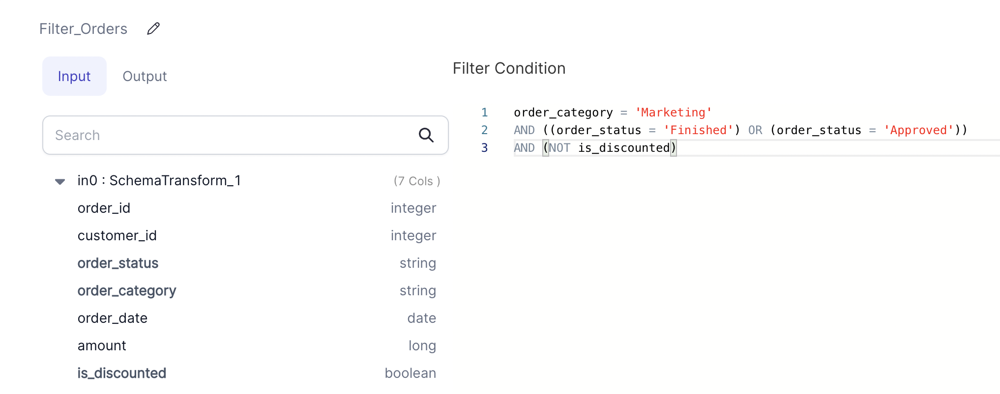

Filters dataframe based on provided filter condition

### Parameters
| Parameter        | Description                                                                           | Required |
|:-----------------|:--------------------------------------------------------------------------------------|:---------|
| Dataframe        | Input dataframe on which the filter condition will be applied.                        | True     |
| Filter Condition | BooleanType column or boolean expression. Supports sql, python and scala expressions. | True     |

### Example


### Spark Code

````mdx-code-block
import Tabs from '@theme/Tabs';
import TabItem from '@theme/TabItem';

<Tabs>

<TabItem value="py" label="Python">

```py
def Filter_Orders(spark: SparkSession, in0: DataFrame) -> DataFrame:
    return in0.filter(
        (
          ((col("order_category") == lit("Marketing")) 
          & ((col("order_status") == lit("Finished")) | (col("order_status") == lit("Approved"))))
          & ~ col("is_discounted")
        )
    )
```

</TabItem>
<TabItem value="scala" label="Scala">

```scala
object Filter_Orders {

  def apply(spark: SparkSession, in: DataFrame): DataFrame =
    in.filter(
      (
        col("order_category") === lit("Marketing"))
        .and(
          (col("order_status") === lit("Finished"))
            .or(col("order_status") === lit("Approved"))
        )
        .and(!col("is_discounted"))
    )
}
```

</TabItem>
</Tabs>

````