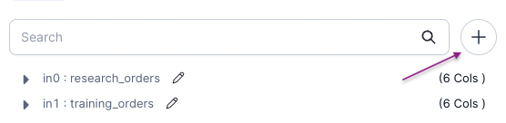

Allows you to perform addition or subtraction of rows from dataframes with identical schemas and different data.

[//]: # ''

### Parameters

| Parameter      | Description                                                                                                                                                                                                                                                                                                                                                                                       | Required |
| :------------- | :------------------------------------------------------------------------------------------------------------------------------------------------------------------------------------------------------------------------------------------------------------------------------------------------------------------------------------------------------------------------------------------------ | :------- |
| Dataframe 1    | First input dataframe                                                                                                                                                                                                                                                                                                                                                                             | True     |
| Dataframe 2    | Second input dataframe                                                                                                                                                                                                                                                                                                                                                                            | True     |
| Dataframe N    | Nth input dataframe                                                                                                                                                                                                                                                                                                                                                                               | False    |
| Operation type | Operation to perform<br/>- `Union`: Returns a dataset containing rows in any one of the input Datasets, while preserving duplicates.<br/>- `Intersect All`: Returns a dataset containing rows in all of the input Datasets, while preserving duplicates. <br/>- `Except All`: Returns a dataset containing rows in the first Dataset, but not in the other datasets, while preserving duplicates. | True     |

:::info
To add more input dataframes, simply click `+` icon on the left sidebar

:::

### Examples

---

#### Operation Type - `Union`


````mdx-code-block
import Tabs from '@theme/Tabs';
import TabItem from '@theme/TabItem';

<Tabs>

<TabItem value="py" label="Python">

```py
def union(spark: SparkSession, in0: DataFrame, in1: DataFrame, ) -> DataFrame:
    return in0.unionAll(in1)
```

</TabItem>
<TabItem value="scala" label="Scala">

```scala
object union {
  def apply(spark: SparkSession, in0: DataFrame, in1: DataFrame): DataFrame =
    in0.unionAll(in1)
}
```

</TabItem>
</Tabs>

````

---

#### Operation Type - `Intersect All`


````mdx-code-block


<Tabs>

<TabItem value="py" label="Python">

```py
def intersectAll(spark: SparkSession, in0: DataFrame, in1: DataFrame, ) -> DataFrame:
    return in0.intersectAll(in1)
```

</TabItem>
<TabItem value="scala" label="Scala">

```scala
object intersectAll {
  def apply(spark: SparkSession, in0: DataFrame, in1: DataFrame): DataFrame =
    in0.intersectAll(in1)
}
```

</TabItem>
</Tabs>

````

---

#### Operation Type - `Except All`


````mdx-code-block


<Tabs>

<TabItem value="py" label="Python">

```py
def exceptAll(spark: SparkSession, in0: DataFrame, in1: DataFrame, ) -> DataFrame:
    return in0.exceptAll(in1)
```

</TabItem>
<TabItem value="scala" label="Scala">

```scala
object exceptAll {
  def apply(spark: SparkSession, in0: DataFrame, in1: DataFrame): DataFrame =
    in0.exceptAll(in1)
}
```

</TabItem>
</Tabs>

````
