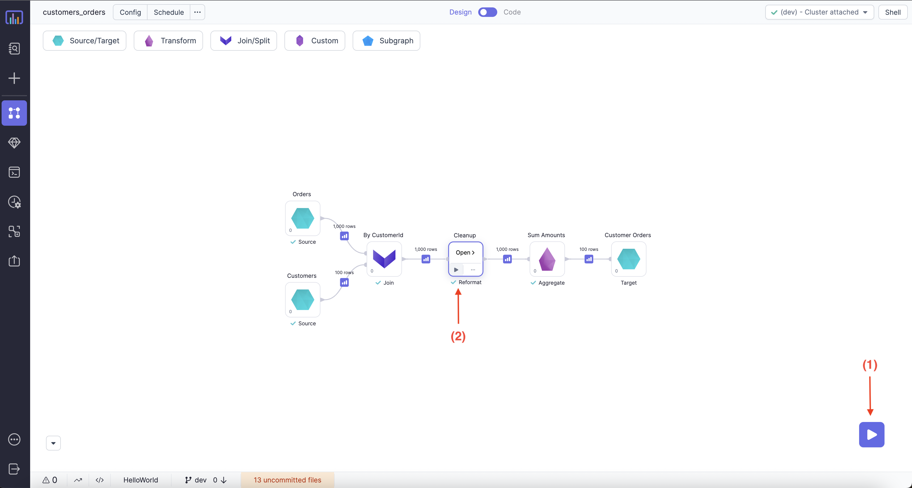
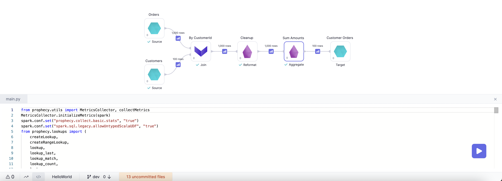
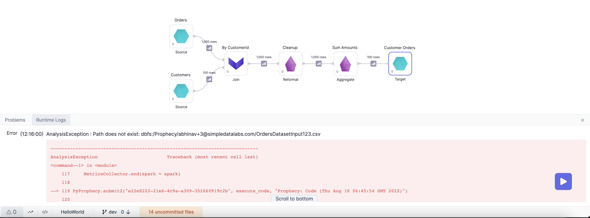
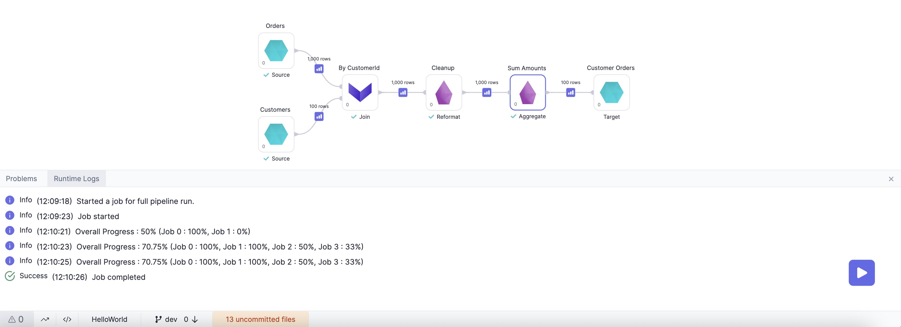
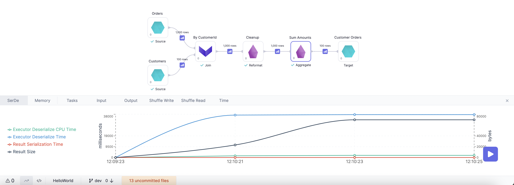
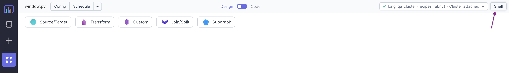
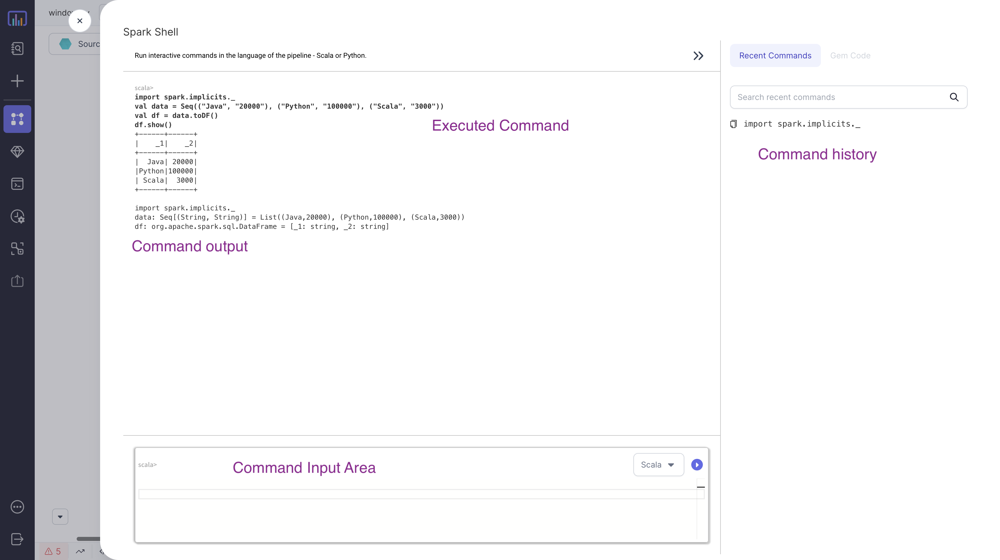

## Running a Pipeline

There are 2 ways to run a Pipeline interactively:



1. Using the play button from the bottom right side. This would execute the entire Pipeline.
2. Using the play button on a particular Gem. This would only execute the flow in the Pipeline till that Gem. This comes
   in handy during development, so that we don't have to run the entire Pipeline to debug/change a particular Gem.

<div class="wistia_responsive_padding" style={{padding:'56.25% 0 0 0', position:'relative'}}>
<div class="wistia_responsive_wrapper" style={{height:'100%',left:0,position:'absolute',top:0,width:'100%'}}>
<iframe src="https://user-images.githubusercontent.com/103921419/185360973-928612ae-7655-4e67-8f95-ae9b63829231.mp4" title="Monitoring" allow="autoplay;fullscreen" allowtransparency="true" frameborder="0" scrolling="no" class="wistia_embed" name="wistia_embed" msallowfullscreen width="100%" height="100%"></iframe>
</div></div>

## Interims

During development, often the user want to see data to make more sense of it and to check whether the expected output is getting
generated or not after the transformation. To ease this process, Prophecy provides you the option to collect data samples at
various level of the Pipelines based on the config.

By default, for interactive runs, data sampling is enabled for all components. This behaviour can be configured as per need from the
`options` menu as shown in image below:

```mdx-code-block
import App from '@site/src/components/slider';

export const ImageData = [
  {
    "image":"/img/interactive-execution/interactive-execution-interims-config.png",
    "description":<h3 style={{padding:'10px'}}>Data Sampling Configuration</h3>,
  },
  {
    "image":"/img/interactive-execution/interactive-execution-interim-all.png",
    "description":<h3 style={{padding:'10px'}}>Data Sampling Mode - All</h3>,
  },
  {
    "image":"/img/interactive-execution/interactive-execution-interim-source.png",
    "description":<h3 style={{padding:'10px'}}>Data Sampling Mode - Source</h3>
  },
  {
    "image":"/img/interactive-execution/interactive-execution-interim-target.png",
    "description":<h3 style={{padding:'10px'}}>Data Sampling Mode - Target</h3>,
  },
  {
    "image":"/img/interactive-execution/interactive-execution-interim-io.png",
    "description":<h3 style={{padding:'10px'}}>Data Sampling Mode - IO</h3>,
  },
  {
    "image":"/img/interactive-execution/interactive-execution-sample-interim.png",
    "description":<h3 style={{padding:'10px'}}>Interim example</h3>,
  },
];

<App ImageData={ImageData}></App>
```

## Execution

Once we run a Pipeline, we can use below options to better understand our Pipeline:

1. Execution code
2. Execution Errors
3. Runtime Logs
4. Runtime Metrics
5. Execution Metrics

### Execution Code

Once we run a Pipeline interactively Prophecy generates the execution code in the backend, which is then executed in
the selected Fabric.



:::info
Execution code can also directly run in `databricks notebook` or [shell](interactive-execution#shell) for debugging.
:::

### Execution Errors

If there are any errors in Pipeline, a pop-up window would open for `execution error`.


Also the error can be seen in the runtime logs as shown in the image below:


### Runtime Logs

Overall progress with associated timestamps can be monitored from the Runtime Logs as shown in image below:



### Runtime Metrics

Various Spark metrics collected during runtime can be monitored as shown in image below:



### Execution Metrics

For `interactive runs` execution metrics are collected, to make the development easier and more intuitive. These can be
accessed from the `Metadata Page` inside the `run tab ` of the `Pipeline`.


## Shell

Prophecy IDE comes with an inbuilt interactive Spark shell that supports both `Python` and `Scala`. The shell is an easy way to quickly analyze data or test Spark commands


:::info
`Spark context` and `session` are available within the shell as variables `sc` and `spark` respectively
:::

---

### Examples

:::note
You need to be connected to a cluster to access the interactive shell
:::

#### Python


#### Scala


