Version 3.4 of our platform, Prophecy, introduces an exciting new feature: **Parameterized Gems**. Now, users can effortlessly create and manage generic frameworks using a user-friendly drag-and-drop interface. This empowers you to increase code re-usability without the need for coding expertise.

#### In this quick start, we will show you how to use Parameterized Gems and run your Spark Pipelines.

We'll take you step by step from introduction to generic frameworks to running the same. By the end of this training, you'll have an understanding of Generic frameworks and how to use Parameterized Gems. Let's dig in!

#### You will need:
- Databricks Account
- GitHub Account (recommended)

If you don't have an existing Prophecy Fabric, Project and Pipeline, please check out [this](https://docs.prophecy.io/low-code-spark/fabrics/create-a-Fabric/) for Fabric, [this](https://docs.prophecy.io/concepts/project/#1-create-new-project) for Project and [this](https://docs.prophecy.io/concepts/project/pipeline) for Pipeline.

## Introduction to generic framework

Enterprises have built **generic frameworks** to accelerate the development of data platforms and standardize the process. These frameworks allow data engineers to quickly build new pipelines using existing building blocks by modifying the pipeline configurations only, thus avoiding the need to create new pipelines from scratch.

Let’s take an example to see how a generic pipeline works. Assume we have to build a **Customer Data Ingestion** pipeline that will read data from a CSV file, reformat data and write it into a SQL table.

Similarly, we need to build an **Order Data Ingestion** pipeline that will read data from a CSV file, reformat data and write it into a SQL table.

As we can see, both the above pipelines perform similar operations while ingesting data from source to target even though the **schema and transformation logics** are completely different. Thus, instead of creating new pipelines from scratch every time for similar use cases, we can create a single **Generic Data Ingestion** pipeline instead and run it differently using the **config variables**.

This process of creating generic pipelines helps enterprises speed up the development process by making the existing building blocks reusable.

#### For this guide, let's try to build the generic Data Ingestion Pipeline (i.e. above example) using Parameterized Gems. 

## 1. Create  pipeline

First, let’s create the generic data ingestion pipeline by going to IDE canvas, dragging and dropping the source, reformat and target gems as shown below:
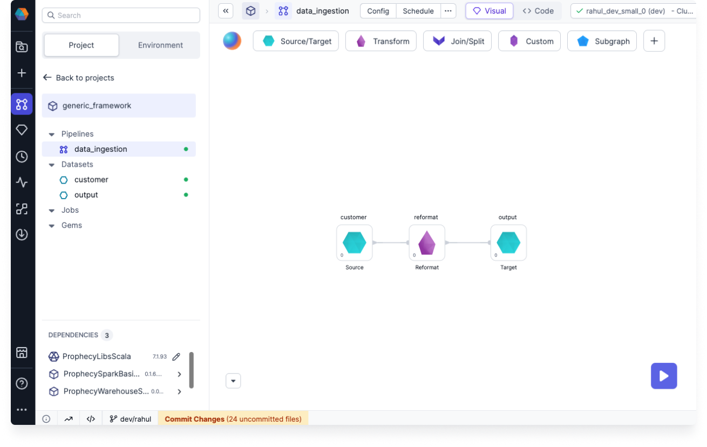

## 2. Create config instances

As we are going to run the generic pipeline separately for both customer and order use cases, we need to create 2 configs: customer_config and order_config. Let’s click on (1) Config tab to open the pipeline config page.

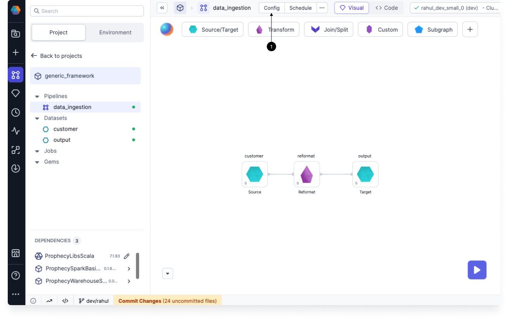

Switch to (1) config tab, click on the (2) instance dropdown and create a (3) new configuration. Name the config instance as customer_config.

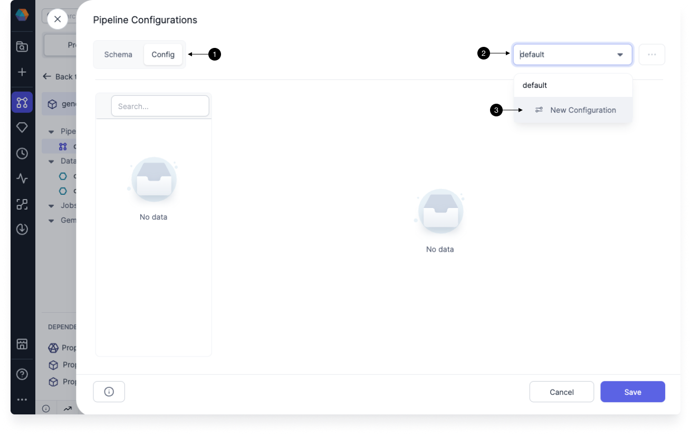

Similarly, create another config instance with name order_config. Then click on (1) Save button as shown below:

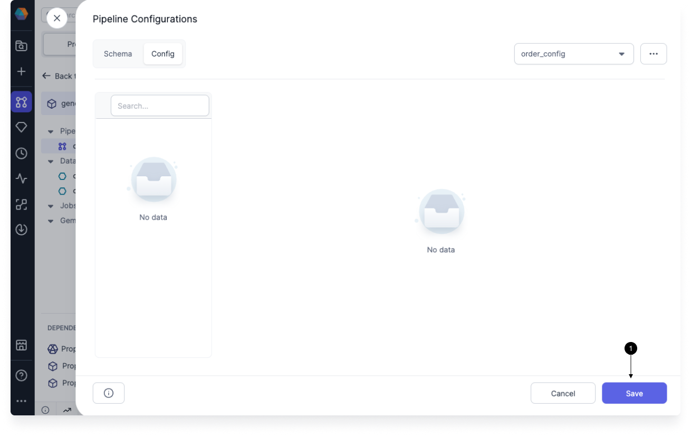

## 3. Configure gems for customer ingestion pipeline

### 3.1 Configure source gem

Go to pipeline config page and create a config key named “input_file” as shown below:

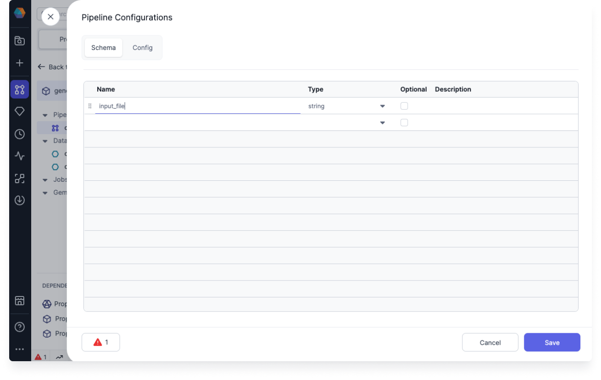

Click on (1) Config tab, switch (2) instance to customer_config and mention value of (3) input_file from where you want to read the data. For this guide, I will be reading CSV data from Databricks.

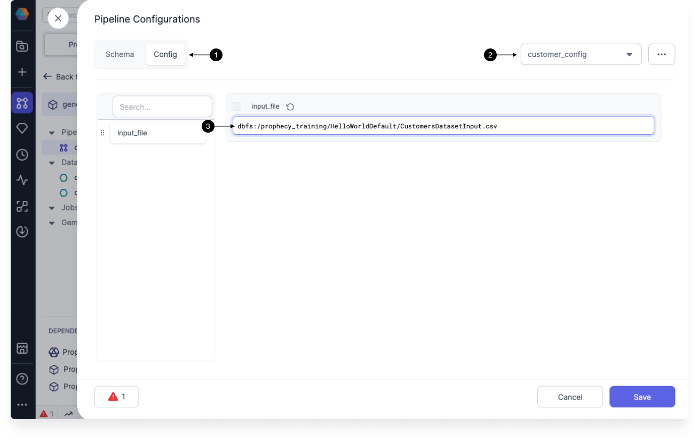

Click on (1) the source gem from the pipeline, select the relevant file type and click on the Location tab.

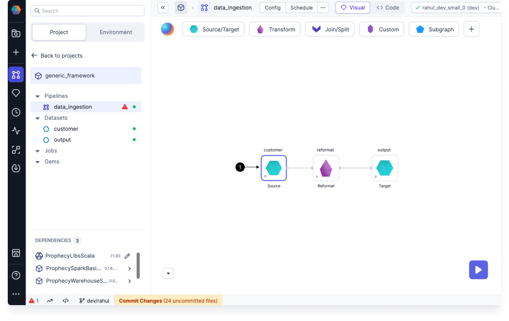

Now we have to provide the location from where data will be read. Add config key (1) input_file in the location input as shown below:

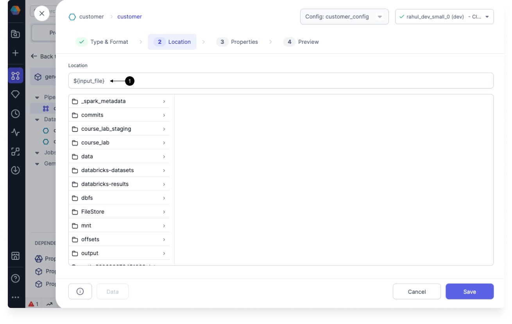

Go to (3) Properties tab and click on Infer Schema button.

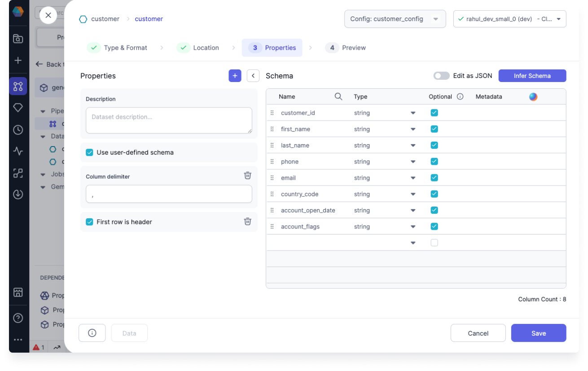

Go to (4) Preview tab and click on the Load button to preview the data. Post that, click on the Save button to store all the changes.

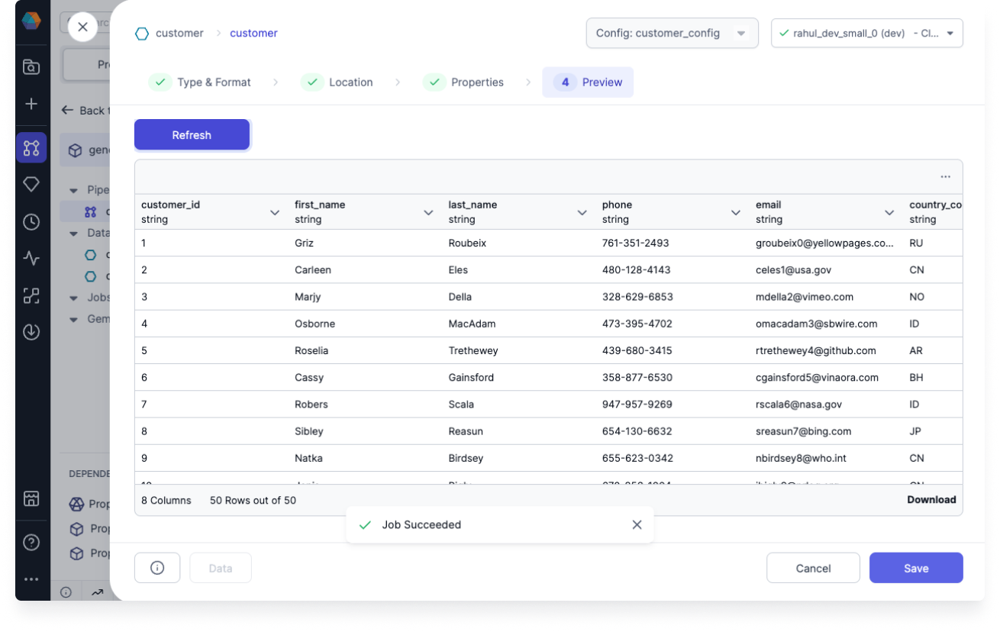

### 3.2 Configure reformat gem

Go to reformat gem, click on the (1) icon  and create a (2) config key named “reformat_logic” as shown below:

Write the (1) logic inside the reformat gem for the customer data ingestion pipeline and click on (2) Save button as shown below:

After you click on the Save button, the reformat_logic config key will be created and stored in the pipeline configuration. In order to check if reformat_logic config key was created with proper values, click on pipeline Config tab, and you will be able to see the config key (1) reformat_logic under (2) Schema tab as shown below:

Under (1) Config tab, you will be able to see the values of the config key (2) reformat_logic as shown below:

### 3.3 Configure target gem

As we had configured the source gem in step 3.1, repeat the same steps to configure Target gem with relevant information.

**Note**: In order to configure the gems for order ingestion pipeline, repeat the steps from 3.1 to 3.3 with relevant details.

## 4. Run pipeline

Now we will be running the pipeline for customer_config instance first. For that, click on the (1) Run button as shown below:
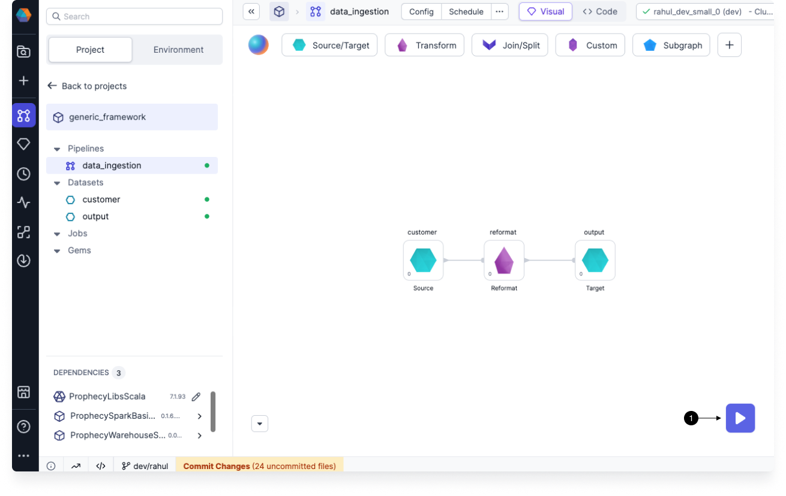

Now, you can check the final data by clicking the final (1) interim icon as shown below:
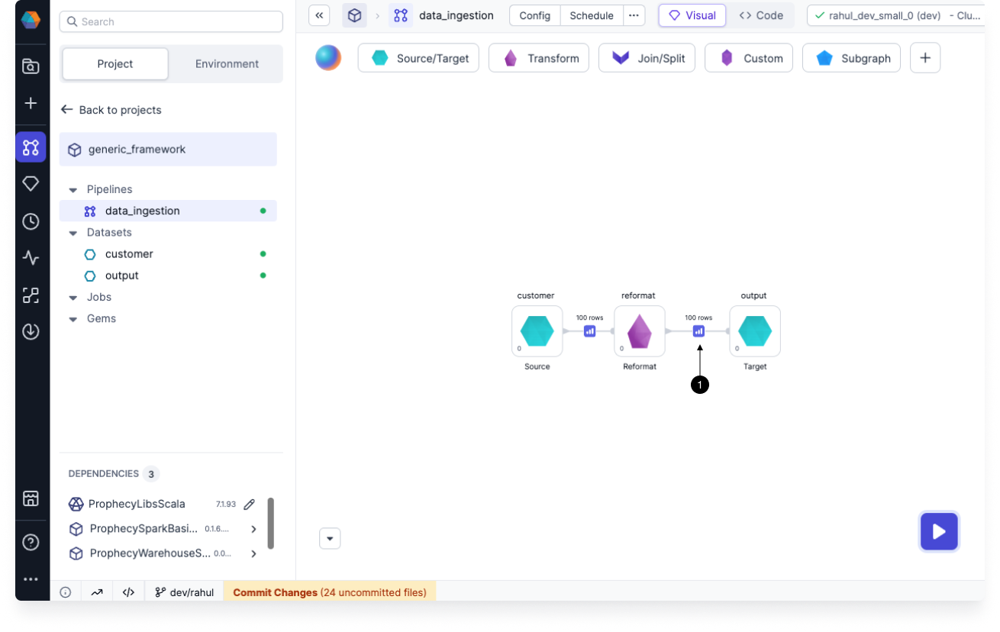

The output data that we got is shown below:
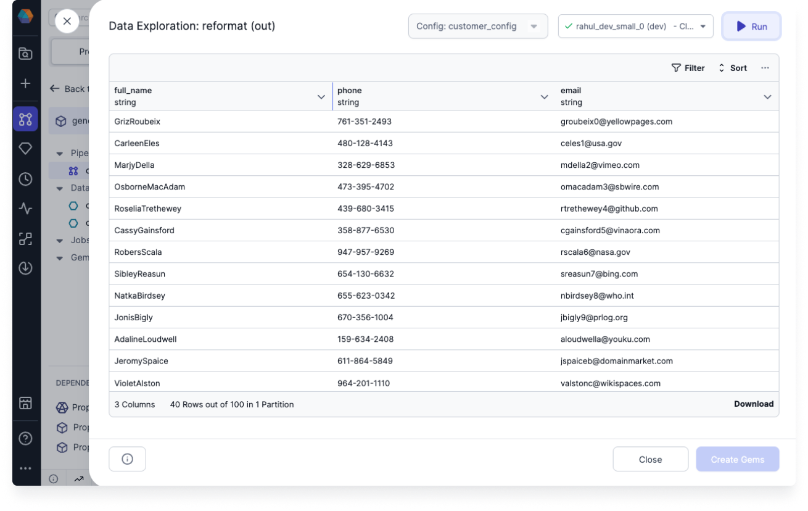

For running the pipeline for order_config instance, first change the pipeline config to order_config and then run the pipeline to check the final data. 

## What’s next?

Great work! 🎉

You've successfully developed your first generic framework using Parameterized Gems in Prophecy. Take a moment to appreciate your accomplishment 🥳.

To continue learning and expanding your skills with Prophecy, explore other tutorials within our documentation, or apply your newfound knowledge to address real-world business challenges!

If you ever encounter any difficulties, don't hesitate to reach out to us (contact.us@Prophecy.io) or join our [Slack community](https://prophecy-io-support.slack.com/join/shared_invite/zt-moq3xzoj-~5MSJ6WPnZfz7bwsqWi8tQ#/shared-invite/email) for assistance. We're here to help!

---