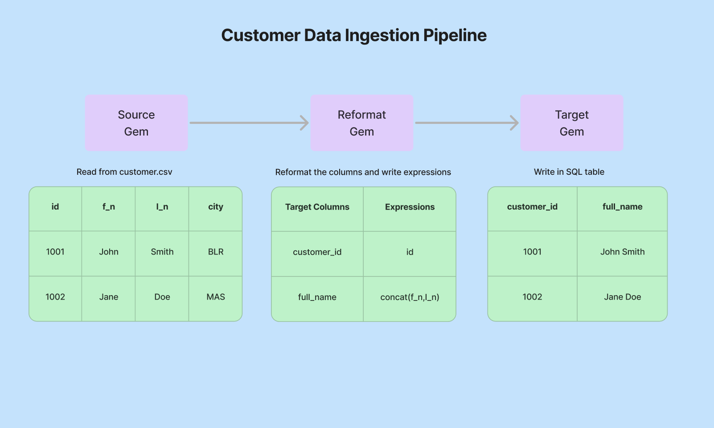
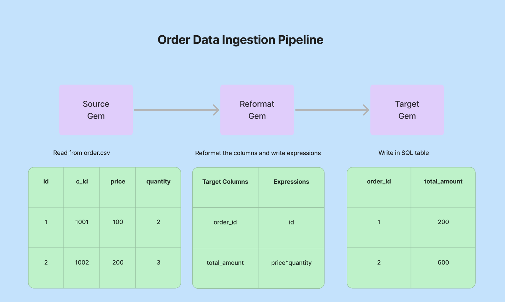
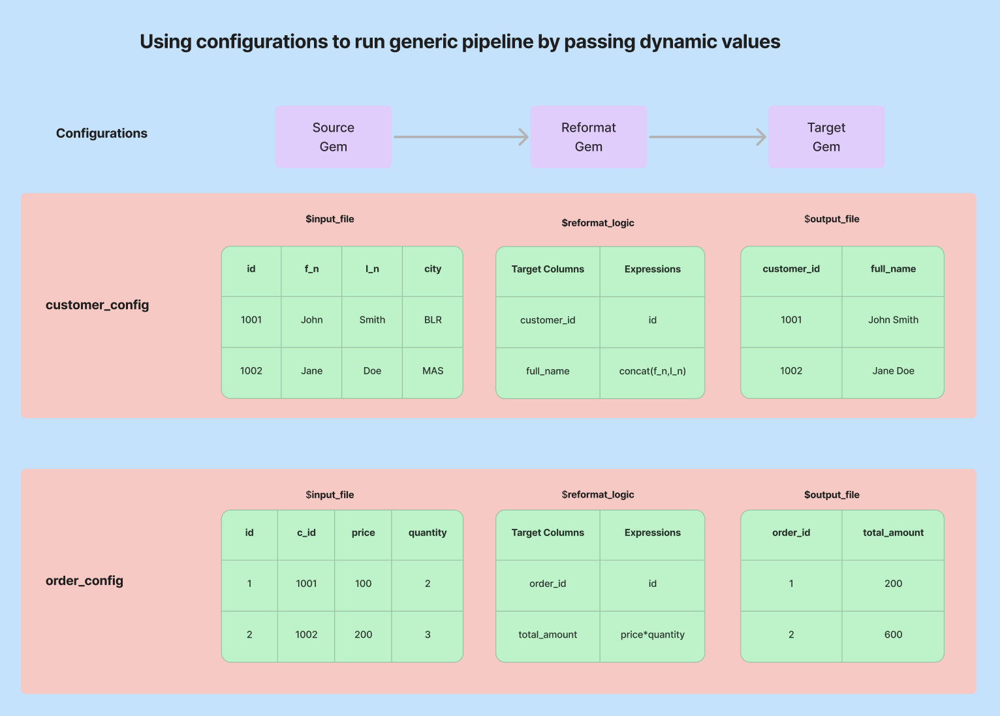
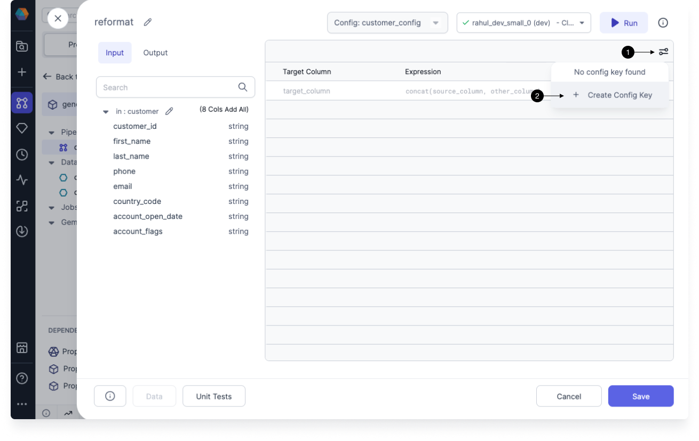
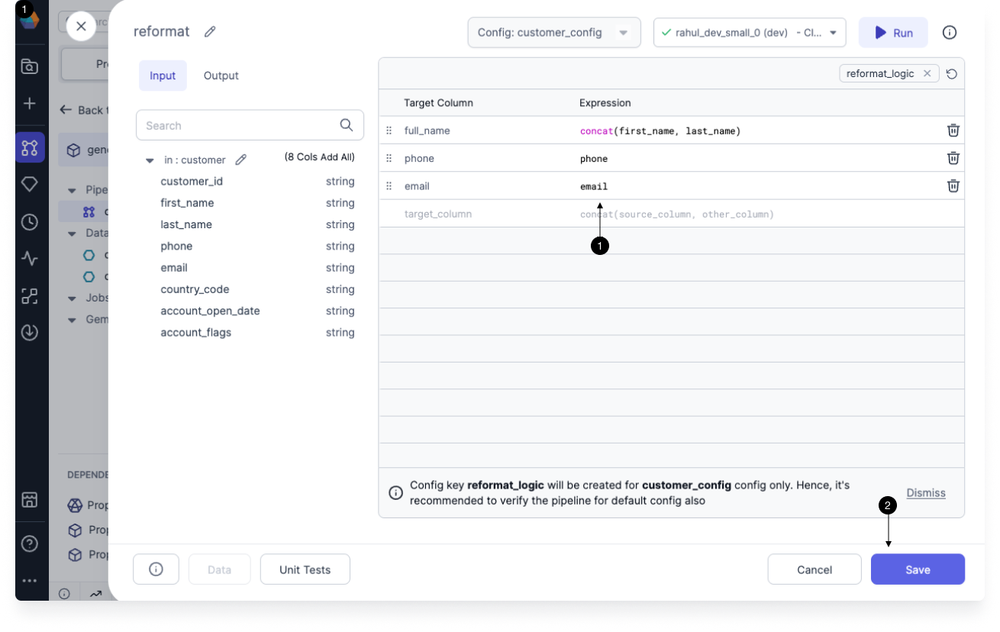
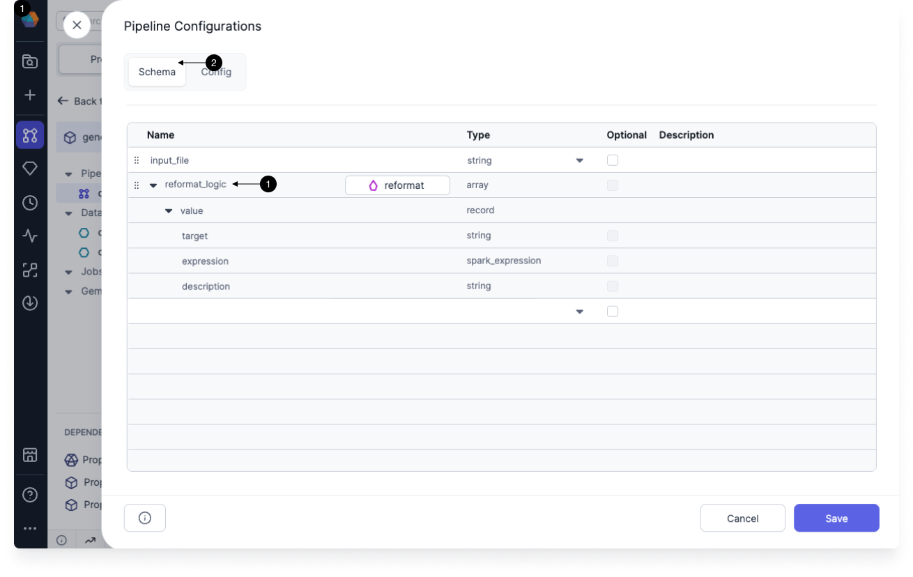
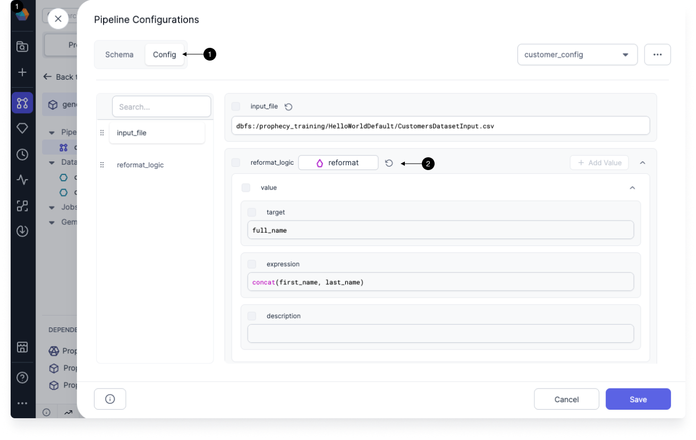

## Introduction

Enterprises have built **generic frameworks** to accelerate the development of data platforms and standardize the process. These frameworks allow data engineers to quickly build new pipelines using existing building blocks by modifying the Pipeline configurations only, thus avoiding the need to create new pipelines from scratch.

Let’s take an example to see how a generic Pipeline works. Assume we have to build a **Customer Data Ingestion** Pipeline that will read data from a CSV file, reformat data and write it into a SQL table.

Similarly, we need to build an **Order Data Ingestion** Pipeline that will read data from a CSV file, reformat data and write it into a SQL table.

As we can see, both the above pipelines perform similar operations while ingesting data from source to target even though the **schema and transformation logics** are completely different. Thus, instead of creating new pipelines from scratch every time for similar use cases, we can create a single **Generic Data Ingestion** Pipeline instead and run it differently using the **config variables**.

This process of creating generic framework helps enterprises speed up the development process by making the existing building blocks reusable. Now let's try to see how you can parameterize any Gem for building generic frameworks.

## Parameterize Gem

Currently, Prophecy allows you to parameterize only those gems which have any table component inside it. For example, let's try to parameterize the Expression table inside the Reformat Gem.

Go to Reformat Gem, click on the (1) parameterize icon and create a (2) config key where all the transformation will be stored as shown below:

Write the (1) transformation logic inside the Reformat Gem and click on (2) Save button as shown below:

After you click on the Save button, the reformat_logic config key will be created and stored in the Pipeline configuration. In order to check if reformat_logic config key was created with proper values, click on Pipeline Config tab, and you will be able to see the config key (1) reformat_logic under (2) Schema tab as shown below:

Under (1) Config tab, you will be able to see the values of the config key (2) reformat_logic as shown below:

Similary, you can parameterize other gems in the Pipeline as per your business requirement. Post that, you can run the single Pipeline with multiple config instances to achieve different outputs.

:::info
Please note, that Source gems can also be parameterized by using config variable to provide the file location. Check
out [this guide](https://docs.prophecy.io/low-code-spark/configuration/#examples-for-pipeline-level-configurations)
to learn more.
:::

---
