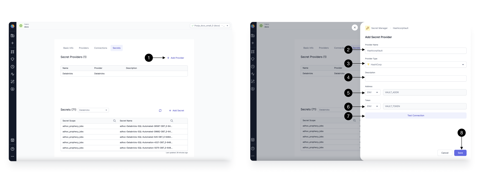
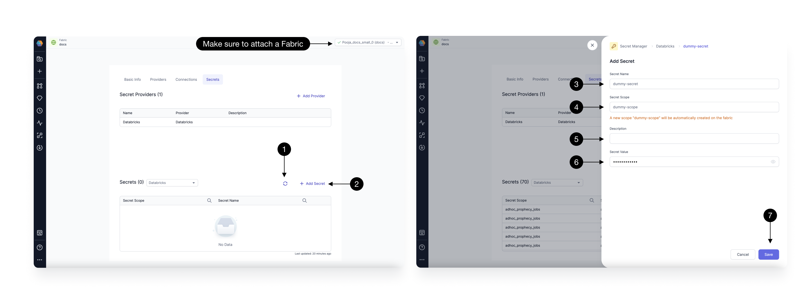

HashiCorp Vault is a comprehensive and highly scalable secrets management solution that provides centralized control over sensitive information such as API keys, passwords, and encryption keys. It ensures secure storage, dynamic secret generation, and fine-grained access policies.
For users seeking robust secret management in Prophecy, they can use [HashiCorp Vault](https://developer.hashicorp.com/vault/docs/what-is-vault) as a reliable Secret Provider.

Let's explore how to seamlessly integrate and utilize HashiCorp Vault secrets in Prophecy.

## Managing HashiCorp Vault Secret Provider

To add a HashiCorp Vault Secret Provider, click on the **(1) Add Provider** button, opening the Secret Provider form.

Provide a **(2) Name**, select **(3) Provider type** as **HashiCorp**, and add a **(4) Description** of your choice.
For authentication, Prophecy currently supports fixed Environment variables with names **(5) VAULT_ADDR** and **(6) VAULT_TOKEN**. Ensure your Spark cluster has these environment variables set correctly, pointing to the respective Vault URL and token. Verify the configuration by clicking the **(7) Test connection** button.

Once done, click **(8) Save**.

## Managing Vault Secrets and Policies

After adding your Vault provider, click on the **(1) Refresh** button to fetch secrets already stored in HashiCorp Vault.
Make sure you select the Secret provider created above in the Secret Provider dropdown while listing the secrets.

To create a new Secret, click on the **(2) Add Secret** button, opening the Add secret form.

Provide a **(3) Secret Name**, and select a **(4) Secret Policy** from the dropdown. Add a **(5) Description**, and the **(6) value** for your secret. Once done, click **(7) Save**. This will create the Secret with the given key and value, associated with the specified policy.

You can also Edit/Delete an existing secret from the button next to the Secret in the table.

## Using HashiCorp Vault Secrets in Pipelines

Once you have added a HashiCorp Vault Secret Provider and stored secrets, you can seamlessly [use](./using-secrets.md) them in your Pipelines, enhancing security and ensuring smooth execution.
