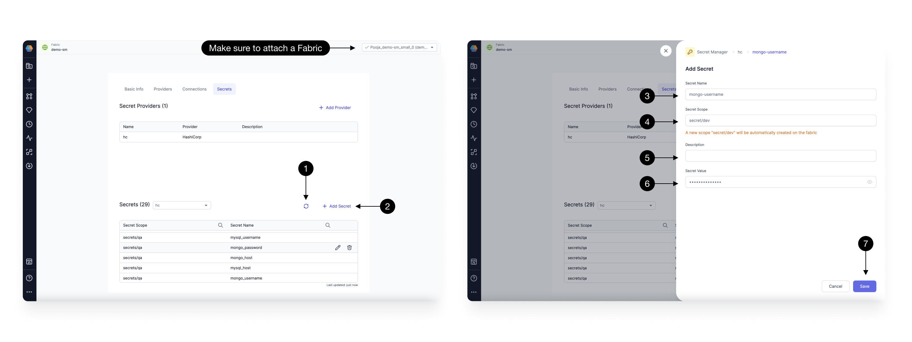

[HashiCorp Vault](https://developer.hashicorp.com/vault/docs/what-is-vault) is a comprehensive and highly scalable secrets management solution that provides centralized control over sensitive information such as API keys, passwords, and encryption keys. It ensures secure storage, dynamic secret generation, and fine-grained access policies.

## Managing HashiCorp Vault Secret Provider

To add a HashiCorp Vault Secret Provider, click on the **(1) Add Provider** button, opening the Secret Provider form.

Provide a **(2) Name**, select **(3) Provider type** as **HashiCorp**, and add a **(4) Description** of your choice.
For authentication, Prophecy currently supports fixed Environment variables with names **(5) VAULT_ADDR** and **(6) VAULT_TOKEN**. Ensure your Spark cluster has these environment variables set correctly, pointing to the respective Vault URL and token. Verify the configuration by clicking the **(7) Test connection** button.

Once done, click **(8) Save**.

## Managing Vault Secrets

After adding your Vault provider, click on the **(1) Refresh** button to fetch secrets already stored in HashiCorp Vault.
Make sure you select the Secret provider created above in the Secret Provider dropdown while listing the secrets.

:::info
You can only fetch the secrets accessible to the Token provided in your Spark cluster
:::

To create a new Secret, click on the **(2) Add Secret** button, opening the Add secret form.

Provide a **(3) Secret Name**, and select a **(4) Secret Scope** from the dropdown.Scope in Hashicorp vault is nothing but the path of that secret key. Note that if the scope/path doesn't exist, it will be auto-created.  
Add a **(5) Description**, and the **(6) value** for your secret. Once done, click **(7) Save**. This will create the Secret with the given key and value, at the specified path.

You can also Edit/Delete an existing secret from the button next to the Secret in the table.

## Using HashiCorp Vault Secrets in Pipelines

Once you have added a HashiCorp Vault Secret Provider and stored secrets, you can seamlessly [use](./using-secrets.md) them in your Pipelines.
