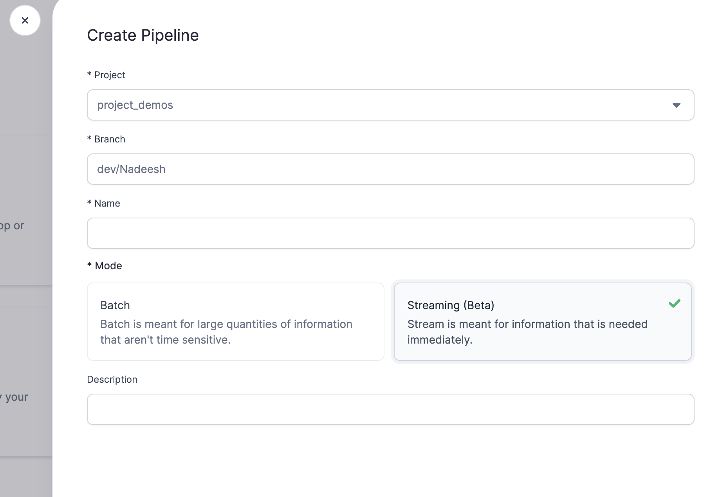

Prophecy 2.7 introduces native support for streaming data running on Spark Structured Streaming. The streaming capability is available for `Python` projects. Support for Scala will be added in the future.

Streaming pipelines work differently from batch pipelines:

1. Streaming applications are always running, continuously processing incoming data.
2. Data is processed in micro-batches, with the notable exception of [Continuous Triggers](https://spark.apache.org/docs/latest/structured-streaming-programming-guide.html#continuous-processing) (an experimental feature available in Spark3.3). Continuous triggers are not supported by Prophecy.
3. Streaming applications handle transient data rather than maintain the entire data. Aggregations and joins require watermarking for maintaining a limited state.
4. All Streaming Datasets can behave similar to Batch datasets using the Spark `ForEachBatch`. More on `ForEachBatch` [here](https://spark.apache.org/docs/3.1.1/api/python/reference/api/pyspark.sql.streaming.DataStreamWriter.foreachBatch.html) Note that `forEachBatch` is not supported by Prophecy.

This documentation assumes you are already familiar with how Structured Streaming works. For more information, you can consult the Structured Streaming documentation [here](https://spark.apache.org/docs/latest/structured-streaming-programming-guide.html).

## Spark Structured Streaming using Prophecy IDE

Within a Prophecy `Python` Project, a user can create a Structured Streaming Pipeline using the Streaming(beta) mode.

### Working with a Streaming Pipeline

To create a Streaming Pipeline, users can follow a process similar to creating a Batch Pipeline in a `Python` project. For more on Pipeline creation and understanding Prophecy pipelines, please check [this](/concepts/pipeline) link. Streaming Pipelines work differently from Batch Pipelines in the following ways:

1. Partial runs are not supported for streaming applications. A partial run is only allowed on a `Streaming Target` Gem.
2. Streaming pipelines are long-running tasks and process data at intervals. Currently, they do not capture cumulative statistics.
3. Streaming Pipelines are continuous and do not stop running. To terminate a Streaming Pipeline, users need to click the "X" button. A Streaming Pipeline is an ongoing process and will not terminate itself.
4. To deploy the Pipeline on Databricks, users can follow the same process described [here](/low-code-jobs/databricks-jobs). A scheduled Job will check if the Streaming Pipeline is running every X minutes. If the Pipeline is not running, the Job will attempt to start it.

### Streaming Sources and Targets

Spark Structured Streaming applications have a variety of source and target components available to construct Piplines. Streaming sources and targets are accessed using `spark.readStream()` or `spark.writeStream()`. Additionally, any batch data sources can be used in a streaming application. Batch data sources are read using the `spark.read()` function at every processing trigger (due to Spark evaluating lazily). More on triggers [here](https://spark.apache.org/docs/latest/structured-streaming-programming-guide.html#triggers).

For more information on Batch Source and Target Gems, click [here](/low-code-spark/gems/source-target/source-target.md).

For more information on Streaming Source and Target Gems, click [here](/low-code-spark/spark-streaming/streaming-source-gem).

### Streaming Transformations

For more information on Streaming Transformations, click [here](/low-code-spark/spark-streaming/streaming-transformations).
