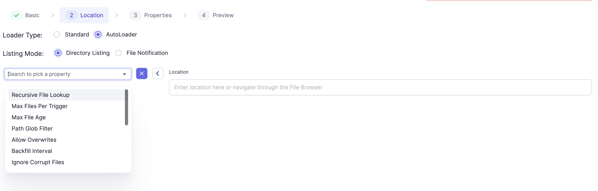
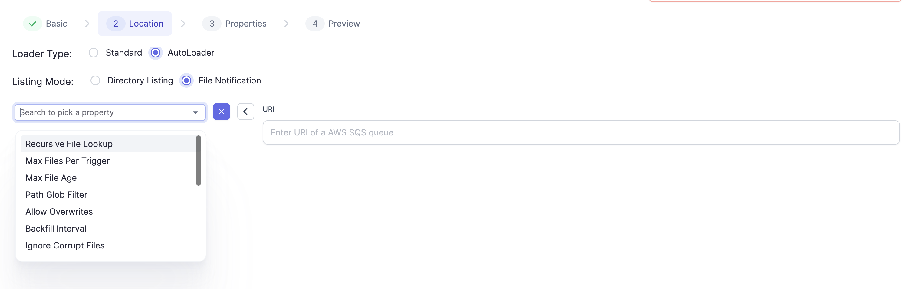

## File-based Streaming Sources and Targets

For file stream sources, incoming data files are incrementally and efficiently processed as they arrive in cloud storage. No additional setup is necessary, and cloud storage only needs to be accessible from the User's Fabric.

Autoloader is available for use with a Databricks Fabric and supports loading data directory listing, as well as using file notifications via AWS's Simple Queue Service (SQS). More on Autoloader [here](https://docs.databricks.com/ingestion/auto-loader/index.html). For different Cloud Storages supported by Autoloader, please check [this](https://docs.databricks.com/ingestion/auto-loader/file-detection-modes.html) page.

When you select Format and click NEXT, this Location Dialog opens.

## Databricks Auto Loader

Databricks Fabrics can utilize [Auto Loader](https://docs.databricks.com/ingestion/auto-loader/index.html).

Auto Loader supports loading data directory listing as well as using AWS's Simple Queue Service (SQS) file notifications. More on this [here](https://docs.databricks.com/ingestion/auto-loader/file-detection-modes.html)

Stream sources using Auto Loader allow [configurable properties](https://docs.databricks.com/ingestion/auto-loader/options.html#file-format-options) that can be configured using the Field Picker on the Gem.

## Formats Supported

The following file formats are supported. The Gem properties are accessible under the Properties Tab by clicking on `+` :

1. JSON: Native Connector Docs for Source [here](https://spark.apache.org/docs/3.1.3/api/python/reference/api/pyspark.sql.streaming.DataStreamReader.json.html). Additional Autoloader Options [here](https://docs.databricks.com/ingestion/auto-loader/options.html#json-options).
2. CSV: Native Connector Docs for Source [here](https://spark.apache.org/docs/3.1.3/api/python/reference/api/pyspark.sql.streaming.DataStreamReader.csv.html). Additional Autoloader Options [here](https://docs.databricks.com/ingestion/auto-loader/options.html#csv-options).
3. Parquet: Native Connector Docs for Source [here](https://spark.apache.org/docs/3.1.3/api/python/reference/api/pyspark.sql.streaming.DataStreamReader.csv.html). Additional Autoloader Options [here](https://docs.databricks.com/ingestion/auto-loader/options.html#csv-options).
4. ORC: Native Connector Docs for Source [here](https://spark.apache.org/docs/3.1.3/api/python/reference/api/pyspark.sql.streaming.DataStreamReader.orc.html). Additional Autoloader Options [here](https://docs.databricks.com/ingestion/auto-loader/options.html#orc-options).
5. Delta: A quickstart on Delta Lake Stream Reading and Writing is available [here](https://docs.databricks.com/structured-streaming/delta-lake.html#delta-table-as-a-source). Connector Docs are available [here](https://docs.delta.io/latest/delta-streaming.html). Note, that this would require installing the Spark Delta Lake Connector if the user has an on prem deployment. We have additionally provided support for Merge in the Delta Lake Write Connector. (uses `forEatchBatch` behind the scenes).
