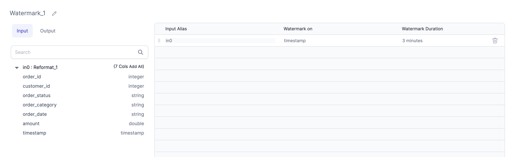

## Watermarking

Watermarking is a technique that enables aggregations on streaming data by limiting the state over which the aggregation is performed. In order to prevent out-of-memory errors, we have introduced support for watermarking. More information on watermarking is available in the Spark documentation [here](https://spark.apache.org/docs/latest/structured-streaming-programming-guide.html#window-operations-on-event-time)

The Watermark option has been added to some Gems. You may define the Watermark here:

A Watermark Tab has been added to Aggregate, Join, Deduplicate and SQLStatement Gems. This allows users to add of Watermarking to a `timestamp` column. A user may enter the column name or select it from the Port Schema Table on the left. The text box is editable.

## Transformation Gems

Transform Gems that generate code but do not work within Streaming Applications include `OrderBy`, `Limit`, and `Window` (partitionBy).
Although `Window` would work with a watermarked column as part of the partitioning, it is advised to use `window()` or `session_window()` from the `pyspark.sql.functions package`. (More details on windowing [here](https://spark.apache.org/docs/latest/structured-streaming-programming-guide.html#window-operations-on-event-time)) Watermarking has been added to the [Aggregate](/low-code-spark/gems/transform/aggregate.md) and [Deduplicate](/low-code-spark/gems/transform/deduplicate.md) Gems, as well as the [SQL Statement](/low-code-spark/gems/custom/sql-statement.md) Gem. The [Join Gem](/low-code-spark/gems/join-split/join.md) has also been updated with watermarking.
