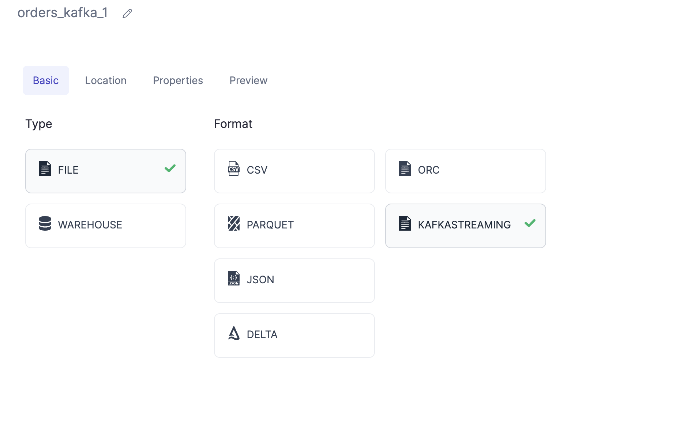
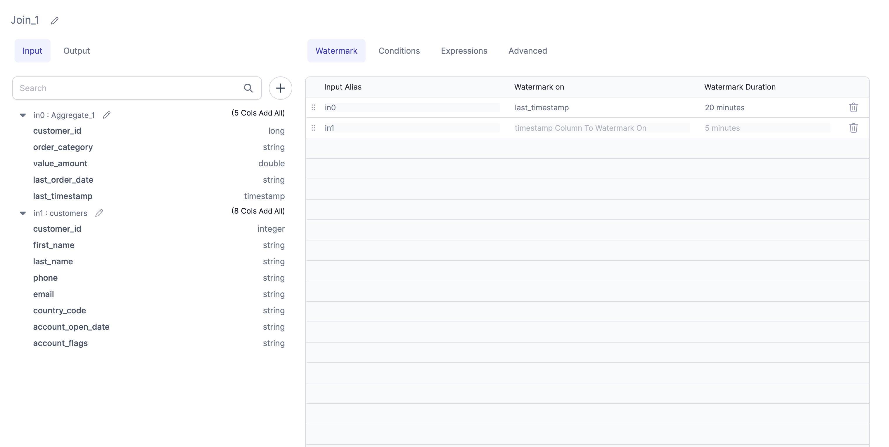

Starting with Prophecy 2.7, we now provide native support for Structured Streaming Applications. Currently, this feature is only available for Python projects. However, we plan to add support for Scala in the future.

Streaming pipelines differ from batch pipelines in several important ways:

Streaming applications are always running, continuously processing incoming data.
Data is processed in microbatches (with the exception of Continuous Triggers, which are still an experimental feature in Spark 3.3).
Streaming applications handle transient data. Real-world aggregations and joins require watermarking for state maintenance.
All Streaming Datasets can be made to behave as Batch datasets using the Spark ForEachBatch.
This documentation assumes you are already familiar with how Structured Streaming works. For more information, you can consult the Structured Streaming documentation [here](https://spark.apache.org/docs/latest/structured-streaming-programming-guide.html).

## Spark Streaming using Prophecy IDE

Within a Python Project, a User can create a Streaming Pipeline much like creating a Batch Pipeline.

### Creating a Streaming Pipeline

To create a Streaming Pipeline, users can follow a process similar to creating a Batch Pipeline within a Python project. For more on Pipeline creation and understanding Prophecy pipelines, please check [this](/concepts/pipeline) link. However, there are some differences in execution:

1. Partial runs are not possible for streaming applications. Partial run is only allowed on a StreamingTarget Gem.
2. Streaming pipelines are long-running tasks and capture data at intervals. They do not currently provide cumulative statistics, but they can be used to preview data.
3. To stop the Pipeline, users need to click the "X" button.
4. To deploy the Pipeline on Databricks, users can follow the same process described [here](/low-code-jobs/databricks-jobs). A schedule will check if the Streaming Pipeline is running every X minutes. If it is not running, the Job will attempt to start it.

## Dataset Components

There are a few key differences between the Prophecy Gems between a Batch Pipeline and a Streaming Pipeline. The following Source/Target options are available for Streaming Pipelines:

Spark Streaming applications have a variety of Source/Target components available for use in Pipeline construction. These include both normal batch data sources, which can be read using the `spark.read()` function at every processing trigger, and streaming-specific sources and targets, which are accessed using `spark.readStream()` or `spark.writeStream()`.

### Source/Target

For normal batch data sources, any batch source can be used in a streaming application. These are represented as normal Source Gems and are read with `spark.read()`, which is accessed at every processing trigger (due to Spark evaluating lazily). (More on triggers [here](https://spark.apache.org/docs/latest/structured-streaming-programming-guide.html#triggers))
For more information on Source gems, see [here](/low-code-spark/gems/source-target/source-target.md)

### StreamingSource/StreamingTarget

Streaming source gems render to `spark.readStream()` on the Spark side. Currently, we support file stream-based sources and targets, warehouse-based targets, and stream-based sources and targets:

#### File Stream Based Sources/Targets

For file stream sources, incoming data files are incrementally and efficiently processed as they arrive in cloud storage. No additional setup is necessary, and cloud storage only needs to be accessible from the User's Fabric.

Autoloader is available for use with a Databricks Fabric and supports loading data directory listing, as well as using file notifications via AWS's Simple Queue Service (SQS). More on Autoloader [here](https://docs.databricks.com/ingestion/auto-loader/index.html). For different Cloud Storages supported by Autoloader, please check [this](https://docs.databricks.com/ingestion/auto-loader/file-detection-modes.html) page

When you select Format and click NEXT, this Location Dialog opens.

##### Autoloader

Databricks Fabrics allow the use of Autoloader, which you read more about [here](https://docs.databricks.com/ingestion/auto-loader/index.html).
Autoloader supports loading data Directory listing as well as using File Notifications via AWS's Simple Queue Service (SQS). More on this [here](https://docs.databricks.com/ingestion/auto-loader/file-detection-modes.html)

Files Loaded using Autoloader have a [few common properties](https://docs.databricks.com/ingestion/auto-loader/options.html#file-format-options) that can be set using the Field Picker on the Gem.

#### Formats Supported

We provide support for the following formats at present. The Gem properties would be accessible under the Properties Tab, under a + sign:

1. Json: Native Connector Docs for Source [here](https://spark.apache.org/docs/3.1.3/api/python/reference/api/pyspark.sql.streaming.DataStreamReader.json.html). Additional Autoloader Options [here](https://docs.databricks.com/ingestion/auto-loader/options.html#json-options)
2. CSV: Native Connector Docs for Source [here](https://spark.apache.org/docs/3.1.3/api/python/reference/api/pyspark.sql.streaming.DataStreamReader.csv.html). Additional Autoloader Options [here](https://docs.databricks.com/ingestion/auto-loader/options.html#csv-options)
3. Parquet: Native Connector Docs for Source [here](https://spark.apache.org/docs/3.1.3/api/python/reference/api/pyspark.sql.streaming.DataStreamReader.csv.html). Additional Autoloader Options [here](https://docs.databricks.com/ingestion/auto-loader/options.html#csv-options)
4. Orc: Native Connector Docs for Source [here](https://spark.apache.org/docs/3.1.3/api/python/reference/api/pyspark.sql.streaming.DataStreamReader.orc.html). Additional Autoloader Options [here](https://docs.databricks.com/ingestion/auto-loader/options.html#orc-options)
5. Delta: A quickstart on Delta Lake Stream Reading and Writing is available [here](https://docs.databricks.com/structured-streaming/delta-lake.html#delta-table-as-a-source). Connector Docs are available [here](https://docs.delta.io/latest/delta-streaming.html). Note, that this would require installing the Spark Delta Lake Connector if the user has an on prem deployment. We have additionally provided support for Merge in the Delta Lake Write Connector. (uses `forEatchBatch` behind the scenes)

#### Warehouse Based Sources/Targets

Warehouse-based sources and targets are also supported, with Splunk HEC currently being the sole example.

#### Stream Based Sources/Targets

Currently we support only **Kafka Steaming** Sources/Targets. A very comprehensive reading on what Kafka Sources/Targets supports is available [here](https://spark.apache.org/docs/latest/structured-streaming-kafka-integration.html).
We currently allow a user to authenticate using username/password via Databricks Secrets. We DO NOT recommend using the username/password option directly as that would commit your credentials to your code.
The Kafka Gem also has support for inferring the Schema of the incoming message (automatically the `value` column) if it is either JSON or AVRO type. A user would have to provide an example record for the same.

### Lookup

These are also same as Lookups applicable to Batch Pipelines. We can use lookups to interact with data coming into a Pipeline. More on Lookup [here](/low-code-spark/gems/source-target/lookup.md)

## Watermarking

Watermarking is a technique that enables aggregations on streaming data by limiting the state over which the aggregation is performed. In order to prevent out-of-memory errors, we have introduced support for watermarking. More information on watermarking is available in the Spark documentation [here](https://spark.apache.org/docs/latest/structured-streaming-programming-guide.html#window-operations-on-event-time)

A Watermark Tab has been added to some Gems. It looks like this:

A Watermark Tab has been added to some Gems (Aggregate, Join, Deduplicate, SQLStatement) to facilitate the addition of watermarking to a Timestamp type column. The user can either enter the column name or select it from the Port Schema Table on the left. The textbox is only editable for this purpose.

## Transformation Gems

Transform Gems that generate code but do not work within Streaming Applications include Order By, Limit, and Window (partitionBy).
Although Window would work with a watermarked column being part of the partitioning, it is advised to use `window()` or `session_window()` from the `pyspark.sql.functions package`. (More details on windowing [here](https://spark.apache.org/docs/latest/structured-streaming-programming-guide.html#window-operations-on-event-time)) Watermarking has been added to the [Aggregate](/low-code-spark/gems/transform/aggregate.md) and [Deduplicate](/low-code-spark/gems/transform/deduplicate.md) Gems, as well as the [SQL Statement](/low-code-spark/gems/custom/sql-statement.md) Gem. The [Join Gem](/low-code-spark/gems/join-split/join.md) has also been updated with watermarking.

## Future Work

Adding a generic implementation for forEachBatch.
