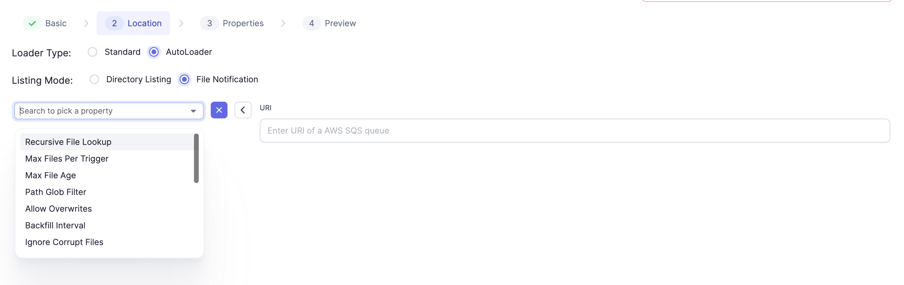

Prophecy 3.0 onwards, we have introduced native support for Structured Streaming Applications. 
NOTE that this is currently only possible for Python Projects. However, we will eventually start supporting Scala as well. 

Streaming Pipelines are inherently different from Batch Pipelines. Some salient points are: 
1. Spark Streaming applications are always running, constantly processing incoming data
2. Data is processed in microbatches (except with Continuous Triggers, which Spark only has as an Experimental Feature in Spark 3.3)
3. Streaming Applications have transient data. Any (real world) aggregations/joins requires watermarking for State Maintenance
4. All Streaming Datasets can be made to behave as Batch datasets using the Spark ForEachBatch

This documentation would assume you're already familiar with how Structured Streaming works. For more on this, you can go through their documentation [here](https://spark.apache.org/docs/latest/structured-streaming-programming-guide.html) 

## Spark Streaming using Prophecy IDE

Within a Python Project, a User can create a Streaming Pipeline much like creating a Batch Pipeline.

### Execution
The user has to connect the Fabric to the Pipeline, same as a Batch Pipeline. 
However, a few differences in execution are:
1. Truly Partial Runs are not possible for Streaming apps. Partial Run is only allowed on a StreamingTarget Gem
2. These are long running tasks and the intervals capture some data. It does not give cumulative statistics atm. It can be used to preview data though.
3. To stop the pipeline, the X button has to be pressed. 
4. To Deploy the Pipeline on Databricks, use the same process as described [here](/low-code-jobs/databricks-jobs) In this case, a schedule will, every X minutes, check if the Streaming pipeline is running or not. If not, the job will try to start it. 

## Dataset Components
There are a few key differences between the Prophecy Gems between a Batch pipeline and a Streaming Pipeline. The following Source/Target options are available for Streaming Pipelines:

Spark Streaming Applications have the following Source/Target components
They are:

### Source/Target 
Normal Batch Data Sources: We can use any batch source in Streaming applications. These are normal Source Gems, which are read with `spark.read()`, which would be accessed at every processing trigger. (For fixed interval triggers. More on triggers [here](https://spark.apache.org/docs/latest/structured-streaming-programming-guide.html#triggers)) 
More on Source gems [here](/low-code-spark/gems/source-target/source-target.md)

### StreamingSource/StreamingTarget
Streaming Source Gems render to `spark.readStream()` on Spark Side. Currently, we support the following:
#### File Stream Based Sources/Targets:
File Stream Sources incrementally and efficiently processes new data files as they arrive in cloud storage without any additional setup. The Cloud Storage just needs to be accessible from the user's Fabric. For different Cloud Storages supported by Autoloader, please check [this](https://docs.databricks.com/ingestion/auto-loader/file-detection-modes.html) page. 
Some file Stream Readers have support from Delta Lake's Autoloader which works with a Databricks Fabric. More on Autoloader [here](https://docs.databricks.com/ingestion/auto-loader/index.html).

When you select Format and click NEXT, this Location Dialog opens.

##### Autoloader:
Databricks Fabrics allow the use of Autoloader, which you read more about [here](https://docs.databricks.com/ingestion/auto-loader/index.html).
Autoloader supports loading data Directory listing as well as using File Notifications via AWS's Simple Queue Service (SQS). More on this [here](https://docs.databricks.com/ingestion/auto-loader/file-detection-modes.html)

Files Loaded using Autoloader have a [few common properties](https://docs.databricks.com/ingestion/auto-loader/options.html#file-format-options) that can be set using the Field Picker on the Gem. 

#### Formats Supported
We provide support for the following formats at present. The Gem properties would be accessible under the Properties Tab, under a + sign:
1. Json: Native Connector Docs for Source [here](https://spark.apache.org/docs/3.1.3/api/python/reference/api/pyspark.sql.streaming.DataStreamReader.json.html). Additional Autoloader Options [here](https://docs.databricks.com/ingestion/auto-loader/options.html#json-options)
2. CSV: Native Connector Docs for Source [here](https://spark.apache.org/docs/3.1.3/api/python/reference/api/pyspark.sql.streaming.DataStreamReader.csv.html). Additional Autoloader Options [here](https://docs.databricks.com/ingestion/auto-loader/options.html#csv-options)
3. Parquet: Native Connector Docs for Source [here](https://spark.apache.org/docs/3.1.3/api/python/reference/api/pyspark.sql.streaming.DataStreamReader.csv.html). Additional Autoloader Options [here](https://docs.databricks.com/ingestion/auto-loader/options.html#csv-options)
4. Orc: Native Connector Docs for Source [here](https://spark.apache.org/docs/3.1.3/api/python/reference/api/pyspark.sql.streaming.DataStreamReader.orc.html). Additional Autoloader Options [here](https://docs.databricks.com/ingestion/auto-loader/options.html#orc-options)
5. Delta: A quickstart on Delta Lake Stream Reading and Writing is available [here](https://docs.databricks.com/structured-streaming/delta-lake.html#delta-table-as-a-source). Connector Docs are available [here](https://docs.delta.io/latest/delta-streaming.html). Note, that this would require installing the Spark Delta Lake Connector if the user has an on prem deployment. We have additionally provided support for Merge in the Delta Lake Write Connector. (uses `forEatchBatch` behind the scenes) 

#### Warehouse Based Sources/Targets
Currently we only support Splunk HEC, that too, as a target. More documentaion on the properties we support here.
#### Stream Based Sources/Targets
Currently we support only **Kafka Steaming** Sources/Targets. A very comprehensive reading on what Kafka Sources/Targets supports is available [here](https://spark.apache.org/docs/latest/structured-streaming-kafka-integration.html).
We currently allow a user to authenticate using username/password via Databricks Secrets. We DO NOT recommend using the username/password option directly as that would commit your credentials to your code. 
The Kafka Gem also has support for inferring the Schema of the incoming message (automatically the `value` column) if it is either JSON or AVRO type. A user would have to provide an example record for the same. 

### Lookup
These are also same as Lookups applicable to Batch pipelines. We can use lookups to interact with data coming into a pipeline. More on Lookup [here](/low-code-spark/gems/source-target/lookup.md)

## Watermarking
Watermarking allows us to perform aggregations on Streaming data. It is needed to bound the state over which an aggregation would occur. There is a very good explanation given in the Spark Documentation [here](https://spark.apache.org/docs/latest/structured-streaming-programming-guide.html#window-operations-on-event-time) 
We have added Watermarking Support to enable users to perform Aggregations without the risk of OOMs. More on Watermarking [here](https://spark.apache.org/docs/latest/structured-streaming-programming-guide.html#handling-late-data-and-watermarking)

A Watermark Tab has been added to some Gems. It looks like this:

On the corresponding dataframe, watermarking can be added on a Timestamp type column. The User can type in the column name or Click it from the Port Schema Table. (Left ) 
The Textbox would only be editable 

## Transform Gems:

The following Gems will not work within Streaming Applications. (They would generate code, but give an error during execution):
1. Order By (an endless Stream cannot be ordered)
2. Limit
3. Window (partitionBy) (This would work with a watermarked column being part of the partitioning, but it is better to use `window()` or `session_window` from the `pyspark.sql.functions` package. More details [here](https://spark.apache.org/docs/latest/structured-streaming-programming-guide.html#window-operations-on-event-time))

Watermarking has been added to:
1. Aggregate Gem: More details on Aggregate Gem [here](/low-code-spark/gems/transform/aggregate.md) 
2. Deduplicate Gem: More details on Aggregate Gem [here](/low-code-spark/gems/transform/deduplicate.md)

## Custom Gems
Watermarking has also been added to the SQL Statement Gem: More details on Aggregate Gem [here]((/low-code-spark/gems/custom/sql-statement.md))

## Join/Split Gems
Watermarking has been added to the Join Gem. More detail on the Join Gem [here](/low-code-spark/gems/join-split/join.md)

# Future Work
1. Adding a generic implementation for forEachBatch.
 

