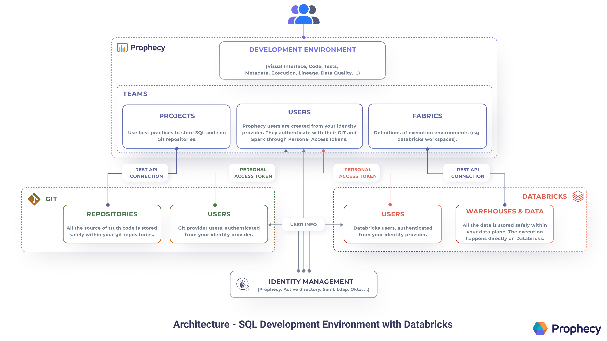

Use Prophecy's interface to develop SQL projects on Databricks Warehouses.

Take advantage of Prophecy's low-code interface to quickly develop data models on Databricks. Start building your Medallion Architecture - or incorporate another existing framework. For your team, Prophecy facilitates faster development on Databricks.

## Getting Started

Try the getting-started [guide](/docs/getting-started/getting-started-with-low-code-sql.md) to connect to Databricks, create or import a Project, and develop a model. Then schedule Databricks Jobs and deploy the entire Project from Prophecy using the best CI/CD practices with Git.

## Enterprise-ready Architecture

Curious about how Prophecy integrates with Git, Databricks, and identity management systems? Users define the SQL queries in Prophecy's visual (or code) editors, and Prophecy helps define the appropriate functions, CTEs, macros, etc for versioned storage on Git. Then Prophecy takes these coded instructions and runs the query on the Databricks SQL Warehouse.

To connect with data stored in a SQL Warehouse, or to allow for interactive SQL execution, Prophecy can connect to an existing Databricks execution environment through a secure and performant REST API connection.

Each Fabric defined in Prophecy connects to a single Databricks Warehouse and each user is required to provide credentials to authenticate to it. Prophecy integrates with several identity management systems and protocols. All the data is stored safely within your data plane. SQL query execution then takes place on the Databricks Warehouse.

Start using Prophecy's low-code interface with Databricks today!
