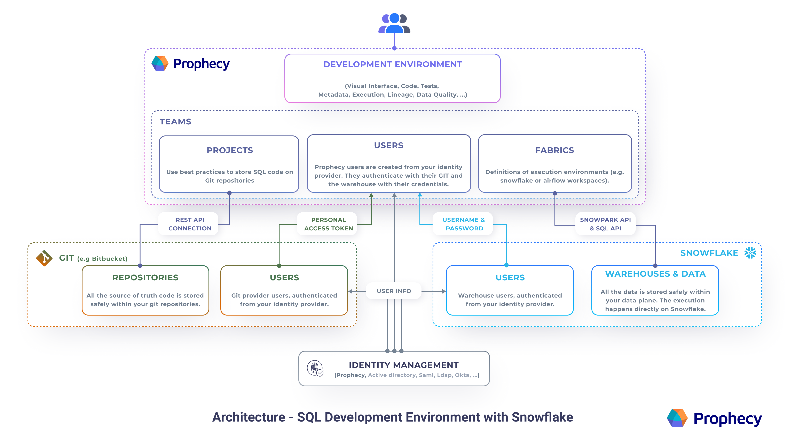

Use Prophecy's interface to develop SQL projects on Snowflake Warehouses.

Take advantage of Prophecy's low-code interface to quickly develop data models on Snowflake. Whether you're using an Ingestion / Transforming / Serving pattern, prefer the Medallion Architecture, or prefer another framework, Prophecy facilitates faster development on Snowflake.

## Getting Started

Try the getting-started guide to connect to Snowflake, create or import a Project, and develop a model. Then schedule jobs on Airflow and deploy using the best CI/CD practices with Git.

## Schedule jobs on Airflow

Many Snowflake users need to schedule jobs using Airflow. Prophecy supports several Airflow options - just follow the [setup](/docs/low-code-jobs/airflow/setup/setup.md) instructions to the desired Airflow type. When your SQL project is ready to run on a defined schedule, like once a day, then [create](/docs/getting-started/getting-started-with-low-code-airflow.md#create-an-airflow-job) an Airflow Job.

## Enterprise-ready Architecture

Curious about how Prophecy integrates with Git, Snowflake, and identity management systems? Users define the SQL queries in Prophecy's visual (or code) editors, and Prophecy helps define the appropriate functions, CTEs, macros, etc for versioned storage on Git. Then Prophecy takes these coded instructions and runs the query on the Snowflake Warehouse.

To connect with data stored in a SQL Warehouse, or to allow for interactive SQL execution, Prophecy can connect to an existing Snowflake execution environment through secure and performant Snowpark or Snowflake APIs.

Each Fabric defined in Prophecy connects to a single Snowflake Warehouse and each user is required to provide credentials to authenticate to it. Prophecy integrates with several identity management systems and protocols. All the data is stored safely within your data plane. SQL query execution then takes place on the Snowflake Warehouse.

Start using Prophecy's low-code interface with Snowflake today!
