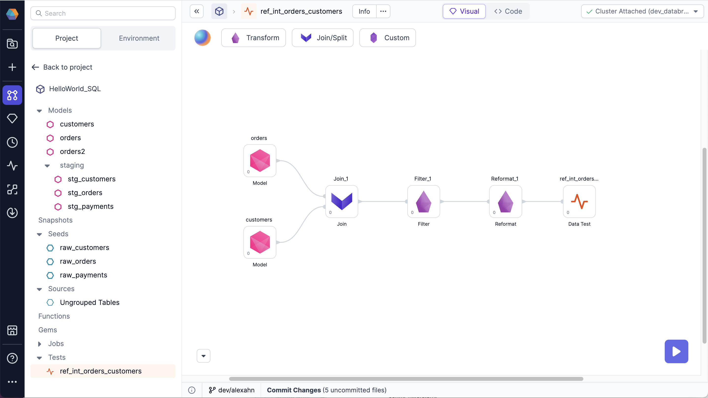

You can use data tests to ensure that your business data is generated reliably over time. As a data engineer, data analyst, or business user, you can run data tests so that you don’t have to manually check every Dataset every time you run a Job or model. The data test checks the validity of the SQL in your project by querying the single table result generated from the transformation steps shown.

## What you'll need to know

Data tests use [dbt](https://docs.getdbt.com/docs/build/data-tests) for the underlying test execution, but you don’t need to know dbt or how to write your own tests. Prophecy simplifies the test definitions that are normally defined in .sql and .yaml files.

You can use data tests in Prophecy the same way you use other database objects in your Databricks environment.

### Supported database objects

Supported database objects include:

- Models
- Snapshots
- Seeds
- Sources

### Supported test types

Supported test types include:

- Project tests

## What's next

Data tests are useful if you want to check the validity of your data, without having to manually check every dataset. And you don’t need to know dbt or how to write your own tests to use them.

To set up a project test, see [Use project tests](/docs/low-code-sql/data-tests/use-project-tests.md).
