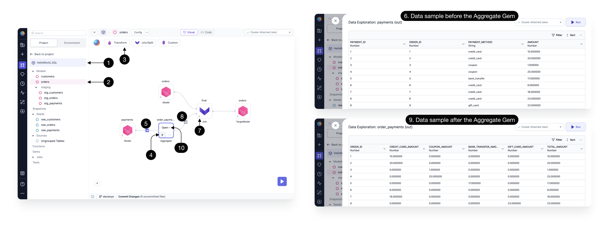
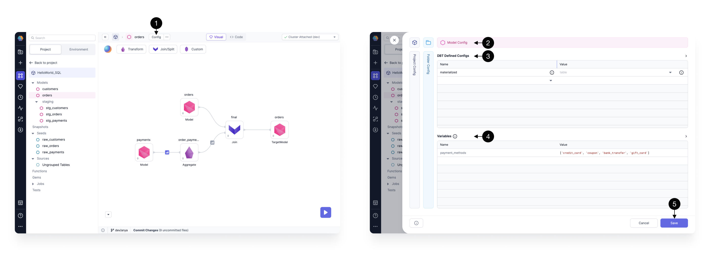

Together let's build an Aggregate Gem. Follow along in the `HelloWorld_SQL` Project.

:::info
To learn more about the Aggregate Gem UI, see [this page](/docs/concepts/project/gems.md) which illustrates features common to all Gems.
:::

## Run

When you're ready to see how your Aggregate Gem works, **() Run** interactively to view **()[sample data](../../interactive-development/data-explorer.md).**
